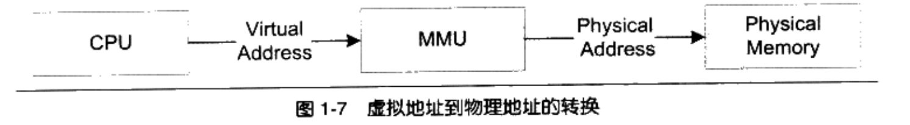

# Chapter1 简介

!!! info 

    为什么要读这本书？无论是在学习计算机系统/操作系统/CTF时，都需要对Linker/Loader/Library等内容有一定了解，但可惜的是没有一门专门的课程讲授。这本书又是经学长老师等人强烈推荐，所以想要阅读它，并简单做笔记记录。

## 系统软件

把管理计算机本身的软件称为系统软件，可以分成两块，一块是平台性的，如os kernel，驱动程序，运行库和其他系统工具；另一块是用于程序开发的，如编译器/汇编器/链接器等开发工具和开发库。本书着重介绍系统软件的一部分。

从结构上看，开发工具和应用程序上同一层的，都使用API（Application Programming Interface），其提供者是运行库，什么样的运行库提供什么样的API，如Linux下的Glibc库提供POSIX的API；Windows的运行库提供Windows API，32位windows提供的API又称为Win32.

运行库使用OS提供的System Call Interface，往往以软件中断的方式提供，如Linux用0x80号中断作为系统调用接口，Windows用0x2E号中断为系统调用接口（很老的Windows）。

Kernel用硬件提供的接口标准来工作，所以Kernel和Driver的开发者要根据各种硬件编程接口来开发OS和Driver。

## 设备驱动

OS为硬件做抽象，给运行库和应用程序提供驱动来管理硬件。在UNIX中，硬件被抽象为文件；在Windows中，图形硬件被抽象成为GDI，声音和多媒体设备被抽象为DirectX对象；磁盘被抽象为普通文件系统等。

## 内存管理

程序和物理内存之间存在虚拟内存，它作为一层抽象来管理内存分配等问题。

### 隔离

程序运行时希望有单一地址空间，有自己的CPU，不关心其他程序。每个进程为自己分配了一块独立的虚拟空间，并且每个进程都只能访问自己的地址空间，做到了进程隔离

### 分段（Segmentation）

最开始用的是分段实现，即操作系统设置一个映射函数，把虚拟内存映射到相同大小的物理地址上，实际操作由硬件完成

分段最大的问题上内存使用效率低下，每次换入换出的单位上整个程序，会造成大量的磁盘访问操作。根据程序的局部性原理，**当一个程序中运行时，在某个时间段内，它只是频繁地用到了一小部分数据**。人们自然想到了更小粒度的内存分割和映射方法，即分页。

### 分页（Paging）

分页，即把地址空间人为分成固定大小的页，每一页大小由硬件决定。对整个系统来说，页是固定大小的。

按分页方式，一个进程只有部分在内存中，很多未使用的部分保存在磁盘内。虚拟空间的页叫VP（Virtual Page），物理内存中的页叫PP（Physical Page），磁盘中的页叫做DP（Disk Page）。

当进程需要用到Process1的VP2和VP3时，硬件会报页错误，然后OS接管进程，把VP2和VP3从磁盘读出来装入内存，建立映射关系。

分页也可以做到保护，每个页都可以设置权限属性。

虚拟存储需要硬件支持来实现，几乎所有硬件都采用MMU（Memory Management Unit）来实现页映射

> 一般MMU都集成在CPU内，不会以独立部件的形式存在

