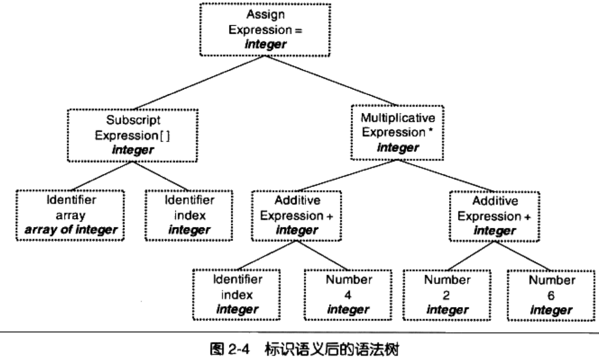
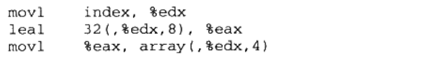

# Chapter2 编译和链接

## 被隐藏了的过程

以helloworld为例，在linux命令行中执行：

```
gcc hello.c
./a.out
```

这两句命令包括了四个步骤：预处理（Prepressing）/编译（Compilation）/汇编（Assembly）/链接（Linking）


### 预编译

用gcc进行预编译的命令是：

```
gcc -E hello.c -o hello.i
```

从中也可以看出经过预编译后的文件扩展名是`.i`。

预编译主要处理以`#`开头的预编译指令，如`#include`/`#define`等，主要处理规则如下：

- 将所有的“#define”删除，并且展开所有的宏定义。
- 处理所有条件预编译指令，比如“#if”、“#ifdef”、“#elif”、“#else”、“#endif”
- 处理“#include”预编译指令，将被包含的文件插入到该预编译指令的位置。注意，这个过程是递归进行的，也就是说被包含的文件可能还包含其他文件。
- 删除所有的注释“//”和“/* */”
- 添加行号和文件名标识，比如#2“hello.c”2，以便于编译时编译器产生调试用的行号信息及用于编译时产生编译错误或警告时能够显示行号。
- 保留所有的#pragma 编译器指令，因为编译器须要使用它们。

经过预编译后的.文件不包含任何宏定义，因为所有的宏已经被展开，并且包含的文件也已经被插入到`.i`文件中。

### 编译

编译就是把预处理完的文件进行一系列词法分析/语法分析/语义分析及优化后生成相应的汇编代码文件。下一节会简单介绍。编译过程对应的gcc命令为：

```
gcc -S hello.i -o hello.s
```

现版本的gcc把预编译和编译合并，用cc1的程序来完成，故也可以使用：

```
cc1 hello.c
```

或

```
gcc -S hello.c -o hello.s
```

**实际上gcc这个命令只是一些程序的包装，它会根据不同的参数去调用预编译编译程序cc1/汇编器as/链接器ld。**

### 汇编

汇编器是把汇编代码变成机器码的过程，一一对应。可以用as汇编器或者gcc来完成：

```
as hello.S -o hello.o
gcc -c hello.s -o hello.o
```

或

```
gcc -C hello.c -o hello.o
```

### 链接

汇编器得到的是一个目标文件而不是可执行文件，需要经过链接后才变得可执行。静态链接命令如下：


可以看到需要链接非常多的文件，且有很多参数如`-lgcc`/`-lgcc_eh`/`-lc`等，在后面会详细展开

## 编译器简介

下面对编译过程做简要展开，具体内容在编译原理中会详细介绍。

编译过程一般分为6步：扫描/语法分析/语义分析/源代码优化/代码生成/目标代码优化。


举例分析各个过程，样例代码为

```
array[index] = (index + 4) * (2 + 6)
```

### 词法分析

源代码先被输入到扫描器（Scanner），扫描器对其进行词法分析，运用类似FSM对算法把代码分割成一系列的Token，在上面的程序中，包含16个记号：


记号一般分为以下几类：关键字/标识符/字面量/特殊符号。在识别记号的同时，扫描器也把标识符放到了符号表，把数字/字符串常量放到文字表。

### 语法分析

语法分析器（Grammar Parser）把记号进行语法分析，生成语法树（Syntax Tree）。分析过程采用上下文无关语法（与下推自动机有关，详见计算理论）。简而言之，语法树就是以表达式为节点的树。


符号和数字是最小的表达式，它们往往是叶子。在语法分析的同时，很多运算符号的优先级和含义也被确定下来了。

### 语义分析

语义分析器（Semantic Analyzer）完成的是确认一个语句是否真正有意义。编译器所能分析的语义是静态语义，对应的动态语义是指只有当运行时才能被确定的语义。

静态语义包括声明/类型匹配/类型转换，比如把浮点型表达式复制给整型表达式时，隐含了一个类型转换过程，语义分析需要完成这个步骤。动态语义一般指在运行期出现的相关问题，比如除以0是一个运行期语义错误。

经过语义分析后，语法树的表达式都被标识了类型，如果有类型需要做隐式转换，语义分析器会在语法树中插入转换节点。



### 中间语言生成

现代编译器有很多层的优化，这里所描述的是源码级优化（Source Code Optimizer）。比如案例中的（2+6）可以被优化成8.由于直接在语法树上做优化很困难，所以一般把语法树转换成中间代码，它是语法树的顺序表示。比较常见的中间代码类型有：三地址码（Three- address Code）和P-代码。以三地址码为例，最基本的三地址码是：

```
x = y op z
```

故上面的例子可以被优化成以下中间代码：

```
t2 = index + 4
t2 = t2 * 8
array[index] = t2
```

中间代码使得编译器可以被分为前后端，前端负责产生机器无关的中间代码，后端把中间代码转换成目标机器代码。

### 目标代码生成及优化

下面的过程都属于后端。后端主要包括代码生成器/目标代码优化器（Target Code Optimizer）。

代码生成器根据机器把代码转换成汇编，如：


目标代码优化器对其做优化，比如选择合适的寻址方式/用位移代替乘法/删除多余指令等，如：



### 小结

经过六个步骤，源代码成功变成了目标代码。但是还有一个重要问题，index和array的地址没有确定。且如果目标代码中有变量定义在其他模块又该如何？由此可以引出链接器，现代的编译器把源代码编译成未链接的目标文件，然后由链接器把目标文件链接成可执行文件。

## 链接器简介

本部分只对链接器的历史和目的做介绍，工作原理见后文。

在用纸带编程的时候，对于跳转指令，其目标地址在程序修改时都需要重新计算，这个过程叫做重定位（Relocation）。为了解决这个复杂的问题，汇编语言产生了，它引入了 **符号** 的概念，用符号表示指令，或者标记位置。不管这个符号代表的目标地址发生了什么变化，汇编器在每次汇编程序的时候都会重新计算符号地址，极大解放了生产力。

在高级语言编程过程中，往往有成千上万个模块，按照层次化和模块化存储为软件开发提供了极大便利，而这就需要链接技术的支持，如模块之间如何通信，模块间符号的引用等问题。

## 模块拼装-静态链接

模块化编程的必要技术就是组装模块，这个过程由链接完成。链接的主要内容就是把各个模块之间相互引用的部分处理好，使得各个模块之间能正确衔接。链接过程包括 地址和空间分配（Address and Storage Allocation）/ 符号决议（Symbol Resolution）/ 和重定位（Relocation）等步骤

??? note "符号决议"

    符号决议有时候也被叫做符号绑定(Symbol Binding)、名称绑定(Name Binding)名称决议(Name Resolution)，甚至还有叫做地址绑定(Address Binding)、指令绑定(Instruction Binding)的，大体上它们的意思都一样，但从细节角度来区分，它们之间还是存在一定区别的，比如"决议”更倾向于静态链接，而“绑定”更倾向于动态链接，即它们所使用的范围不一样。在静态链接，我们将统一称为符号决议。

最基本的静态链接就是把目标文件和库一起链接起来，最常见的库是运行时库（Runtime Library），它是支持程序运行的基本函数集合。库其实是一组目标文件的包，即最常用的代码编译成目标文件后打包的结果。

??? note "目标文件"

    我们认为对于 Object 文件没有一个很合适的中文名称,把它叫做中间目标文件比较合适，简称为目标文件，所以本书后面的内容都将称 Obiect 文件为目标文件，很多时候我们也把目标文件称为模块。

在链接过程中，如果一个程序要访问定义在另一个文件里的全局变量，那么其地址在编译过程中是不知道的，编译器会先把目标地址置0，等待链接器做修正，这个修正过程叫做重定位（Relocation），每一个要被修正的地方叫做一个重定位入口（Relocation Entry）。

