# Chapter3

本章集中于目标文件。编译器编译源码后产生的文件叫做目标文件，本章会展开讲目标文件的格式，从结构上来讲，目标文件是已经编译后的可执行文件格式，只是还没有链接，有些符号和地址还没有被调整。

## 目标文件的格式

现在PC平台流行的可执行文件格式主要是Windows下的PE（Portable Executable）和Linux的ELF（Executable Linkable Fomat），它们都是COFF（Common file format）的变种。目标文件就是源代码经过编译后但未进行链接的中间文件（Windows的.obj和Linux的.o）。

不光是可执行文件（Windows下的.exe和Linux下的ELF可执行文件）按照可执行文件格式存储，动态链接库（DLL，Dynamic Linking Library）（Windows的.dll和Linux的.so）及静态链接库（Static Linking Library）（Windows的.lib和Linux的.a）都按照可执行文件存储。它们在 Windows 下都按照 PE-COFF 格式存储，Linux 下按照 ELF 格式存储。静态链接库稍有不同，它是把很多目标文件捆绑在一起形成一个文件，再加上一些索引，可以简单地把它理解为一个包含有很多目标文件的文件包。ELF文件标准里面把系统中采用ELF 格式的文件归为如表 3-1 所列举的 4类。

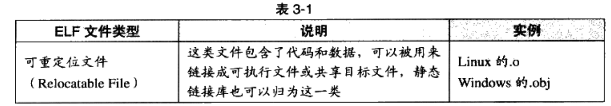

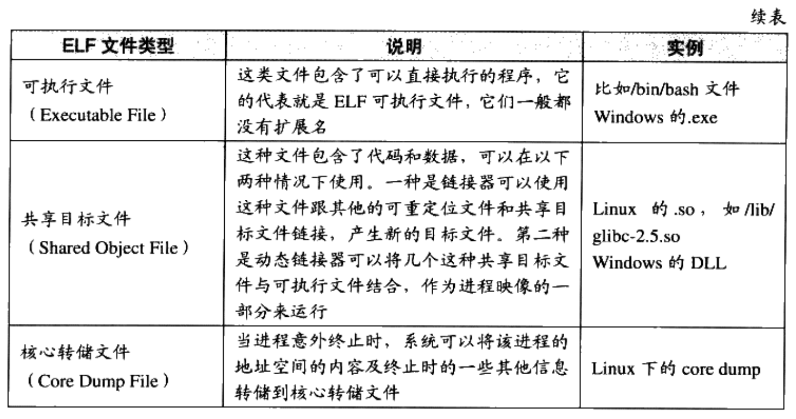

> 下面的剖析以ELF为主，然后会专门分析PE-COFF结构，对比其与ELF的异同

## 目标文件是什么样的

除了编译后的机器指令代码/数据，目标文件中还有链接所需信息，如符号表/调试信息/字符串等，这些信息按Section或者Segment存储。

机器指令被放在代码段里，如.code或.text；全局变量和局部静态变量被放在数据段，叫.data。


ELF的开头是一个文件头，文件头描述了整个文件的文件属性，包括文件是否可执行、是静态链接还是动态链接及入口地址(如果是可执行文件)、目标硬件、目标操作系统等信息，文件头还包括一个段表(Section Table)，段表其实是一个描述文件中各个段的数组。段表描述了文件中各个段在文件中的偏移位置及段的属性等，从段表里面可以得到每个段的所有信息。文件头后面就是各个段的内容，比如代码段保存的就是程序的指令，数据段保存的就是程序的静态变量等。

未初始化的全局变量和局部静态变量默认值都是0，所以为它们在.data段分配空间是没必要的，所以把它记录到.bss段内。故.bss段只是为未初始化的全局变量和局部静态变量预留位置，它没有内容，故在文件中也不占空间。

小结：**源码被编译后主要分为程序指令和程序数据。代码段数据程序指令，数据段和bss段数据程序数据**。

#### 数据指令分段的好处

- 一方面是当程序被装载后，数据和指令分别被映射到两个虚存区域。由于数据区域对于进程来说是可读写的，而指令区域对于进程来说是只读的，所以这两个虚存区域的权限可以被分别设置成可读写和只读。这样可以防止程序的指令被有意或无意地改写。
- 另外一方面是对于现代的 CPU 来说，它们有着极为强大的缓存(Cache)体系。由于缓存在现代的计算机中地位非常重要，所以程序必须尽量提高缓存的命中率。指令区和数据区的分离有利于提高程序的局部性。现代 CPU 的缓存一般都被设计成数据缓存和指令缓存分离，所以程序的指令和数据被分开存放对 CPU 的缓存命中率提高有好处。
- 第三个原因，其实也是最重要的原因，就是当系统中运行着多个该程序的副本时，它们的指令都是一样的，所以内存中只须要保存一份程序的指令部分。对于指令这种只读的区域来说是这样，对于其他的只读数据也一样，比如很多程序里面带有的图标图片、文本等资源也是属于可以共享的。当然每个副本进程的数据区域是不一样的，它们是进程私有的。共享指令的概念在现代的操作系统里面占据了极为重要的地位，特别是在有动态链接的系统中，可以节省大量的内存。

### 以SimpleSection.o为例

代码如下：

```c
/*
 * SimpleSection.c
 * Linux:
 *   gcc -c SimpleSection.c
 * Windows:
 *   c1 SimpleSection.c /c /Za
 */
 
int printf( const char* format, ...);

int global_init_var = 84;
int global_uninit_var;

void func1( int i )
{
	  printf( "%d\n", i );
}

int main(void)
{
		static int static_var = 85;
		static int static_var2;
		int a = 1;
		int b;
		
		func1( static_var + static_var2 + a + b );
		
		return a;
}
```

> 若不加说明，那么以下分析的都是32位x86下的ELF格式

用GCC编译这个文件（参数 -c 表示只编译不链接）

```bash
$ gcc -c SimpleSection.c
```

用objdump可以看object内部结构，运行

```bash
$ objdump -h SimpleSection.o
```

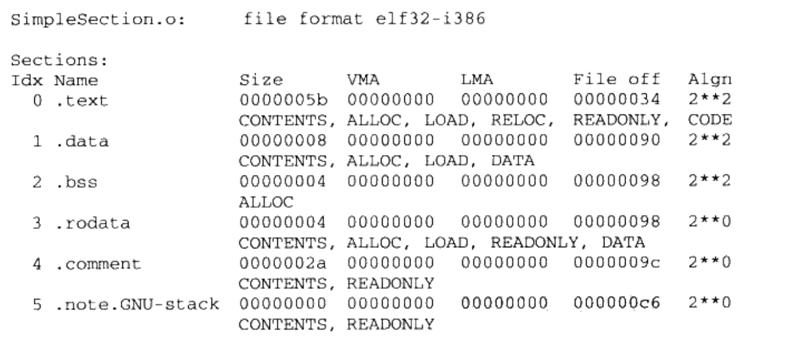

> Linux平台还有一个常用工具readelf，后面也会介绍

可以看到显示的段比我们之前的分析要多，多了.rodata/.comment/.note.GNU-stack,它们分别是只读数据段/注释信息段/堆栈提示段，后面的段属性中，size指段长度，file offset指段所在位置，每个段第二行的CONTENTS，ALLOC表示段的各种属性。比如CONTENTS表示该段在文件中存在，比如bss段就没有CONTENS。对于堆栈提示段，它虽然有CONTENTS属性，但是长度为0，在这里也暂时当它不存在。于是我们的ELF文件可以表示为：


### 代码段

用objdump的-s参数（把所有段内容以十六进制打印出来），-d参数（把所有包含指令的段反汇编），执行

```bash
$ objdump -s -d SimpleSection.o
```


### 数据段和只读数据段

.data保存的是已初始化的全局静态变量和局部静态变量。.rodata保存的是只读数据，比如我们上面代码里调用printf的参数`"%d\n"`。执行：

```bash
$ objdump -x -s -d SimpleSection.o
```


从数据的存储方式可以看出该CPU的字节序的小端（Little-endian）的。

### BSS段

.bss段存的是未初始化的全局变量和局部静态变量，如代码中的global_uninit_var和static_var2.但是可以看到这个段只有4个字节，与原本的8个字节不符。

可以从符号表看到，只有static_var2被放到了.bss段，全局的未初始化变量没有被放到任何段里，只是一个未定义的COMMON符号。有些编译器会把全局未初始化变量放在.bss段里，有些不存放，只是留一个未定义的全局变量符号，等链接的时候再在.bss分配空间。

> 在弱符号/强符号，和COMMON块两个章节会深入讲解

可以简单地把全局未初始化变量放在.bss段。另外，编译单元内部可见的静态变量是放在.bss段内的。

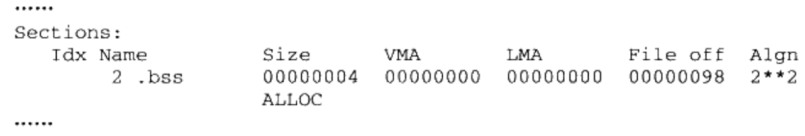

### 其他段


应用程序也可以自定义段，但是不能以`.`开头，否则会和系统保留段名冲突。GCC提供了一个扩展机制，可以让程序员把变量放到指定的段，只要在全局变量或函数前面加上`__attribute__((section("name")))`即可。

```c
__attribute__((section("FOO"))) int global = 42;
```

## ELF文件结构描述

这一节详细描述了ELF的文件结构。其基本结构如下：


下面对各个重要组成部分做详细介绍

### 文件头

可以用readelf来详细查看ELF文件


ELF文件头定义了 **ELF魔数，文件机器字节长度，数据存储方式，版本，运行平台，ABI版本，ELF重定位类型，硬件平台，硬件平台版本，入口地址，程序头入口和长度，段表位置和长度及段段数量等**。

ELF文件头结构被定义在 "/usr/include/hlf.h" ，有32位和64位版本。以32位结构 "Elf32_Ehdr" 为例

```c
typedef structure {
		unsigned char e_ident[16];
		Elf32_Half e_type;
		Elf32_Half e_machine;
		Elf32_Word e_version;
		Elf32_Addr e_entry;
		Elf32_Off e_phoff;
    Elf32_Off e_shoff;
    Elf32_Word e_flags;
    Elf32 Half e_ehsize;
    Elf32 Half e phentsize;
    Elf32 Half e phnum;
    Elf32 Half e shentsize;
    Elf32 Half e_shnum;
    E1f32 Half e_shstrndx;
}Elf32 Ehdr;
```

和readelf的输出对应关系如下：

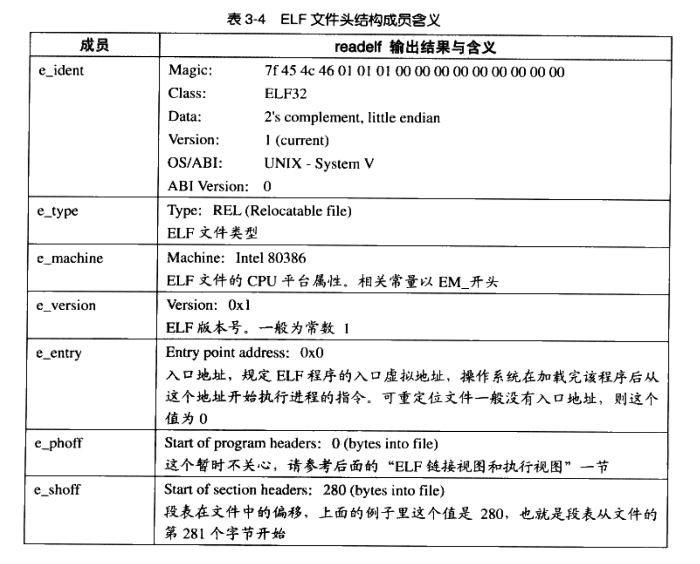

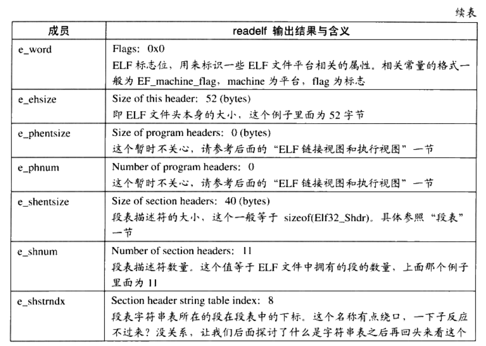

#### ELF魔数

Magic的16个字节恰好对应成员e_ident，被规定用来标识ELF的平台属性。


前四个字节是所有ELF文件都必须相同的标识码。第一个字节对应ASCII码中的DEL控制符，后面3个字节是ELF的ASCII码。这4个字节又被称为ELF的魔数，几乎所有可执行文件格式开头都是魔数。魔数用来确认文件类型，OS在加载文件时会确认魔数是否正确。

后面的一个字节用来标识ELF文件类，0x01是32位，0x02是64位；第6个字节是字节序（小端/大端）；第7个字节规定ELF主版本号，一般是1.后面的9个字节没有定义，可作为扩展标识。

#### 文件类型

e_type成员标识ELF文件类型，每个类型对应一个常量。系统通过这个常量判断ELF的真正文件类型而不是扩展名。

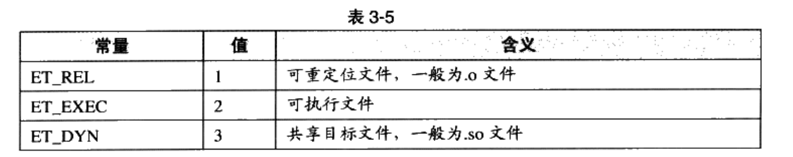

#### 机器类型

e_machine标识机器类型


### 段表

段表是除了文件头外最重要的结构，描述了段的段名，段段长度，在文件中的偏移，读写权限和其他属性。可以说， **ELF文件的段结构就是由段表决定的，编译器/链接器/装载器都是依靠段表定位和访问各个段的属性的**。段表的位置由文件头中的e_shoff成员决定。

用readelf可以看到真正的段表结构（objdump只展示了主要段）


段表就是一个数组，元素类型为Elf32_Shdr结构体。每个结构体对应一个段，被称为段描述符。Elf32_Shdr被定义在 "/usr/include/elf.h"，内容如下：

```c
typedef struct
{
  Elf32 Word		sh_name;
  Elf32 Word		sh_type;
  Elf32_Word		sh_flag;
  E1f32 Addr		sh_addr;
  Elf32_Off			sh_offset;
  Elf32 Word		sh_size;
  Elf32_Word		sh_link;
  Elf32_Word		sh_info;
  Elf32_Word		sh_addralign;
  E1f32 Word		sh_entsize;
} Elf32_Shdr
```

含义见下表：

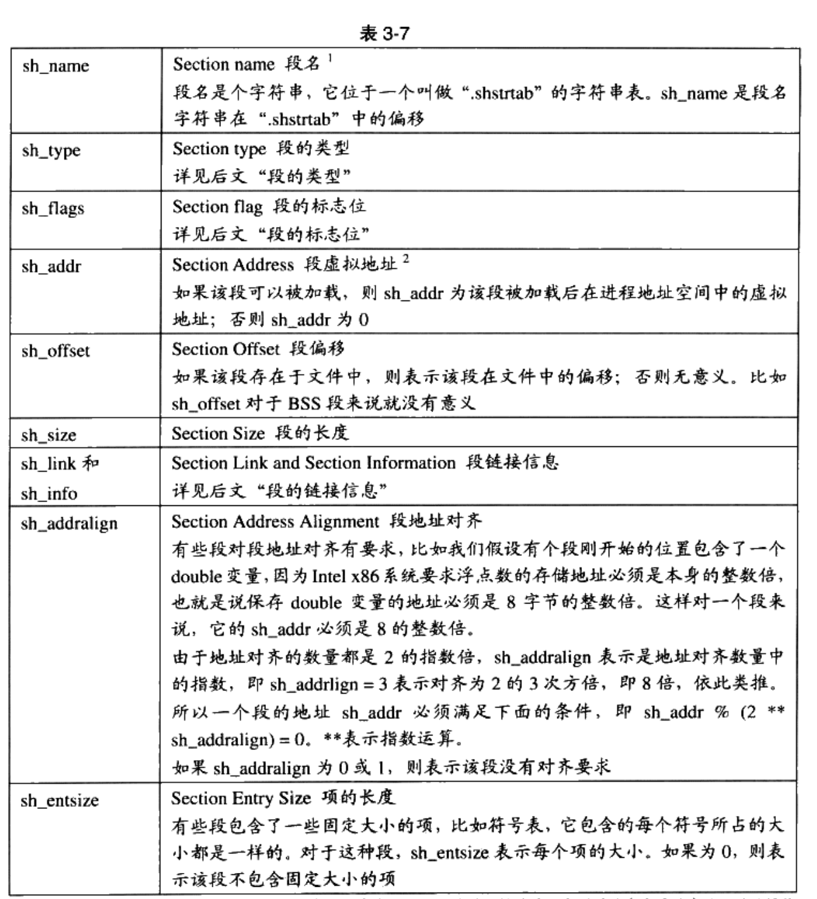

真正的段结构：


??? note "段的类型/标志位/链接信息"

    
    
    
    
    
    
    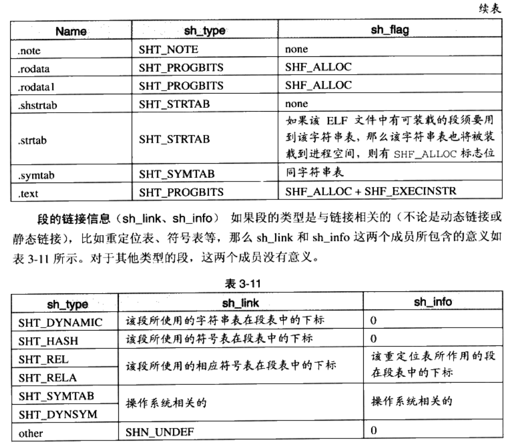

#### 重定位表

.rel.text段的类型为SHT_REL，说明它是一个重定位表。代码段和数据段中那些对绝对地址引用的位置都记录在里面。对于每个需要重定位的代码段或者数据段，都会有一个相应的重定位表。比如.rel.text就是.text段的重定位表，因为在.text段中存在对printf的调用。重定位表在静态链接章节会展开介绍。

#### 字符串表

由于字符串的长度往往是不定的，所以把字符串放到一个表内，用偏移来引用字符串。方法如下：


这样就可以只用下标引用字符串了。常见的段名有 .strtab/.shstrtab .前者为字符串表，用来保存普通字符串，比如符号名字；后者为段表字符串表，用来保存段表中的字符串，如段名。

ELF文件头中最后的成员 e_shstrndx 就是段表字符串表的偏移。于是只要分析ELF文件头，就可以得到段表和段表字符串表的位置，从而解析整个ELF文件的位置。

## 链接的接口--符号

在链接过程中，目标文件的相互拼合就是对函数和变量地址的引用。如文件B用到了A中的函数，那么称A定义了该函数，B引用了该函数。我们把函数和变量统称为符号，函数名和变量名统称为符号名。

每一个目标文件都有一个符号表，每个符号都有符号值，对于变量和函数，符号值就是它们的地址。所有符号一共可分为5类：

- 定义在本目标文件的全局符号，可以被其他目标文件引用。比如 SimpleSection.o 里面的“func1”、“main”和“global_init_var”
- 在本目标文件中引用的全局符号，却没有定义在本目标文件，这一般叫做外部符号(External Symbol)，也就是我们前面所讲的符号引用。比如 SimpleSection.o 里面的“printf”.
- 段名，这种符号往往由编译器产生，它的值就是该段的起始地址。比如SimpleSection.o里面的“.text”、“.data”等。
- 局部符号，这类符号只在编译单元内部可见。比如 SimpleSection.o里面的“static_var和“static_var2”。调试器可以使用这些符号来分析程序或崩溃时的核心转储文件。这些局部符号对于链接过程没有作用，链接器往往也忽略它们。
- 行号信息，即目标文件指令与源代码中代码行的对应关系，它也是可选的。

链接过程只关注全局符号，即第一第二类符号。

> 用readelf，objdump，nm都可以看符号表。nm的命令如下：
>
> ```bash
> $ nm SimpleSection.o
> ```

### ELF符号表结构

ELF文件的符号表往往是一个段，段名是.symtab，其结构为一个Elf32_Sym结构的数组，每个结构对应一个符号。这个数组的第0个元素是无效的“未定义”符号。

Elf32_Sym结构的定义如下：

```c
typedef struct {
		Elf32_Word st_name;
		Elf32_Addr st_value;
		Elf32_Word st_size;
		unsigned char st_info;
		unsigned char st_other;
		Elf32_Half st_shndx;
} Elf32_Sym;
```

其成员定义如下：


??? note "符号类型和绑定信息/符号所在段/符号值"

    
    
    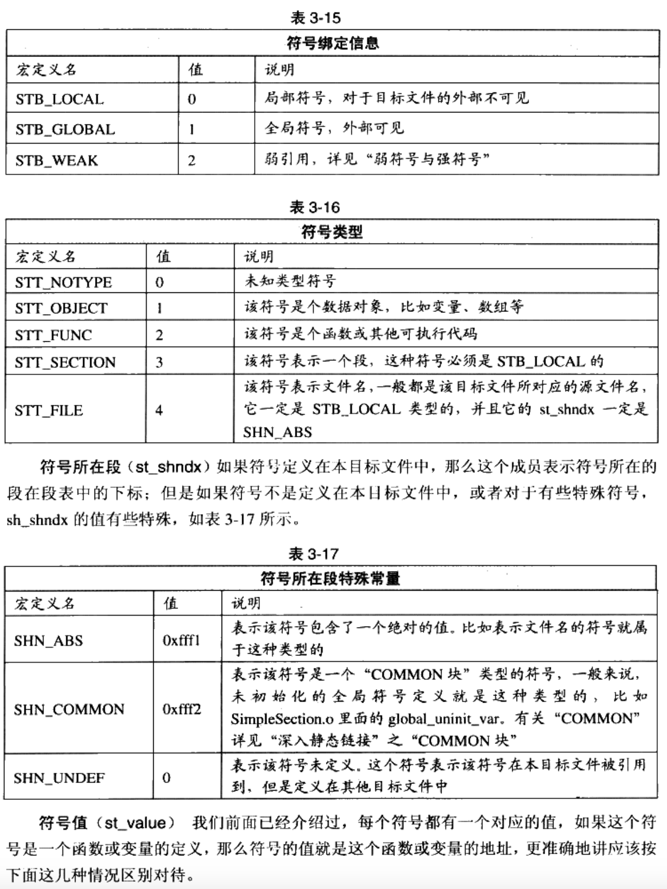
    
    
    
    

用readelf查看SimpleSection.o文件的符号表

```bash
$ readelf -s SimpleSection.o
```

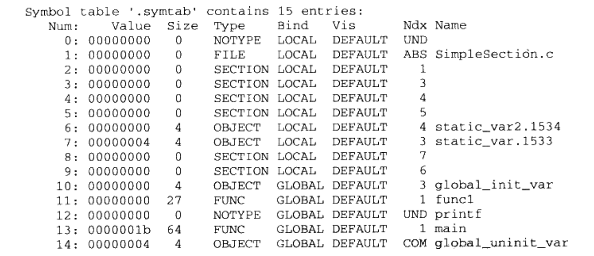

把输出与上面的结构体成员一一对应即可，非常清晰。

### 特殊符号

用ld作为链接器的时候会产生很多特殊符号：

- __executable_start，该符号为程序起始地址，注意，不是入口地址，是程序的最开始的地址。
- __etext 或 _etext 或 etext，该符号为代码段结束地址，即代码段最末尾的地址。
- _edata 或 edata，该符号为数据段结束地址，即数据段最末尾的地址。
- _end 或 end，该符号为程序结束地址。

可以在程序中用extern关键字声明并直接使用该符号

### 符号修饰与函数签名

由于在C语言之前，汇编语言已经有一些写好的库了。如果直接把符号和对应的函数名相等，会出现和汇编语言库的名称冲突等问题。于是，UNIX下的C语言规定，C源代码所有全局变量和符号编译后，符号加上下划线`_`,Fortran语言的前后都加上`_`。

这种简单的方法并没有从根本上解决符号冲突问题。同一种语言的目标文件也有可能产生符号冲突。于是从C++开始，增加了Namespace的方法来解决多模块的符号冲突问题。

#### C++符号修饰

C++有函数重载的性质，即允许多个不同参数类型的函数拥有一样的名字；C++还在语言级别支持名称空间，即允许在不同名称空间有多个同样名字的符号。以下面一段代码来举例说明：

```c++
int func(int);
float func(float);

class C {
		int func(int);
		class C2 {
				int func(int);
		};
};

namespace N {
		int func(int);
		class C {
				int func(int);
		};
}
```

**函数签名** 包含了一个函数的信息，包括函数名，参数类型，所在的类，名称空间及其他信息，它用来识别不同的函数，上面6个func函数的函数签名都不相同。在编译器和链接器处理符号时，它们用某种名称修饰的方法，使得每一个函数签名对应一个修饰后名称。

上面的函数签名对应的修饰后名称如下：

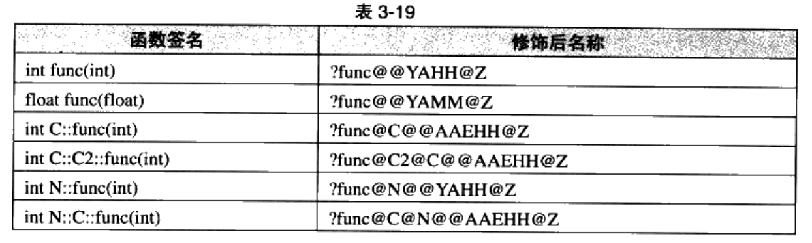

> 编译器为 Visual C++

由于不同编译器采用不同的名字修饰方法，必然会导致不同编译器产生的目标文件无法正常相互链接。

### extern “C”

C++为了与C兼容，增加了 "extern "C""关键字，C++编译器会把后面的代码当作C代码处理，也就是说名称修饰将不起作用。

考虑以下情况：若一个C文件包含了string.h，且用了memset函数，另一个C++文件也用了memset函数，那么链接器在链接的时候必然出错，因为C文件并不对memset做修饰，而C++文件会。

因此，几乎所有系统头文件都会使用以下技巧（利用C++的宏"__cplusplus"）

```c++
#ifdef __cplusplus
extern "C" {
#endif

void *memset (void *, int, size_t);

#ifdef __cplusplus
}
#endif
```

### 弱符号与强符号

对于C/C++来说，编译器默认函数和已初始化的全局变量为强符号，未初始化的全局变量为弱符号。也可以用GCC的`__attribute__((weak))`来定义任何一个强符号为弱符号。强符号和弱符号都是针对 **定义** 来说的，不是针对符号的引用。

链接器会按照以下规则处理被多次定义的全局符号：

- 规则1:不允许强符号被多次定义(即不同的目标文件中不能有同名的强符号):如果有多个强符号定义，则链接器报符号重复定义错误。
- 规则2:如果一个符号在某个目标文件中是强符号，在其他文件中都是弱符号，那么选择强符号。
- 规则3:如果一个符号在所有目标文件中都是弱符号，那么选择其中占用空间最大的一个。比如目标文件 A 定义全局变量 global 为 int 型,占4个字节;目标文件 B 定义 global为 double 型，占8个字节，那么目标文件A和B链接后，符号 global占8个字节(尽量不要使用多个不同类型的弱符号，否则容易导致很难发现的程序错误)。

#### 弱引用和强引用

若链接器找不到符号的定义则报错，那么这种就被称为强引用；若不报错，而是用其默认值0或其他特殊值来代替，这种被称为弱引用。

弱符号和弱引用对于库来说很有用，如库中定义的弱符号可以被用户定义的强符号覆盖，使得程序可以用自定义版本的库函数；程序可以对某些扩展功能模块的引用定义为弱引用，当我们把扩展模块和程序做链接时，功能模块可以正常使用；去掉某些功能模块，程序也可以正常链接

在Linux中，可以定义pthread_create函数的弱引用来判断是否链接到pthread库，从而选择执行单线程还是多线程版本：

```c++
#include <stdio.h>
#include <pthread.h>

int pthread_create(
		pthread_t*,
		const pthread_attr_t*,
		void* (*)(void*),
		void*
) __attribute__ ((weak));

int main(){
		if(pthread_create) {
				printf("This is multi-thread version!\n");
				main_multi_thread();
		} else {
				printf("This is single-thread version!\n");
				main_single_thread();
		}
}
```

## 调试信息

几乎所有现代编译器都支持源码级别的调试，那么必须要求编译器提前把源码和目标代码之间的关系，如目标代码中的地址对应源码的哪一行/函数和变量的类型/结构体定义/字符串等保存到目标文件中。

给GCC加上-g参数，就可以加上调试信息。目标文件中多了很多"debug"相关段


这些段中保存的就是调试信息。现在的ELF采用DWARF的标准调试信息格式。在Linux下，可以用strip命令来去掉ELF的调试信息。

