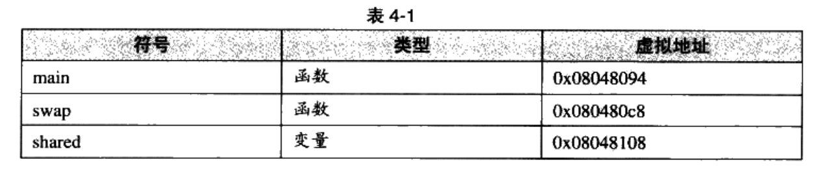
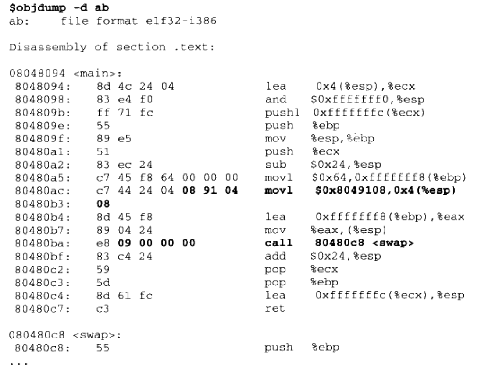
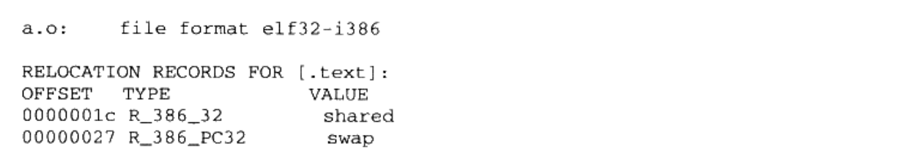
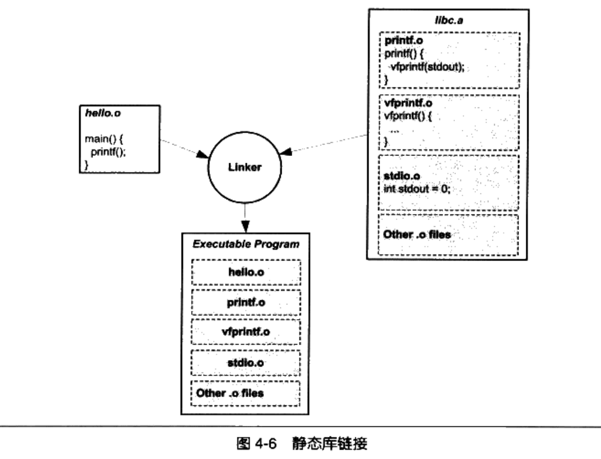
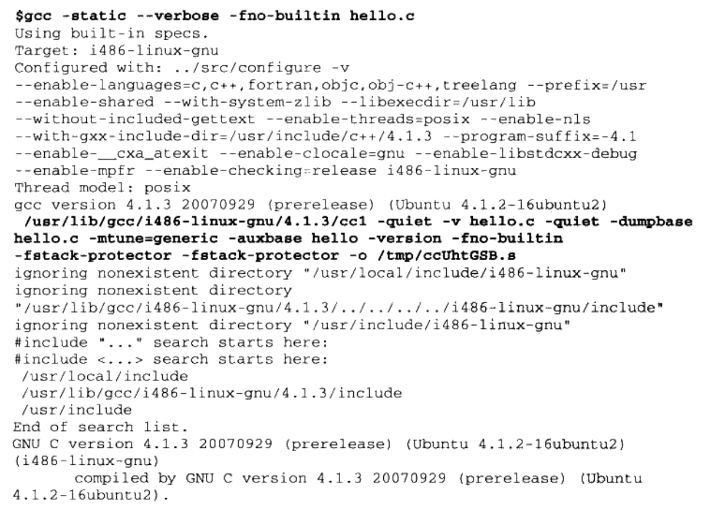
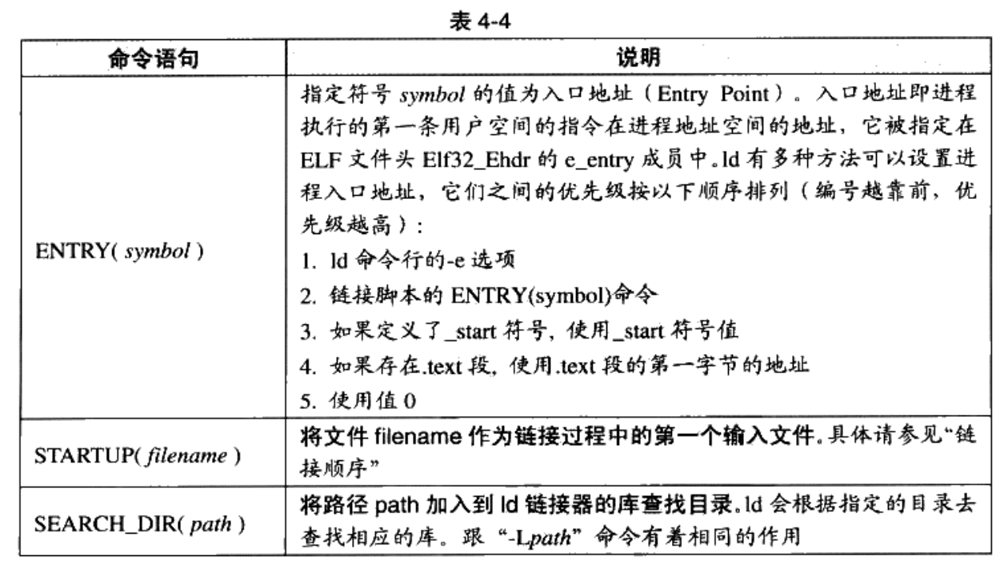

# Chapter4 静态链接

在第三章中我们分析了ELF文件格式，现在进一步讨论链接的核心：静态链接。以下面的a.c，b.c两个文件为例：

```C
/* a.c */
extern int shared;

int main(){
		int a=100;
		swap( &a, &shared );
}
```

```c
/* b.c */
int shared = 1;

void swap( int* a, int* b)
{
*a ^= *b ^= *a ^= *b;
}
```

先用gcc编译成目标文件：

```bash
$ gcc -c a.c b.c
```

b.c中有两个全局符号，分别是shared/swap;a.c中有一个全局符号main.a.c引用了b.c的swap和shared，然后要做的就是链接这两个目标文件为可执行文件ab

## 空间与地址分配

先考虑一个关键问题：对于多个输入目标文件，链接器如何把它们的各个段合并到输出文件，换言之，输出文件中的空间如何分配给输入文件。

### 按序叠加

最简单的叠加方案：


显然这个方案是不好的：因为这样分配的段太零散了，最终的可执行文件里可能会有成千上万个段。更重要的是，因为段有对齐要求，即使是一个字节的段也要在内存中占用4096字节，浪费了很大的空间，形成了大量内部碎片。

### 相似段合并

把相同性质的段合并在一起


??? note "可执行文件空间与虚拟地址空间"

    “链接器为目标文件分配地址和空间”这句话中的“地址和空间”其实有两个含义:第一个是在输出的可执行文件中的空间;第二个是在装载后的虚拟地址中的虚拟地址空间。对于有实际数据的段，比如“.text”和“.data”来说，它们在文件中和虚拟地址中都要分配空间，因为它们在这两者中都存在;而对于“.bss”这样的段来说，分配空间的意义只局限于虚拟地址空间，因为它在文件中并没有内容。事实上，我们在这里谈到的空间分配只关注于虚拟地址空间的分配，因为这个关系到链接器后面的关于地址计算的步骤，而可执行文件本身的空间分配与链接过程关系并不是很大。

---

现在链接器的空间分配策略基本上都是第二种。采用两步链接的方法。

- 第一步 空间与地址分配：扫描所有输入，获取各个段长度/属性/位置，收集所有符号定义和引用，放到全局符号表内。链接器能够算出合并后的段的长度和位置，然后建立映射关系。
- 第二步 符号解析与重定位：核心步骤，读取段数据/重定位信息，进行符号解析/重定位/调整代码地址等

用ld链接器做链接：

```bash
$ld a.o b.o -e main -o ab
```

> -e main表示把main作为程序入口，ld默认的入口是_start


??? note "VMA 和 LMA"

    VMA 表示 Virtual Memory Address,即虚拟地址，LMA 表示 Load Memory Address.即加载地址，正常情况下这两个值应该是一样的，但是在有些嵌入式系统中，特别是在那些程序放在 ROM的系统中时,LMA和VMA是不相同的。这里我们只要关注 VMA即可。

可以看到，在链接前，LMA还没有被分配，都是0，链接后，各个段都已经被分配到了对应的虚拟地址。根据Linux的进程虚拟地址空间分配规则，ELF默认从0x08048000开始分配。

### 符号地址的确定

在虚拟地址被计算出来的同时，各个符号的虚拟地址也就被确定了，因为各个符号在段内的相对位置是固定的。根据段的虚拟地址和符号在段内的偏移，就可以计算出符号的虚拟地址。



## 符号解析与重定位

### 重定位

先看在链接前a.o文件的符号被解析成什么值：


可以看到，shared作为变量被编译器暂时写为0，swap作为函数也被解析成在原地跳转。也就是说，编译器把符号解析和重定位的工作交给了链接器来做。



再看链接后的程序，main的两个重定位入口都已经被修正到了正确的位置。

### 重定位表

我们自然要问，链接器是怎么知道要调整哪些指令呢？以及这些指令的哪些部分需要调整，怎样调整？在ELF文件中，存在重定位表的结构专门存储重定位信息。它在ELF中往往是一个或多个段。

一个段往往有一个附属的重定位表，如：.text对应的重定位表（重定位段）是.rel.text。用objdump的-r参数可以看重定位表：

```bash
$ objdump -r a.o
```



每一个要被重定位的地方叫一个重定位入口。重定位入口的偏移用来定位它的位置对32位x86机器，重定位表是Elf32_Rel结构的数组，每一个元素对应一个入口。

```c
typedef struct {
		Elf32_Addr r_offset
		Elf32_Word r_info
}  Elf32_Rel;
```


### 符号解析

重定位过程也伴随着符号解析，当链接器要对某个符号的引用做重定位时，就要确定它的地址。方法是找由所有输入目标文件符号表组成的全局符号表。


### 指令修正方式

不同处理器的地址格式不同。x86的寻址模式多的令人发指。但是对于32bitx86机器的ELF文件重定位入口所修正指令寻址方式只有两种：

- 绝对近址32位寻址
- 相对近址32位寻址

每个被修正的位置的长度都是32位，4字节。而且都是近寻址不用考虑远地址寻址。所以x86的基本重定位类型如下：


## COMMON块

由于弱符号机制允许同一符号的定义存在多个文件中，所以会出现一个问题：多个弱符号定义的类型不同该怎么办？具体分为以下三个情况：

- 两个或两个以上的强符号类型不一致
- 一个强符号。其他都是弱符号，出现类型不一致
- 两个或以上弱符号类型不一致

第一种情况显然不用管，因为链接器会直接报符号多重定义错误。链接器只需要额外处理第二第三种情况。

目前的编译器和链接器都支持COMMON块机制。在之前的分析中，我们知道编译器把未初始化的全局变量定义作为弱符号。当另一个文件也定义了一个同样的符号，且未初始化，那么就会采用占用空间大的那个符号作为定义。

COMMON类型的链接规则是针对符号都是弱符号的情况，如果有一个是强符号，那么最终结果的符号空间和强符号一样。如果有弱符号大小比强符号大，那么ld链接器会报warning。

**COMMON块出现的需求本质上来自链接器不支持符号类型**。

我们自然会想到，当编译器把一个编译单元编译称目标文件时，如果包含了弱符号，那么该弱符号的大小在此时是未知的。所以编译器此时无法为弱符号在BSS段分配空间，但是链接器可以确定弱符号大小，故它可以在最终输出文件的BSS段为其分配空间。总体来看，未初始化的全局变量还是被放在BSS段的。

## 静态库链接

程序如何使用OS提供的API？一种语言的开发环境往往会附有语言对应的库，他们是对API的封装。本节只是简单地介绍静态库的链接过程。

一个静态库可以看成一组目标文件的集合。比如在Linux中，libc位于/usr/lib/libc.a；在Windows上，Visual C++附带多个版本的C/C++运行库。以libc为例，glibc是用C语言开发的，和输入输出相关的有printf.o/scanf.o；和文件操作相关的有fread.o/fweite.o；和时间日期相关的有date.o/time.o等等。由于零散的目标文件非常杂乱，人们用ar压缩程序把它们压缩成libc.a这个静态库文件。



下面用GCC的-verbose参数来展示整个编译链接过程：




关键部分已加粗。可以看到，先调用cc1把hello.c编译成.s文件，再调用汇编器as把.s文件汇编成.o文件，最后调用collect2程序来完成链接。关于collect2，可以简单地理解为是ld链接器的封装，后面会展开介绍。可以看到，在链接过程中至少包含了以下库和目标文件：

```
crt1.o			crti.o			crtbeginT.o			libgcc.a
libgcc_eh.a libc.a			crtend.o				crtn.o
```

## 链接过程控制

对于特殊程序，如OS Kernel/BIOS/Boot Loader/嵌入式系统等，它们受限于特殊条件，比如必须要制定输出文件的各个段虚拟地址/段名称/段存放顺序等。所以我们需要有控制链接过程的工具。

### 链接控制脚本

链接器提供了多种控制链接过程的方式，具体有三种方法：

- 命令行传递参数
- 把链接指令放在目标文件里，一般是编译器干的
- 使用链接控制脚本，最为灵活和强大

下面以ld链接器为例讲解。可以用命令：

```bash
$ ld -verbose
```

来查看ld默认的链接脚本。如果要指定自己写的脚本为链接控制脚本，可以用-T参数：

```bash
$ ld -T link.script
```

### 最“小”的程序

为了演示链接控制过程，需要做一个最小的helloworld程序。我们放弃调用C语言库，且不用main做入口，且不分段。源码如下：

```c
char* str = "Hello world!\n";

void print()
{
		asm( "movl $13,%%edx \n\t"
				"movl %0,%%ecx  \n\t"
				"movl $0,%%ebx. \n\t"
				"movl $4,%%eax. \n\t"
				::"r"(str):"edx","ecx","ebx");
}

void exit()
{
		asm( "movl $42,%ebx \n\t"
				"movl $1,%ezx. \n\t"
				"int $0x80		\n\t" );
}

void nomain()
{
		print();
		exit();
}
```

> 这里要调用 EXIT 结束进程是因为如果是普通程序，main()函数结束后控制权返回给系统库，由系统库负责调用 EXIT，退出进程。我们这里的 nomain()结束后系统控制权不会返回，可能会执行到 nomain()后面不正常的指令，最后导致进程异常退出。

### 使用ld链接脚本

简单来讲，控制链接过程无非是控制输入段如何变成输出段，具体来说就是哪些输入端要合并成一个输出段，哪些输入段要丢弃等。下面介绍TinyHelloWorld的链接脚本TinyHelloWorld.lds：

```
ENTRY(nomain)

SECTIONS
{
	. = 0x08048000 + SIZEOF_HEADERS;
	
	tinytext  : { *(.text) *(.data) *(.rodata) }
	
	/DISCARD/ : { *(.comment) }
}
```

- SECTIONS语句块内的第一行意思是把当前虚拟地址设置成 0x08048000 + SIZEOF_HEADERS，SIZEOF_HEADERS是输出文件的文件头大小。因为这条语句后面紧跟输出段tinytext，故其地址即为上面这个值。
- 第二行意思是所有输入文件中名字为.text/.data/.rodata的段都合并到tinytext段中
- 第三行意思是丢掉.comment段

> 可以用ld的-s选项来去掉符号表，得到的文件会更小

### ld链接脚本语法简介

链接脚本由语句组成，语句分为命令语句和赋值语句。链接脚本很像C语言：

- 语句之间用；作为分隔符
- 脚本语言的语句中可以使用C语言类似的表达式和运算符
- 可以用/* */作为注释。在脚本中用到的凡是包含；或其他分隔符的，必须要用引号引用起来

命令语句比较复杂。上面举例的链接脚本由两个命令语句ENTRY和SECTIONS组成。常见的命令语句如下：




剩下最重要和复杂的是SECTIONS命令。它的基本格式是：

```
SECTIONS
{
		...
		secname : { contents }
		...
}
```

> secname 表示输出段的段名，secname 后面必须有一个空格符，这样使得输出段名不会有歧义，后面紧跟着冒号和一对大括号。大括号里面的contents 描述了一套规则和条件，它表示符合这种条件的输入段将合并到这个输出段中。输出段名的命名方法必须符合输出文件格式的要求，比如，如果使用ld 生产一个 a.out 格式的文件，那么输出段名就不可以使用除“.text”、“.data”和“.bss”之外的任何名字，因为 a.out 格式规定段名只允许这三个名字。有一个特殊的段名叫“/DISCARD/”，如果使用这个名字作为输出段名，那么所有符合后面 contents 所规定的条件的段都将被丢弃，不输出到输出文件中。

后面比较重要的是contents规则，它包含若干个条件，以空格隔开，如果输入段符合这些条件中的任意一个则符合contents规则。条件写法如下：

```
filename(sections)
```

filename代表输入文件名，sections代表输入段名。举例说明：

- `file1.o(.data)` file1.o中的.data段符合条件
- `file1.o` 代表file1.o的所有段都符合条件
- `*(.data)` 代表所有输入文件的.data段符合条件
- `[a-z]*(.text*[A-Z])` 代表所有输入文件中以a到z开头的文件中所有段名以.text开头并且以A到Z结尾的段。

> 事实上，正则表达式的*/？/[]规则都可以用

## BFD库

各种的软硬件平台都有其独特的目标文件格式，就算格式相同如ELF在不同平台下都有不同变种。特别是对于GCC和binutils等跨平台工具来说，最好有统一的接口。

BFD库就是这样的一个GNU项目。它本身是binutils项目的子项目，把目标文件抽象成一个统一模型。使用BFD库的程序只要通过操作抽象后的文件模型就可以操作所有BFD支持的目标文件格式。

现在GCC都用BFD库来处理目标文件。一旦要支持一种新的目标文件格式，只需要在BFD库里加上这种格式即可。在ubuntu下，可使用命令：

```bash
sudo apt install binutils-dev
```

来安装BFD库。通过代码：

```c
#include <stdio.h>
#include "bfd.h"

int main()
{
    const char **t = bfd_target_list();
    while (*t)
    {
        printf("%s\n", *t);
        t++;
    }
    return 0;
}
```

可以获得BFD库可支持的所有格式：

```bash
gcc -o target target.c -lbfd
```

```bash
$ ./target
elf64-littleaarch64
elf64-bigaarch64
elf32-littleaarch64
elf32-bigaarch64
elf32-littlearm
elf32-bigarm
pei-aarch64-little
elf64-little
elf64-big
elf32-little
elf32-big
srec
symbolsrec
verilog
tekhex
binary
ihex
plugin
```

