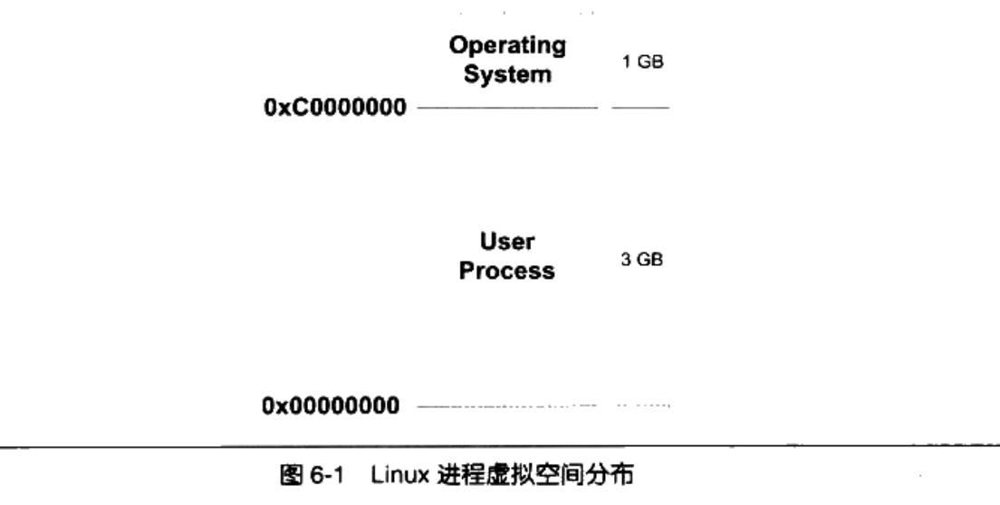
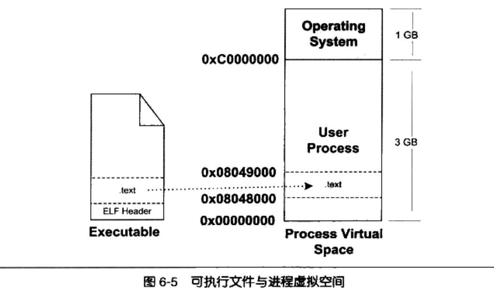
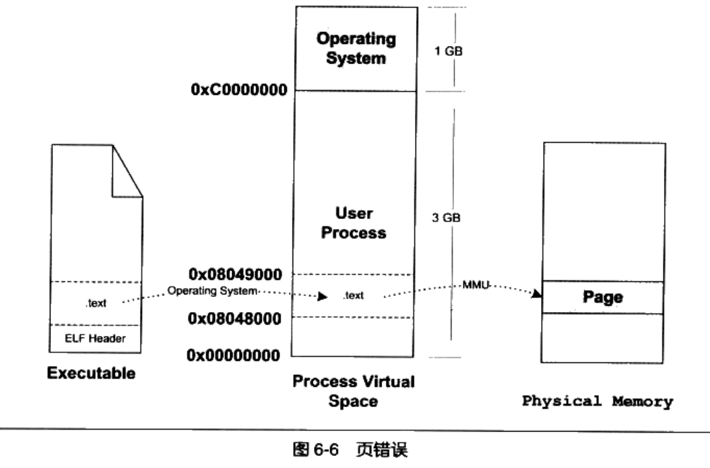
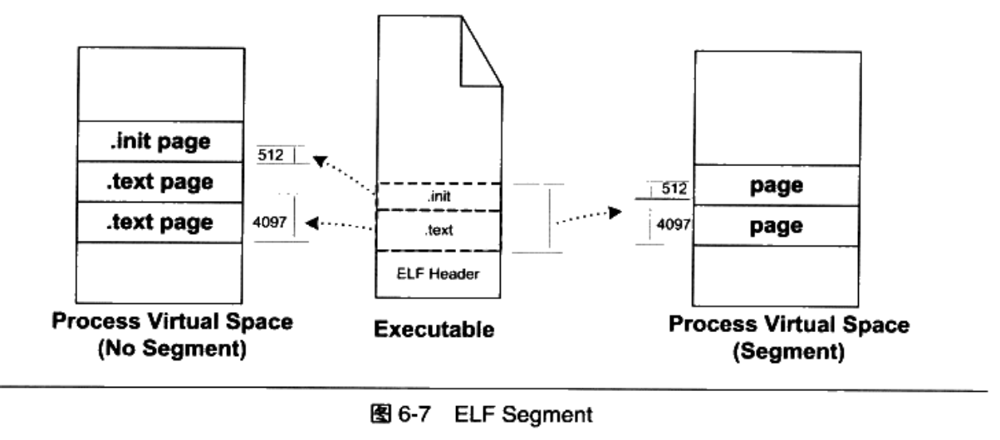
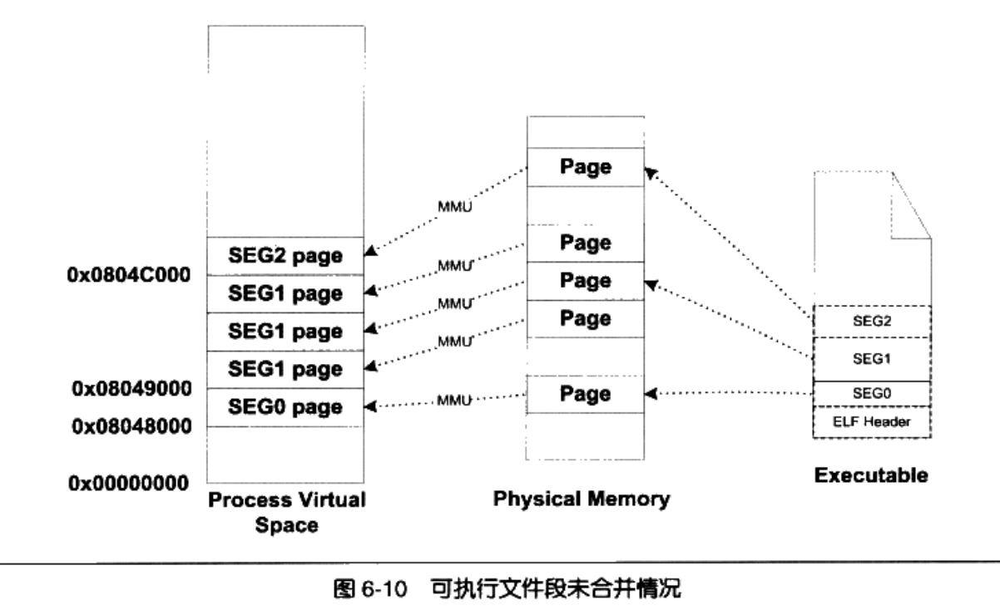
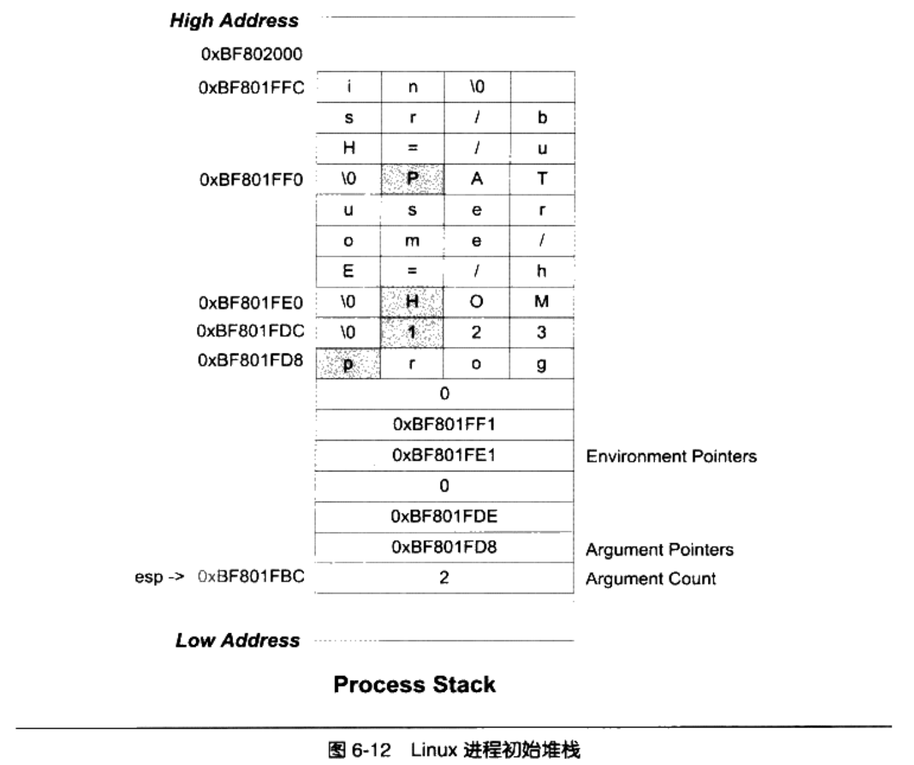

# Chapter6 可执行文件的装载与进程

本章介绍ELF文件在Linux下的装载过程。依次介绍进程虚拟地址空间/覆盖装载/页映射/进程虚拟地址空间的分布情况

## 进程虚拟地址空间

每个进程有自己独立的虚拟地址空间，它的大小由CPU位数决定。硬件决定地址空间的最大理论上限。即硬件的寻址空间大小，比如32位平台是4GB，64位是17179869184GB。下文以32位地址空间为主。

32位平台下的4G虚拟空间显然不是程序可以任意使用的，进程只能使用OS分配的地址。如果访问了未经允许的空间，OS会捕获并抛出错误，结束进程。Windows下是 “进程因非法操作需要关闭” ； Linux下则是 “Segmentation fault”。

32位下，Linux的OS空间分配是这样的：



现在的很多程序运行需要远大于3G的空间。一种解决方法是换成64位的机器，如果条件不允许，则在后面的PAE中介绍。

### PAE

Intel的Pentinum Pro CPU开始采用了36位物理地址，可以访问64G的物理内存。同时，Intel修改了页映射方式，让新的映射方式可以访问到更多物理内存，这个方式就是PAE（Physical Address Extension）。

对于程序来说，它还是只有32位的虚拟地址空间。OS会提供一个窗口映射的方法，把额外内存映射到进程地址空间中。比如把应用程序中0x10000000～0x20000000这256M的空间作为窗口。如果程序要使用高于4G的物理空间，可以把高于4G的物理空间分割成多个256M的小空间，用到哪个就把哪个的地址映射到这个窗口上。在Windows下这个方法是AWE，在Linux等类UNIX OS中，则使用`mmap()`系统调用实现。

## 装载的方式

根据程序的局部性原理，可以把程序最常用的部分留在内存，其他部分放在磁盘里，这就是动态装入的基本原理。 **覆盖装入（Overlay）** 和 **页映射（Paging）** 是两种典型的动态装载方法。

### 覆盖装入

过时的装载方式，在虚拟内存概念出来之前很常用。由开发人员挖掘内存潜力。使用覆盖管理器（Overlay Manager）来辅助管理。对于两个不会相互调用的模块AB来说，它们可以被这样安排：


更复杂一点，程序员需要手工把模块按调用依赖关系组织成树状结构。


- 从任何一个模块到根都叫调用路径。当该模块被调用时，整个调用路径上的模块必须都在内存中。
- 禁止跨树间调用。任意一个模块都不允许跨过树状结构调用。

### 页映射

随着虚拟存储机制的出现同步出现的机制。它把内存和所有磁盘数据和指令按页为单位划分， **所有装载和操作的单位就是页**。为了演示，假设在32位机器上有16KB的内存，每个页大小为4096B，那么一共有4个页。


假设程序大小为32K，共被分为8个页，编号为P0-P7，运行过程中的页映射关系可能如下：


OS根据不同的算法来管理装载过程。Windows和Linux都是这样完成和管理装载的。

## 从操作系统角度看可执行文件装载

本节从OS的角度上看可执行文件到底是如何被装载的。

### 进程的建立

从OS的角度上看，一个进程最关键的特征是它拥有独立的虚拟地址空间。最通常的情况下，创建进程并装载执行可执行文件只需要做：

- 创建独立的虚拟地址空间
- 读取可执行文件头，建立映射关系
- 把PC设置成可执行文件的入口地址

#### 创建独立虚拟地址空间

需要注意， **创建虚拟空间不是创建空间，而是创建映射函数所需要的相应的数据结构**。在x86的Linux下，只需要分配一个页目录即可，甚至不需要设置页映射关系。

#### 读取可执行文件头，建立映射关系

上一步是建立虚拟空间到物理内存的映射关系，这一步是虚拟空间和可执行文件的映射关系。当发生页错误时，OS会从物理内存中分配一个物理页，然后把缺页读到内存中，再设置缺页的虚拟页和物理页的映射关系。显然，当OS捕获到页错误时，它必须知道需要的页在可执行文件的位置，这就是虚拟空间和可执行文件的映射关系。最简单的映射关系见下图：



OS需要维护一个数据结构。Linux把虚拟空间的一个段叫VMA（Virtual Memory Area）；Windows中叫虚拟段（Virtual Section）。具体来说，在上面的例子里，OS会在进程相关的数据结构中设置一个有.text段的VMA：它在虚拟空间中的地址为0x08048000～0x08049000，对应ELF文件中偏移为0的.text，属性为只读等。

#### 把PC设置成可执行文件的入口地址

OS把控制权转交给进程，其中包括堆栈的切换/CPU运行权限的切换等，然后跳到可执行文件的入口地址（保存在ELF文件头中）

### 页错误

上面的步骤并没有实质地把指令和数据装到内存中。当CPU开始执行时，发现这个页面是个空页面，就会抛页错误，把控制权交给OS，OS通过第二步的数据结构找到空页面所在的VMA，计算出其在可执行文件中的偏移，然后在物理内存中分配一个物理页，建立映射关系后把控制权还给进程。



## 进程虚存空间分布

### ELF文件链接视图和执行视图

实际的ELF文件中往往有很多段，对每个段做映射的话，因为页有对齐机制，很可能会造成空间浪费。**OS并不在意页中的内容到底是什么，只在意段的权限**。所以可以把相同权限的段合并到一起来映射。段可能的权限如下：

- 以代码段为代表的权限为可读可执行的段
- 以数据段和BSS段为代表的权限为可读可写的段
- 以只读数据段为代表的权限为只读的段

合并后映射显然能减小空间占用：



ELF因此引入了“Segment”概念，一个“Segment”包含一个或者多个属性类似的“Section”。注意，必须严格区分“Section”和“Segment”，前者是从链接角度上看ELF文件的存储划分单位，后者是从装载角度上看ELF文件的划分单位。下面用代码举例说明：

```C
#include <stdlib.h>

int main(){
		while(1) {
				sleep(1000);
		}
		return 0;
}
```


ELF可执行文件中有专门的数据结构叫程序头表，用来保存Segment信息。（ELF目标文件没有）它的结构体如下：

```c
typedef structure {
		Elf32_Word p_type;
		Elf32_Off p_offset;
		Elf32_Addr p_vaddr;
		Elf32_Addr p_paddr;
		Elf32_Word p_filesz;
		Elf32_Word p_memsz;
		Elf32_Word p_flags;
		Elf32_Word p_align;
} Elf32_Phdr;
```


### 堆和栈

进程运行时所需的堆栈在进程的虚拟空间中的表现也是以VMA的形式存在的，一个进程中的堆和栈一般都有一个对应的VMA。在Linux下，可以看/proc下对应进程的虚拟空间分布


后三个Segment都不是由可执行文件映射出来的，叫做匿名虚拟内存区域。可以看到堆栈都在里面，大小分别为140K和88K。另一个匿名区域叫做vdso，它的地址已经位于内核空间，它是一个内核模块，进程可以通过访问这个VMA和内核做一些通信。

---

下面对进程虚拟空间VMA做小结：

- 代码 VMA，权限只读、可执行;有映像文件。
- 数据 VMA，权限可读写、可执行;有映像文件。
- 堆 VMA，权限可读写、可执行:无映像文件，匿名，可向上扩展
- 栈 VMA，权限可读写、不可执行;无映像文件，匿名，可向下扩展


### 段地址对齐

由于对齐机制的存在，ELF文件也必须尽量做出调整以减少内存浪费。假设一个ELF可执行文件由三个Segment组成。在文件中的偏移如下：


如果不做调整直接映射：




这样整个文件就占了5个页，空间利用率只有58.6%。一些UNIX系统采取了一种方法，让各个段接壤部分共享一个物理页面，然后把这个物理页映射两次：


这样就减少到了三个物理页面。

### 进程栈初始化

进程启动时需要知道进程的运行环境，如系统环境变量和进程运行参数。常见做法是OS把这些信息提前保存到栈中。假设系统有两个环境变量：

```bash
HOME=/home/user
PATH=/usr/bin
```

且运行程序的命令行是：

```bash
$ prog 123
```

那么初始化后的栈结构如下：



启动后，程序的库会把初始化信息传给`main()`，那就是argc,argv两个分数。

