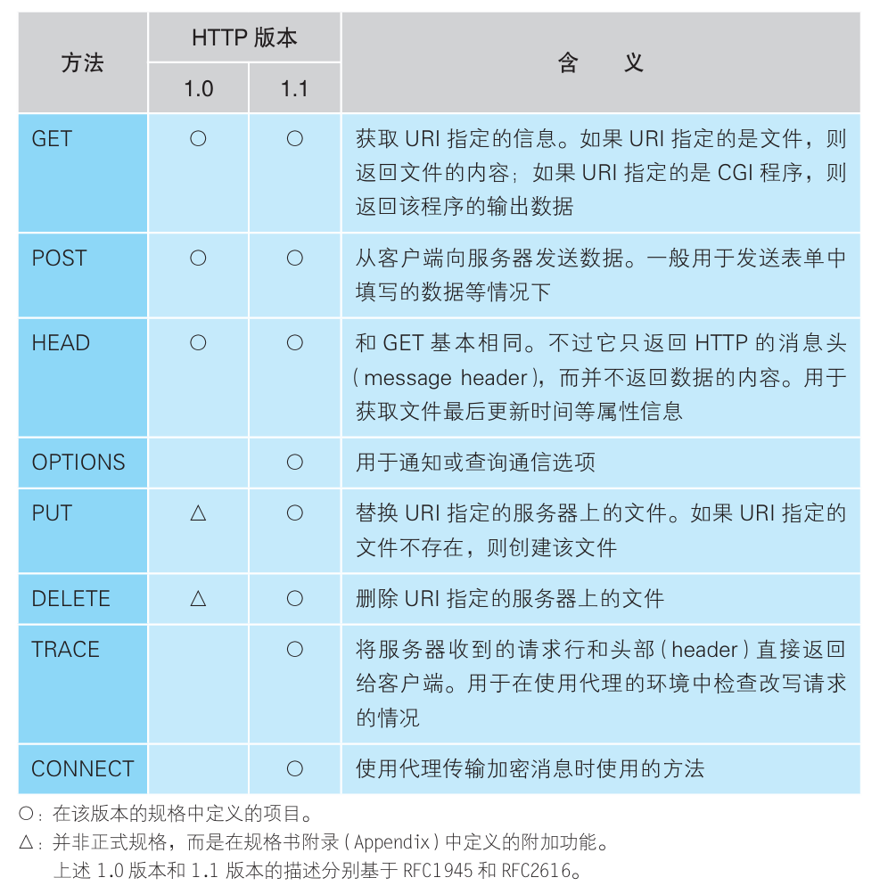
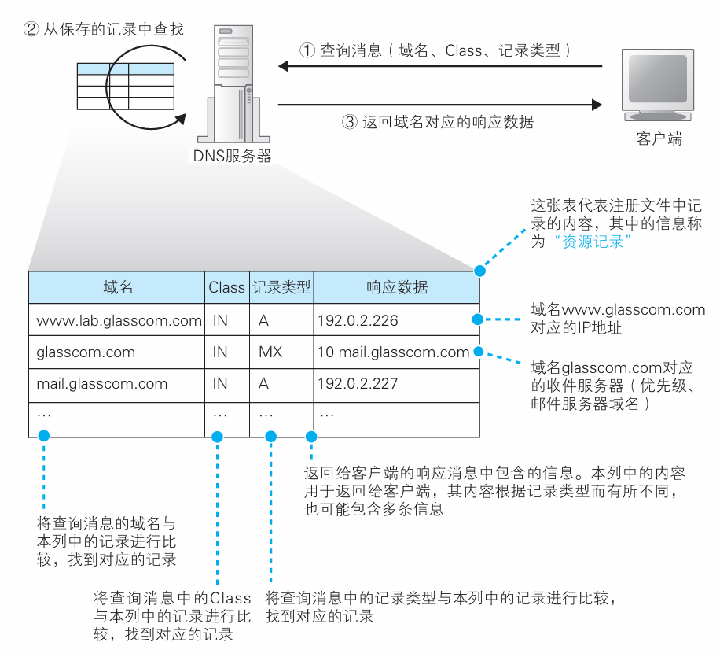

# Chapter1 浏览器生成消息

> 本章分为以下四个部分：
>
> 1. 生成HTTP请求消息
> 2. 向DNS服务器查询Web服务器的IP地址
> 3. 全世界DNS服务器的大接力
> 4. 委托协议栈发送消息

### 生成HTTP请求消息

#### 从输入网址开始

浏览器是一个具备多种客户端功能的综合性客户端软件。这体现在访问Web服务器时用http协议，访问FTP服务器时用ftp协议等等。

URL（Uniform Resource Locator，统一资源定位符）通常会包含服务器的域名、访问文件的路径名等，根据需要也会包含用户名、密码、服务器端口号等信息。

#### 浏览器解析URL

浏览器要做的第一步就是对URL进行解析，生成发送给服务器的请求消息。解析过程如图

当然，有时URL也会省略文件名，此时服务器会根据默认设置来处理这个请求。

#### HTTP的基本思路

HTTP协议定义了客户端和服务器之间交互的消息内容和步骤。请求中包含的内容是“对什么” “做什么操作”两部分。

“对什么”的部分称为URI（统一资源定标识符），它的内容一般是一个存放网页数据的文件名，也可以直接使用"http:"开头的URL作为URI.即URI可以写各种访问目标，这些目标统称为URI.

“做什么操作”的部分称为方法（常见的有GET和POST）。下面给出HTTP的主要方法：

收到请求后，Web服务器会解析其中内容，完成工作后返回响应消息，其开头有状态码，表示执行结果成功或错误

#### 生成HTTP请求

浏览器生成请求消息首先要生成请求行，判断采用哪种方法取决于浏览器的工作状态，如 若我们在地址栏输入网址、点击超链接都是采用的GET方法，而提交表单可能是GET也可能是POST，区别在于GET中的参数附加在URI中，而POST的参数在消息体里.

#### 收到响应

响应消息的第一行为状态码和响应短语：

浏览器在收到消息后会把数据提取出来显示在屏幕上，如果网页中包括图片，那么会在网页的相应位置嵌入标签等控制信息，浏览器会在屏幕上留出显示图片的空间，然后再次访问服务器拿到图片。

> 每个请求中只能写一个URI，所以每次只能获取一个文件

### 向DNS服务器查询Web服务器的IP地址

#### IP地址的基本知识

生成HTTP消息后，需要委托操作系统把消息发给服务器。在做这个操作前，我们需要查询服务器域名对应的IP地址，因为在委托操作系统发送消息时，我们要提供的不是域名而是IP地址。

大多内部局域网都是基于TCP/IP设计的，我们先来了解一下IP的基本思路：

对于IPv4来说，它是一串32bit的数字，每8bit为一组，分为4组，用十进制表示然后用圆点隔开，再加上子网掩码区分网络号和主机号，具体的表示方法如图：

> 子网掩码为1的部分表示网络号，为0的部分表示主机号
>
> 

> 其中，主机号的bit全为0或者全为1时表示两种特殊情况：
>
> - 全0：整个子网
> - 全1：向子网所有设备发送包，即广播

通常域名和IP地址是结合起来使用的，让人来使用域名，让路由器来使用IP地址。为了填补两者之间的障碍，需要有一个机制能够通过名称来查询IP地 址，或者通过IP地址来查询名称，这样就能够在人和机器双方都不做出牺 牲的前提下完美地解决问题。这个机制就是DNS（Domain Name System，域名服务系统）。

#### 通过Socket库查询IP地址

查询IP地址只需要把域名发给附近的DNS服务器即可，服务器会返回其IP地址。我们电脑上的DNS客户端部分称为DNS解析器，通过DNS查询IP地址的操作称为域名解析。解析器其实是一段程序，包含在操作系统的Socket库中。

> Socket库是用于调用网络功能的程序组件集合。

解析器的用法很简单，由于Socket库中的程序都是标准组件，所以 只要从应用程序中调用即可。用法如图：

#### 解析器内部原理

网络应用程序（浏览器）在调用解析器时，控制流就会转移到其内部。

在收到返回的IP地址后，解析器会把它写到指定的内存空间内。当然，当向DNS服务器发送消息时，我们当然也需要知道DNS服务器的IP地址，这个IP地址是事先设置好的，不需要再查询，不同操作系统的设置方法有差异。

### 全世界DNS服务器大接力

#### DNS服务器的基本工作

来自客户端的查询消息包含以下3种信息：

- 域名
- Class：识别网络信息，如今除了互联网没有其他网络，故其值永远为IN
- 记录类型：表示域名对应何种类型的记录，如当类型为A是表示域名对应的是IP地址；类型为MX时，表示域名对应的是邮件服务器。

#### 域名的层次结构

互联网中的服务器不计其数，所以一定会出现在DNS服务器中找不到要查询的信息的情况，解决方法是通过多台DNS服务器配合。DNS服务器中的所有信息都是按照域名以分层次的结构来保存的。DNS中的域名都是用句点分隔的，越右边的位置表示层级越高。

一个域的信息是作为一个整体存 放在DNS服务器中的，不能将一个域拆开来存放在多台DNS服务器中。 不过，DNS服务器和域之间的关系也并不总是一对一的，一台DNS服务器中也可以存放多个域的信息。

#### 寻找相应的DNS服务器

查找方法如下：首先，将负责管理下级域的DNS服务器的IP地址注 册到它们的上级DNS服务器中，然后上级DNS服务器的IP地址再注册到 更上一级的DNS服务器中，以此类推。这样，我们就可以通过上级DNS服务器查询出下级 DNS服务器的IP地址，也就可以向下级DNS服务器发送查询请求了。在互联网 中，com和cn的上面还有一级域，称为根域，我们可以从根域开始一路往下找到任意一个域的DNS服务器。

除此之外还需要完成另一项工作，那就是将根域的DNS服务器信息保 存在互联网中所有的DNS服务器中。这样一来，任何DNS服务器就都可 以找到并访问根域DNS服务器了。因此，客户端只要能够找到任意一台 DNS服务器，就可以通过它找到根域DNS服务器，然后再一路找到位于下层的某台目标DNS服务器

在真实的互联网中，一台DNS服务器可以管理多个域的信息，因此 并不是像上图这样每个域都有一台自己的DNS服务器。图中，每一个域旁边都写着一台DNS服务器，但现实中上级域和下级域有可能共享同一 台DNS服务器。在这种情况下，访问上级DNS服务器时就可以向下跳过 一级DNS服务器，直接返回再下一级DNS服务器的相关信息。

此外，有时候并不需要从最上级的根域开始查找，因为DNS服务器有一个缓存功能，可以记住之前查询过的域名。如果要查询的域名和相关信息已经在缓存中，那么就可以直接返回响应，接下来的查询可以从缓存的位置开 始向下进行。相比每次都从根域找起来说，缓存可以减少查询所需的时间。当然，缓存需要定期进行更新。

### 委托协议栈发送消息

#### 数据收发操作概览

委托协议栈发送数字信息需要调用多个Socket库中的程序组件。简单来说，收发 数据的两台计算机之间连接了一条数据通道，数据沿着这条通道流动，最终到达目的地。

当然，发送消息前还要创建管道。

综上所述，收发数据的操作大致可以总结为以下4个阶段：

- 创建套接字（创建套接字阶段）
- 将管道连接到服务器端的套接字上（连接阶段）
- 收发数据（通信阶段）
- 断开管道并删除套接字（断开阶段）

> 这4个操作都是由操作系统中的协议栈来执行的，浏览器等应用程序并不会自 己去做连接管道、放入数据这些工作，而是委托协议栈来代劳。本章将要介绍的只是这个“委托”的操作。关于协议栈收到委托之后具体是如何连接管道和放入数据的，我们将在第2章介绍。此外，这些委托的操作都是通过调用Socket库中的程序组件来执行的，但这些数据通信用的程序组件其实仅仅充当了一个桥梁的角色，并不执行任何实质性的操作，应用程序的委托内容最终会被原原本本地传递给协议栈。因此，我们无法形象地展示这些程序组件到底完成了怎样的工作，与其勉强强调Socket库的存在，还不如将Socket库和协议栈看成一个整体并讲解它们的整体行为让人更容易理解。

#### 创建套接字阶段

客户端创建套接字的操作非常简单，只要调用Socket 库中的socket程序组件就可以了。套接字创建完成后，协议栈会返回一个描述符，应用程序会将收到的描述符存放在内存中，描述符是用来识别不同的套接字的。

> 应用程序是通过“描述符”这一类似号码牌的东西来识别套接字的。

#### 连接阶段：把管道接上去

应用程序通过调用Socket库中的名为connect的程序组 件来完成这一操作。这里的要点是当调用connect时，需要指定描述符、 服务器IP地址和端口号这3个参数：

- 描述符，就是在创建套接字的时候由协议栈返回的那个描述符。
- 服务器IP地址，就是通过DNS服务器查询得到的我们要访问的服务器的IP地址。
- 端口号，连接操作的对象是某个具体的套接字，因此必须要识别到具体的套接字才行，而仅凭IP地址是无法做到这一点的。当同时指定IP地址和端口号时，就可以明确识别出某台具体的计算机上的某个具体的套接字。

> 如果说描述符是用来在一台计算机内部识别套接字的机制，那么端口号就是用来让通信的另一方能够识别出套接字的机制
>
> 事先作出规定：Web是80端口，电子邮件是25端口

连接成功后，协议栈会将对方的IP地址和端口号等信息保存在套接字中，这样我们就可以开始收发数据了。

#### 通信阶段：传递消息

只要将数据送入套接字，数据就会被发送到对方的套接字中。当然，应用程序无法直接控制 接字，因此还是要通过Socket库委托协议栈来完成这个操作。这个操作需要使用write这个程序组件。接收消息的操作是通过Socket 库中的read程序组件委托协议栈来完成的。

#### 断开阶段：收发数据结束

收发数据结束后，我们要调用close组件进入断开阶段，HTTP协议规定，当Web服务器发送完响应消息之后，应该主动执行断开操作，因此Web服务器会首先调用 close 来断开连接。断开操作传达到客户端之后，客户端的套接字也会进入断开阶段。接下来，当浏览器调用read执行接收数据操作时，read会告知浏览器收发数据操作已结束，连接已经断开。浏览器得知后，也会调用 close 进入断开阶段。

下面是收发消息整体过程示意图：

