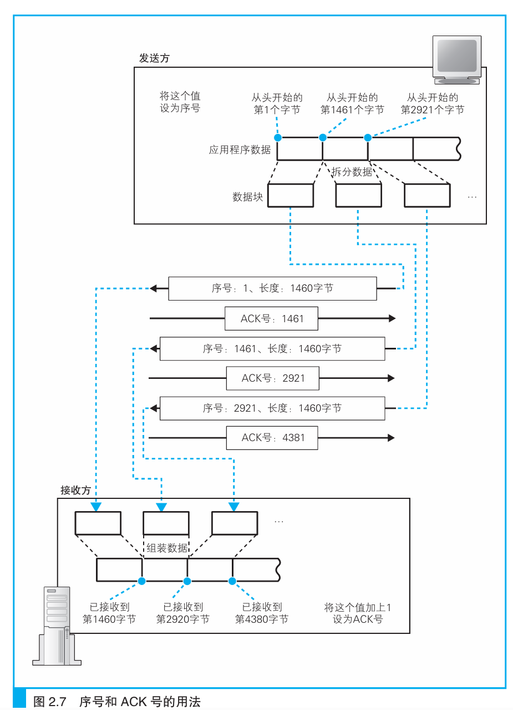
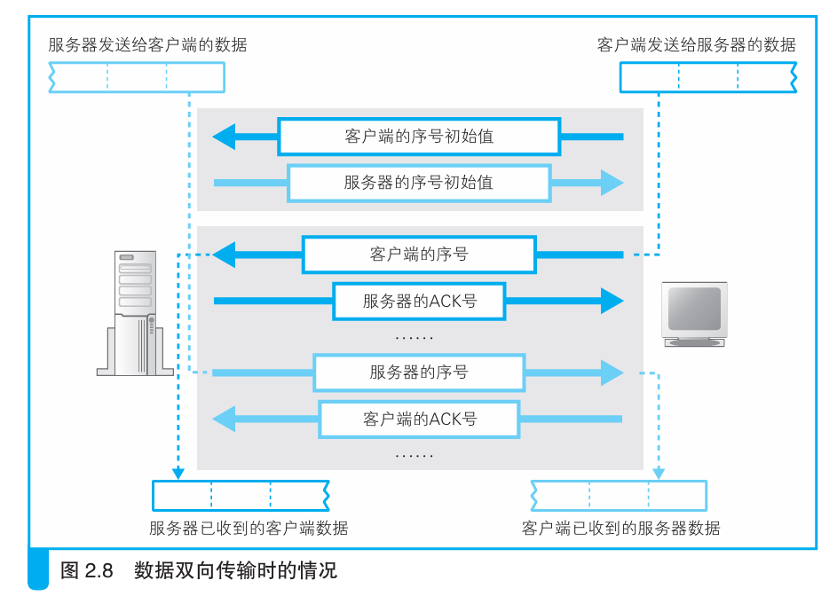
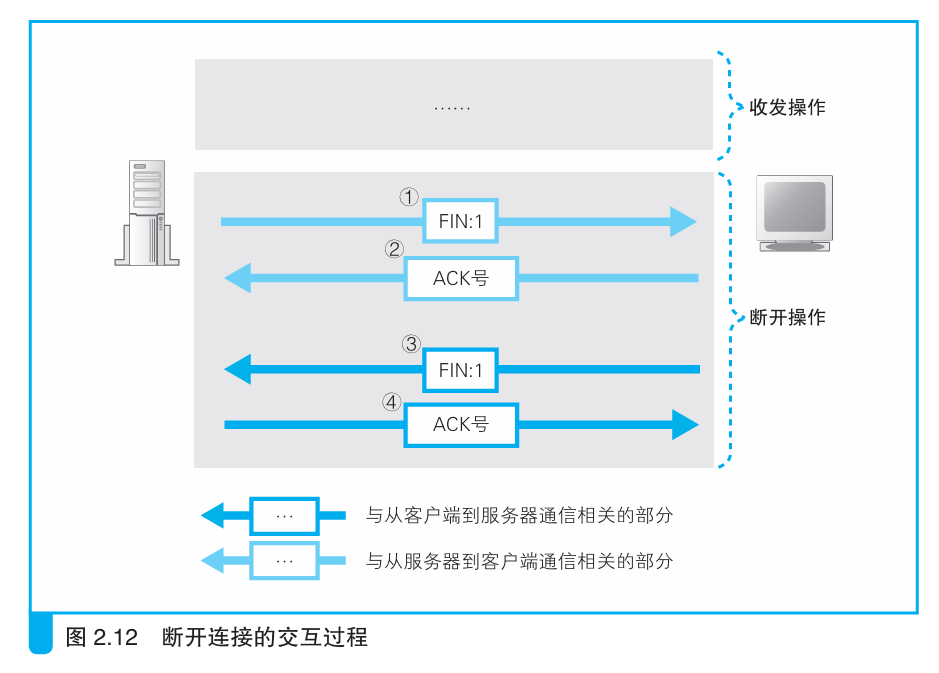
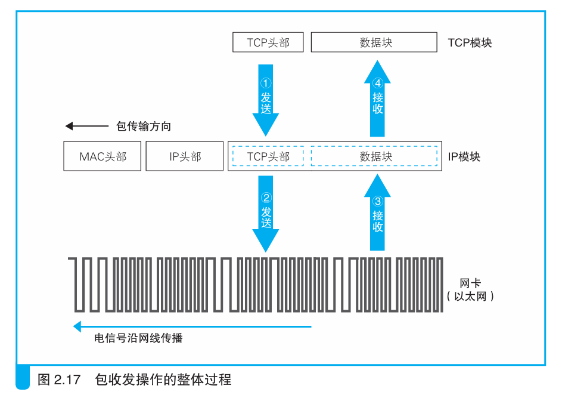
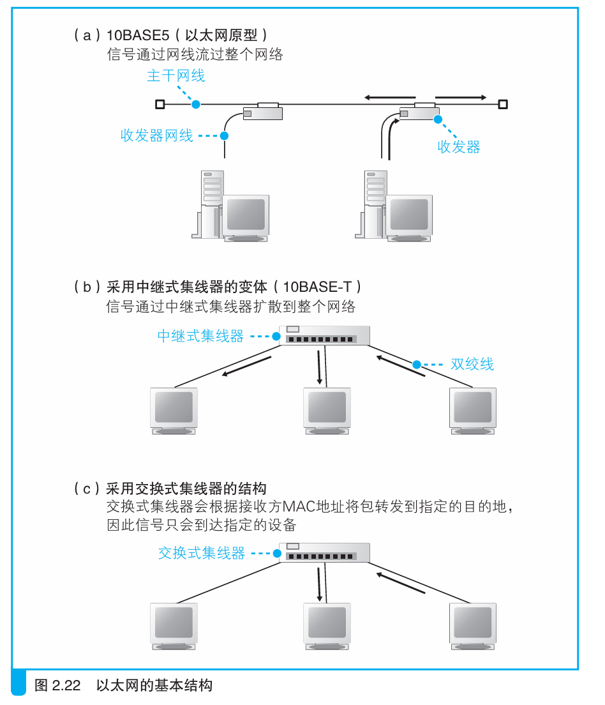

# Chapter2 用电信号传输TCP/IP数据

> 本章深入讲解协议栈、TCP/IP部分内容，分为以下六个部分：
>
> 1. 创建套接字
> 2. 连接服务器
> 3. 收发数据
> 4. 从服务器断开连接并删除套接字
> 5. IP与以太网的包收发操作
> 6. 用UDP协议收发数据的操作

### 创建套接字

本章主要探索操作系统中的网络控制软件（协议栈）和网络硬件（网卡）是如何将浏览器的消息发送给服务器的。结构如下：


> 浏览器、邮件等一般应用程序收发数据时用TCP；
>
> DNS查询等收发较短的控制数据时用UDP。

协议栈中的IP协议部分用于控制网络包收发操作。数据在互联网上以包的形式传送，将包发给通信对象的操作就是由IP负责的。IP中包括ICMP协议和ARP协议，前者用来告知网络包传送过程中产生的错误以及各种控制消息，ARP用于根据IP地址查询相应的以太网MAC地址。

在协议栈内部有一块用于存放控制信息的内存空间，这里记录了用于控制通信操作的控制信息，例如通信对象的IP地址、端口号、通信操作的进行状态等。一言以蔽之，**协议栈是根据套接字中记录的控制信息来工作的。**

在Windows中可以用netstat来显示套接字：


创建套接字时，首先分配一个套接字所需的内存空间，然后向其中写入初始状态，然后把这个套接字的描述符告知应用程序即可。

### 连接服务器

由于在创建套接字的时候并没有告知协议栈通信对象的IP地址和端口号，于是连接操作的目的之一就是把服务器的IP和端口号告知协议栈。

在服务器端，服务器也会创建空的套接字，等待客户端把自己的IP和端口号发给服务器端，于是客户端向服务器传达开始通信的请求也是连接的目的之一。

控制信息可分为两类，第一类是是客户端和服务器相互联络时交换的控制信息。这些内容都由TCP协议定义，每次通信都需要带上，也被称为包的头部，如图：


第二类是保存在套接字中，用来控制协议栈操作的信息。套接字的控制信息和协议栈的程序本身其实是一体的，因此，协议栈具体需要哪些信息会根据 协议栈本身的实现方式不同而不同。

#### 连接的实际过程

```
connect（< 描述符>, < 服务器IP地址和端口号>, …）
```

上面的调用提供了服务器的IP地址和端口号，这些信息会传递给协议栈中的TCP模块。然后，TCP模块会与该IP地址对应的对象，也就是与服务器的TCP模块交换控制信息，这一交互过程包括下面几个步骤：

- 客户端创建一个包含表示开始数据收发操作的控制信息的头部
- 将头部中的控制位的SYN比特设置为1,设置适当的序号和窗口大小
- TCP模块会将信息传递给IP模块并委托它进行发送
- 服务器找到对应的套接字之后，套接字中会写入相应的信息，并将状态改为正在连接，然后，服务器的TCP模块会返回响应，这个过程和客户端一样，需要在TCP头部中设置端口号以及SYN比特。此外，在返回响应时还需要将ACK控制位设为1，表示已经收到包。
- 网络包就会返回到客户端，通过IP模块到达TCP模块，并通过TCP头部的信息确认连接服务器的操作是否成功。如果SYN为1则表示连接成功，这时会向套接字中写入服务器的IP地址、端口号等信息，同时还会将状态改为连接完毕。
-  客户端也需要将ACK比特设置为1并发回服务器，告诉服务器刚才的响应包已经收到。

### 收发数据

#### 将HTTP请求交给协议栈

应用程序在调用write 时会指定发送数据的长度，在协议栈看来，要发送的数据就是一定长度的二进制字节序列。

协议栈会把数据放在发送缓存区中，等待应用程序的下一段数据。判断标准有以下几点：

- 每个网络包能容纳的数据长度。协议栈根据MTU（Maximum Transmission Unit,最大传输单元）来判断，即一个包的最大长度。由于MTU包含头部，所以需要从MTU减去头部长度得到一个包中的最大数据长度MSS（Maximum Segment Size，最大分段大小）。当收到的数据超过或者接近MSS时再发出去。
- 根据时间判断。即使缓冲区长度没有达到MSS，在达到一定时间也应该发出去。因此，协议栈内部有一个计时器来实现它

这两个判断标准其实是矛盾的，如果长度优先，那 么网络的效率会提高，但可能会因为等待填满缓冲区而产生延迟；相反地， 如果时间优先，那么延迟时间会变少，但又会降低网络的效率。由操作系统开发者来权衡。


#### 对较大数据做拆分

如果一个请求数据超过MSS长度，就需要被拆分。每一块数据前面都要加上TCP头部，然后交给IP模块。


#### 使用ACK号确认网络包已收到

TCP具备确认对方是否成功收到网络包，以及当对方没收到时进行重发的功能，因此在发送包之后，还需要进行确认。

TCP模块在拆分数据时， 会先算好每一块数据相当于从头开始的第几个字节，接下来在发送这一块数据时，将算好的字节数写在TCP头部中。



当然，第一个序号不能从1开始，而应该是一个随机值。这个初始序号是在SYN设为1的同时设置并告知对方的。当然数据收发是双向的，服务器也需要确认客户端的ACK。




如果双方确认出错，那么就重发这些错误的包。正因如此，网卡、集线器、路由器都没有错误补偿机制，如果检测到错误就丢包，补偿由TCP来做。

#### 根据网络包平均往返时间调整ACK号等待时间

实际上网络的错误检测和补偿机制非常复杂，比如返回ACK号的等待时间（即超时时间）。考虑以下情形：当网络传输繁忙时就会发生拥塞，ACK号的返回会变慢，这时必须将等待时间设置得稍微长一点，否则可能会发生已经重传了包之后， 前面的ACK号才来的情况。这样的重传是多余的，看上去只是多发一个包而已，但对于本来就很拥塞的网络来说无疑是雪上加霜。如果等待时间过长，那么包的重传就会出现很大的延迟，也会导致网络速度变慢。

因此，TCP采用了动态调整等待时间的方法，这个等待时间是根据ACK号返回所需的时间来判断的。具体来说，TCP会在发送数据的过程中持续测量ACK号的返回时间，如果ACK号返回变慢，则相应延长等待时间；相对地，如果ACK号马上就能返回，则相应缩短等待时间。

#### 使用窗口有效管理ACK号

如果在等待ACK的时候什么都不做，效率是极低的。于是TCP采用滑动窗口来管理数据发送和ACK号的操作。


下面是滑动窗口的具体工作方式。

接收方的TCP收到包后会先把数据存到缓冲区内，如果数据到达速度过快，那么可能会发生缓冲区溢出，于是，接收方需要告诉发送方自己最多能接收多少数据， 然后发送方根据这个值对数据发送操作进行控制，这就是滑动窗口方式的基本思路。


#### ACK 与窗口的合并

要提高收发数据的效率，还需要考虑返回ACK号和更新窗口的时机。

- 更新窗口大小的时机应该是接收方从缓冲区中取出数据传递给应用程序的时候。这个操作是接收方应用程序发出请求时才会进行的，而发送方不知道什么时候会进行这样的操作，因此当接收方将数据传递给应用程序，导致接收缓冲区剩余容量增加时，就需要告知发送方。
- 当接收方收到数据时，如果确认内容没有问题，就应该向发送方返回ACK号。

从这样的设计上来看，ACK号和窗口更新这两个包是分开发送的，网络效率低下。因此TCP采用了合并的方式处理，既可以把ACK和窗口更新的包合并，也可以把多个ACK合并，即发送最后一个ACK；还可以把多个窗口更新的包合并等等。

### 从服务器断开连接并删除套接字

协议栈在设计上允许任何一方先发起断开过程。无论哪种情况，完成数据发送的一方会发起断开过程，以服务器一方发起断开过程为例来进行讲解。首先，服务器一方的应用程序会调用Socket 库的close 程序。然后，服务器的协议栈会生成包含断开信息 的TCP头部，具体来说就是将控制位中的FIN比特设为1。接下来，协议栈会委托IP模块向客户端发送数据。 同时，服务器的套接字中也会记录下断开操作的相关信息。

然后，客户端会返回ACK号表示已经收到。同理，客户端也会发一个FIN为1的包，服务器发回ACK号。



>  为了防止误操作，一般会等待一段时间后再删除这个套接字

下面总结TCP的整体流程：


### IP与以太网的包收发操作

#### 包的基本知识

包由头部和数据组成，头部是控制信息，数据就是包的内容。包在互联网中经过多次转发最终到达接收方。转发设备有路由器、集线器，它们有不同的分工。路由器根据目标地址判断下一个路由器位置，是按照IP协议工作的；集线器在子网中把包传给下一个路由，是按以太网协议工作的。

具体地说，TCP/IP包含以下两个头部：

- MAC头部（用于以太网协议）
- IP头部（用于IP协议）

IP协议和以太网协议是分开工作的，实际上，局域网、ADSL、FTTH都可以和IP协议配合，这种分工架构让互联网能够稳定运行。配合示意图如下：


#### 包收发操作概览

包收发操作的起点是TCP模块委托IP模块发送包的操作。这个委托的过程就是TCP模块在数据块的前面加上TCP 头部，然后整个传递给IP模块。

收到委托后，IP模块会将包的内容当作一整块数据，在前面加上包含控制信息的头部。 模块负责添加如下两个头部。 

- MAC 头部：以太网用的头部，包含MAC地址 

- IP 头部：IP用的头部，包含IP地址 

封装好的包会被交给网络硬件，统称为网卡。传递给网卡的网络包是由一连串0和1组成的数字信息，网卡会将这些数字信息转换为电信号或光信号，并通过网线（或光纤）发送出去，然后这些信号就会到达集线 器、路由器等转发设备，再由转发设备一步一步地送达接收方。



#### 生成包含接收方IP地址的IP头部

IP模块接受TCP模块的委托 负责包的收发工作，它会生成IP头部并附加在TCP头部前面。IP头部的“接收方IP地址”填写通信对象的IP地址。 发送方IP地址需要判断发送所使用的网卡，并填写该网卡的IP地址。具体过程见路由表：


通过路由表我们可以判断出应该使用哪块网卡来发送包了，然后就可以在IP头部的发送方IP地址中填上这块网卡对应的IP地址。

接下来还需要填写协议号， 如果是TCP模块委托的内容，则设置为0x06， 如果是UDP模块委托的内容，则设置为0x17

#### 生成以太网用的MAC头部

MAC头部包含发送方和接收方的MAC地址等信息。MAC地址是48bit长的，具体的MAC头部包含的内容如下：


> IP 模块根据路由表Gateway栏的内容判断应该把包发送给谁

#### 通过ARP查询目标路由器的MAC地址

我们需要使用ARP（Address Resolution Protocol，地址解析协议）来查询MAC地址。以太网中有广播的方法，可以把包发给连接在同一以太网中的所有设备。ARP就利用广播寻找对应IP地址的MAC地址。


实际上ARP使用了缓存技术来减少ARP包的数量。

#### 以太网的基本知识



尽管以太网经历了数次变迁，但其基本的3个性质至今仍未改变，即

- 将包发送到MAC头部的接收方MAC地址代表的目的地
- 用发送方MAC 地址识别发送方
- 用以太类型识别包的内容。

因此，可以认为具备这 3 个性质的网络就是以太网。

#### 将 IP 包转换成电或光信号发送出去

把数字信息转换成电光信号是网卡驱动和网卡做的事情。其结构如下：


网卡的ROM中保存着全世界唯一的MAC地址，这是在生产网卡时写入的。网卡中保存的MAC地址会由网卡驱动程序读取并分配给MAC模块。

#### 再加3个控制数据

网卡里的MAC模块会将包从缓冲区中取出，并在开头加上报头和起始帧分界符，在末尾加上用于检测错误的帧校验序列。


报头是一串像10101010…这样1和0交替出现的比特序列，长度为56比特，它的作用是确定包的读取时机。


一般使用时钟去读取信号：


这里的重点在于如何判断时钟信号的变化周期。只要对信号进行一段时间的观察，就可以找到其变化的周期。因此，我们不能一开始就发送包的数据，而是要在前面加上一段用来测量时钟信号的 特殊信号，这就是报头的作用。

末尾的FCS（帧校验序列）用来检查包传输过程中因噪声导致的波形紊乱、数据错误，它是一串32比特的序列，是通过一个公式对包中从头到尾的所有内容进行计算而得出来的。它和磁盘等设备中使用的CRC错误校验码是同一种东西，当原始数据中某一个比特发生变化时，计算出来的结果就会发生变化。

#### 向集线器发送网络包

发送信号的操作分为两种，一种是使用集线器的半双工模式，另一种是使用交换机的全双工模式。

> 发送和接收同时并行的方式叫作“全双工”，相对地，某一时刻只能进行 发送或接收其中一种操作的叫作“半双工”。

在半双工模式中，为了避免信号碰撞，首先要判断网线中是否存在其 他设备发送的信号。如果有，则需要等待该信号传输完毕，因为如果在有信号时再发送一组信号，两组信号就会发生碰撞。

空闲后，MAC模块从报头开始将数字信息按每个比特转换成电信号，然后由PHY， 或MAU的信号收发模块发送出去。将数字信息转换为电信号的速率就是网络的传输速率。

> PHY（Physical Layer Device，物理层装置）
>
> MAU（Medium Attachment Unit，介质连接单元）

接下来，PHY（MAU）模块会将信号转换为可在网线上传输的格式， 并通过网线发送出去。可以认为PHY（MAU）模块的功能就是对MAC模块产生的信号进行格式转换，转换为可在网线上传输的格式。

一言以蔽之，网卡的MAC模块生成通用信号，然后由PHY（MAU）模块转换 成可在网线中传输的格式，并通过网线发送出去。

> PHY模块还需要检测接受线路中是否有信号进来，避免碰撞

#### 接收返回包

在使用集线器的半双工模式以太网中，一台设备发送的信号会到达连接在集线器上的所有设备。这意味着所有信号都会通过接收线路传进来，因此接收操作的第一步就是把这些信号全都收进来。

信号的开头是报头，通过报头的波形同步时钟，然后遇到起始帧分界符时开始将后面的信号转换成数字信息。这个操作和发送时是相反的，即 PHY（MAU）模块先开始工作，然后再轮到MAC模块。首先，PHY （MAU）模块会将信号转换成通用格式并发送给MAC模块，MAC模块再从头开始将信号转换为数字信息，并存放到缓冲区中。当到达信号的末尾时，还需要检查FCS。具体来说，就是将从包开头到结尾的所有比特套用 到公式中计算出FCS，然后和包末尾的FCS进行对比，正常情况下两者应该是一致的，如果中途受到噪声干扰而导致波形发生紊乱，则两者的值会产生差异，这时这个包就会被当作错误包而被丢弃。

如果FCS校验没有问题，接下来就要看一下MAC头部中接收方 MAC地址与网卡在初始化时分配给自己的MAC地址是否一致，不是则丢弃，是则存入缓存区，接下来网卡会通知计算机收到了一个包。

通知的方式是中断。当网卡发起中断时，网卡驱动会从网卡的缓冲区中取出收到的包， 并通过MAC头部中的以太类型字段判断协议的类型，然后将包交给对应的协议栈。

#### 将服务器的响应包从IP传递给TCP

Web服务器返回的包的以太类型应该是0800，因此网卡驱动会将其交给TCP/IP协议栈来进行处理。接下来就轮到IP模块，第 一步是检查IP头部，确认格式是否正确。如果格式没有问题，下一步就是查看接收方IP地址，若和客户端网卡地址一致则接收。

若不匹配，则IP模块通过ICMP消息把错误告知发送方。


由于包在互联网传输时会被分片，根据包的ID和分片偏移量，IP模块根据这些信息，在所有分片全部收到之后，就可以将它们还原成原始的包，这个操作叫作分片重组。

接下来包会被交给TCP模块。TCP 模块会根据IP头部中的接收方和发送方IP地址，以及TCP头部中的接收 方和发送方端口号来查找对应的套接字。

### 用UDP协议收发数据的操作

在某种情况下，即便没有TCP这样复杂的机制，我们也能够高效地重发数据，这种情况就是数据很短，用一个包就能装得下。比如DNS。

还有一个场景会使用UDP，就是发送音视频。音频和视频数据必须在规定的时间内送达，一旦送晚了，就会错过播放时机， 导致声音和图像卡顿。这就是平时所说丢包的来源。

