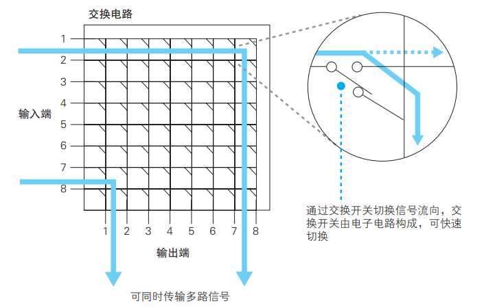
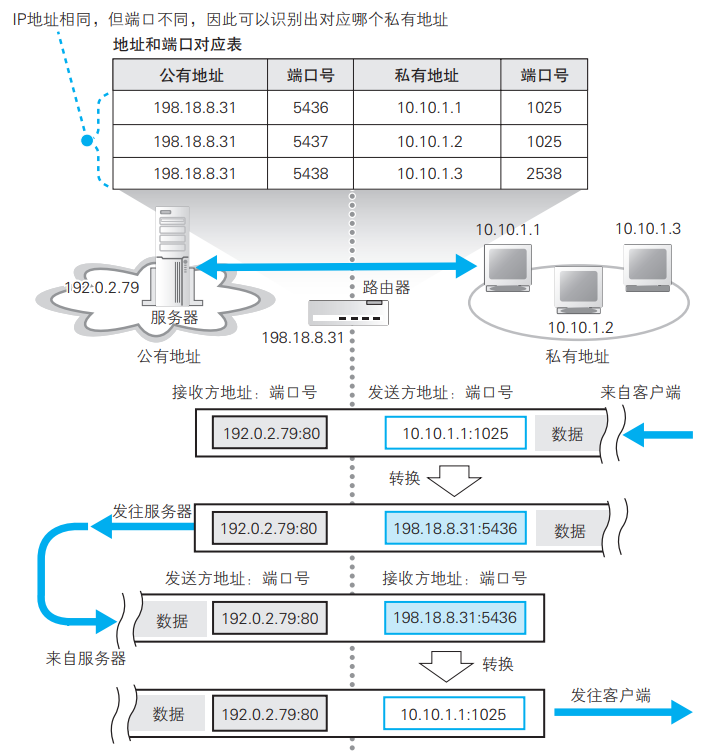

# Chapter3 从网线到网络设备

> 接着第二章，数据被各种协议栈封装成包后由网卡发出，在第三章中，主要分为：
>
> 1. 信号在网线和集线器中传输
> 2. 交换机的包转发
> 3. 路由器的包转发
> 4. 路由器的附加功能

### 信号在网线和集线器中传输

集线器的最根本功能就是把包转发给所有连接在上面的设备。提高传输过程中信号的稳定性，即减小被干扰的概率是集线器工作的重难点。

#### 具体工作原理

信号先从网卡的PHY模块出来，通过RJ-45接口进入双绞线，再通过集线器的RJ-45模块接收，再进入集线器的PHY模块，经集线器的中继器 部分转发到所有连接的设备上

> 一个集线器中有多个PHY模块和与之对应的RJ-45接口，但一张网卡只有一个PHY模块和一个RJ-45接口，中继电路部分直接连接了所有的PHY模块
>
> Tip:由于是中继电路实现的，所以当同时有两个信号传入集线器，会发生信号碰撞而使其无法正常工作（类似半双工）

其中，PHY模块和RJ-45接口的连接有两种模式，一是MDI，即直连接法，信号线无交叉，一是MDI-X，即交叉接法。一般来说，发送信号的一方（可以是计算机，也可以是集线器）采用MDI，接收的一方（一般是集线器）采用MDI-X接法。

#### 双绞线减少噪声和失真

1. 外源性噪声

一般指由其他设备发出的电磁波碰到网线后激发的电流。如果把正负两根导线纽起来，激发产生的电流方向相反，在每一个小节内能够相互抵消，极大减少了外源性噪声

2. 内源性噪声

指和网线相邻的信号线中产生的电磁波对信号线的干扰，解决的方法是让扭绞间隔产生差距，即改变每一对双扭线的节距，这样也可以减小噪声

> 即使广播出的信号发生失真，也会在接收设备将它转换成数字信息后做FCS校验发现错误后丢弃，然后TCP会检测到丢包，并对这个包做重传，所以集线器本身不需要做任何错误校验机制，只需要尽自己所能降低出错概率即可

### 交换机的包转发

#### 工作原理

先展示交换机的内部结构

信号从RJ-45进入，经过MAC模块转成数字信号后做FCS校验，校验通过则存入内存。这部分操作和网卡很像，可以理解成每个端口后相当于一块网卡，但交换机本身没有MAC地址，不像网卡那样只接收目标地址为自己的MAC地址的信号，而是接受所有信号

交换机核心的工作是通过MAC地址表把信号转发到对应端口。比如这个包中的MAC地址为`00-60-97-A5-43-3C`,那么就通过交换电路发到端口2中，交换电路的实现如下：

通过交换电路从输出端口发出时，同样要遵守以太网规则，确认没有其他设备在发送信号，避免信号碰撞

> 前提是终端通过集线器连接到交换机，即半双工。但现在基本不用集线器，而是直接用交换机把终端和路由器连起来，而交换机本身有全双工的工作模式，就不需要进行上述操作避免信号碰撞了
>
> Tips:
>
> 1. 当发送包的源端口和包上的目标端口一致时，交换机会丢掉这个包（这种情况往往是计算机A向计算机B发包，二者又通过同一个集线器连接后，这个集线器再连接到交换机，这样如果交换机发回这个包，根据集线器的广播机制，B会收到两个重复包，所以需要丢弃）
> 2. 当地址表中查不到MAC地址时（第一次向这个地址发或者这个地址被删了），交换机会向除源端口外的所有端口发包
> 3. 当目标地址是广播地址`FF:FF:FF:FF:FF:FF`时，交换机会向除源端口外的所有端口发包

#### MAC表维护

增：收到包时，把发送方的MAC地址和接收这个包的端口号记录到表上

删：删除一段时间不使用的记录即可，下次收到这个设备发来的包时会再添加，所以不会产生问题

#### 全双工模式

> 由于信号碰撞只可能出现在集线器（而双绞线、MAC/PHY模块本身是独立的，不会发生碰撞，且交换机的出现使集线器可以不被使用），所以以太网规范被进行了修订：增加了无论网络中有无信号都可以发送的工作模式，并停用碰撞检测， 这就是全双工模式

**自动协商**

用来自动切换工作模式，以达到最大的传输速率

根据以太网规则，当没有数据传输时，网络中会填充脉冲信号，来检测对方是否正常工作。自动协商机制就利用了这个脉冲信号，通过具体的不同的信号形式，告诉对方自己支持的工作模式和传输速率

在交换机转发包的时候，基本都是端口对端口的传输机制，所以其他端口处于空闲状态。也就是说可以同时执行多个转发操作，比集线器的效率明显要高

### 路由器的包转发

> 从交换机发送到路由器开始，就不再是基于以太网，而是基于IP的了

#### 内部结构

路由器的内部结构：

> 其实通过三种网络设备的对比可以看到，它们的结构无非就是端口加表而已，因为它们的功能也仅仅是简单的转发

对于路由器来说，转发模块就像协议栈的IP模块，端口模块就相当于网卡。整体的工作思路是：根据传入的网络类型的规范通过对应的端口硬件把包收进来，然后转发模块会根据包的IP地址查表后把包转发到对应端口，根据发出的网络类型的规范把包发出去。

> Tip:路由器的每个端口都有它的MAC地址和IP地址（这和交换机完全不同），这代表路由器在收包和发包的时候，其本身就承担着接收者和发送方的角色，而不像交换机那样，只做转发工作

路由表的工作：

路由器只匹配网络号，不匹配主机号，所以在目标地址栏中的主机号都是0

但注意到也有些地址，它们本身的子网掩码和路由表中的子网掩码不同，这就涉及到**路由聚合**的问题

举例来说明：

有三个子网10.10.1.0/24 10.10.2.0/24 10.10.3.0/24，这三个子网都连接路由器A，现在从路由器B连接路由器A。对于路由器B来说，如果逐一记录，需要三条。而如果把它们合并成10.10.0.0/16，则只用记录一条，并在A路由器处能正常分开，这就是路由聚合

上表中还有一个现象，就是子网掩码为32'b1，这可以代表一台具体的计算机而不是子网

网关和接口：

它们是网络包的转发目标，即匹配到记录后把包发到这个网关的这个接口（等价于端口）

跃点数：

距离目标IP的距离，越小越近

#### 工作原理与过程

1. 包接收：根据端口的网络协议来接收包，以以太网为例，PHY和MAC模块把电信号转换成数字信号，再做FCS校验，失败则丢包，成功再检查MAC头部中的MAC地址，匹配则接收，否则丢弃
2. 查路由表确定输出端口：包接收后，路由器就会丢弃MAC头部，然后根据IP头部进行匹配。此时可能会匹配到多条记录，路由器会优先匹配网络号比特数最长的一条（最精确），当同时有长度相同的记录时，再比较跃点数，优先匹配跃点数小的记录。如果找不到记录，路由器会丢掉这个包，同时发ICMP消息
3. 设置默认路由：通过把子网掩码设成0.0.0.0来实现，任何一个网络包都可以匹配这条记录
4. TTL:包的有效期，每经过一个路由器减一，减为零时被丢弃，防止死循环
5. 分片：包的大小超过输出端口的MTU时，就需要分片。与TCP的分片不同，对于IP来说，源数据包括了TCP头部和数据，所以IP会把它们都看作数据处理进行分片，跟分好片的包加上IP头部和MAC头部
6. 包发送：根据输出端口类型（**接入网**类型）来发包，假设输出端口为以太网，那么通过网关的IP地址（如果网关为空，则为目标IP），利用ARP查询对应的MAC地址，把它和发送端口的MAC地址填写到MAC头部中，再加上以太类型字段0x0800，就可以发送了

#### 路由器和交换机的关系

IP协议本身没有传输数据的功能，本质上，是把IP协议包装到以太网包的数据部分中，也就是加上MAC头部，委托以太网来传输数据。一言以蔽之，路由器把包的传输工作委托给交换机进行。当然，更广义的层面上，网络类型当然不止以太网一种，其他比如无线局域网等都可以在这里把以太网替换掉。那么这个问题就可以被抽象总结成：IP委托各种通信技术把包传输到下一个路由器。

### 路由器的附加功能

#### 地址转换

由于互联网的发展，会出现IP地址不够分配的现象。但在某些情况下，如两家公司AB的内网之间根本不会有包的流动，所以在这个范围内的地址重复是不会存在问题的，这就是地址转换的由来，它用来解决地址不足的问题。

> 内网地址叫私有地址，原来的固定地址叫公有地址
>
> 私有地址范围：
>
> 10.0.0.0 ~ 10.255.255.255
> 172.16.0.0 ~ 172.31.255.255
> 192.168.0.0 ~ 192.168.255.255

但是还有的问题是公司内网有时也需要和互联网交互，这就要求公司把内网分为开放的部分和内部设备，这个划分的机制就是地址转换

基本原理：在转发包时修改IP头部的IP地址和端口号

举例：

> 改写端口号是为了节省公有地址

#### 包过滤

原理很简单，就是根据MAC头部、IP头部、TCP头部，按照事先设置的规则来判断转发或丢弃，一般用来实现防火墙。

但难点在如何设置一套规则，来排除非法入侵的访问（后面服务器章节会提到）

