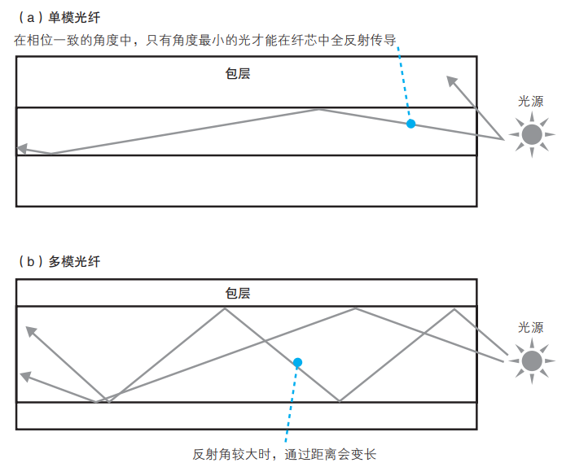
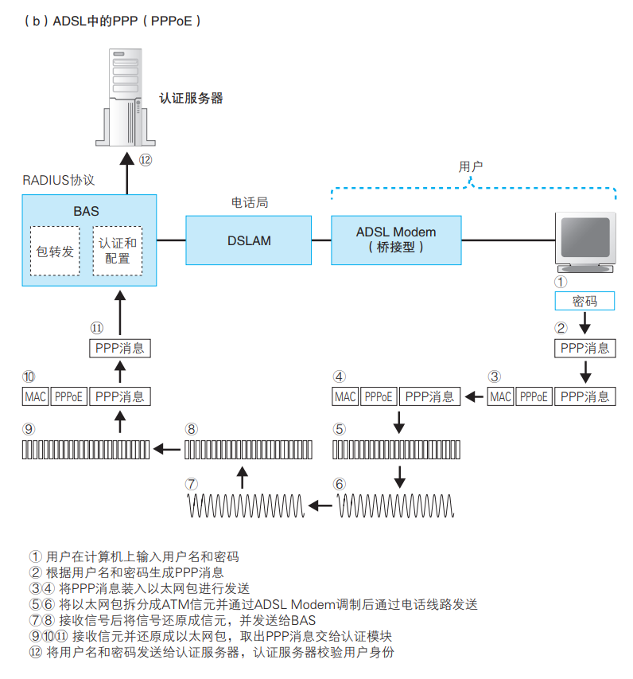
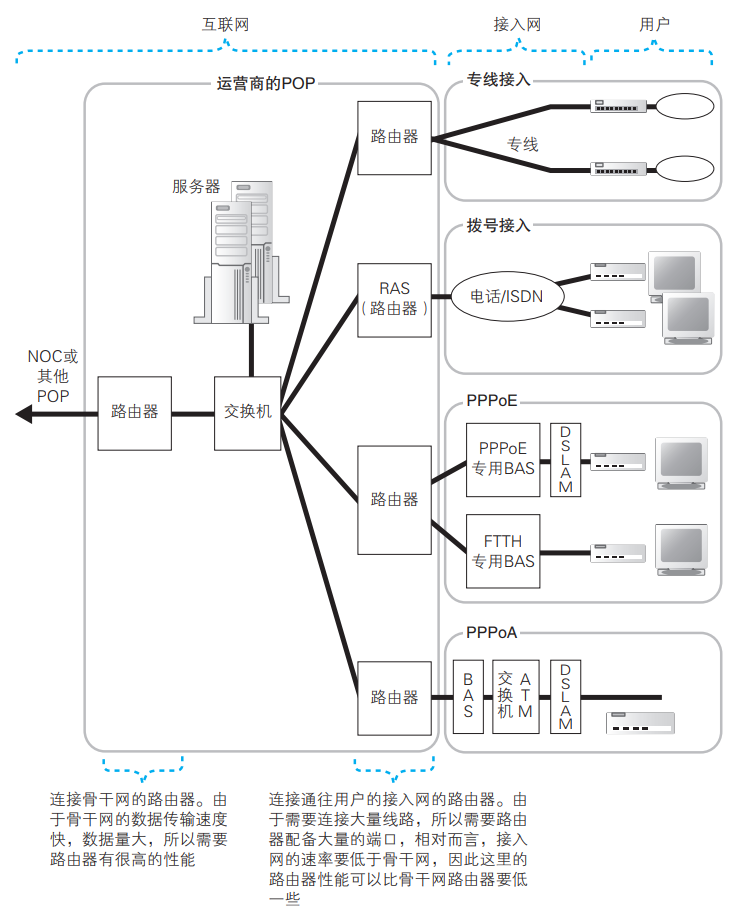

# Chapter4 通过接入网进入互联网内部

> 本章一般在传统计算机网络里不常提到，所以仅作简单了解，内容还是非常重要的，主要分为：
>
> 1. ADSL接入网结构和工作方式
> 2. 光纤接入网（FTTH）
> 3. 接入网中使用的PPP和隧道
> 4. 网络运营商的内部
> 5. 跨越运营商的包
>

### ADSL接入网结构和工作方式

> 距离的不同与路由维护方式的不同，是互联网和家庭公司网络之间最大的不同

接入网结构（PPPoE模式）：

互联网接入路由器会在网络包前面加上MAC头部、PPPoE头部、PPP头部，然后发送给ADSL Modem(调制解调器)

网络包转变形态的过程：

ADSL(Asymmetric Digital Subscriber Line)，不对称数字用户线，是一种利用架设在电线杆上的金属电话线通信的技术，上下行方向的通信速率不对称

#### ADSL Modem

1. 把包拆成信元

信元：很小的数据库，开头有五个字节的头部，后面是48字节的数据

把包拆成信元的历史原因是运营商对ATM技术的支持（Asynchronous Transfer Mode,异步传输），用信元传输数据比较容易和其他设备整合。

2. 把信元调制成电信号

前面以太网的模数转换采用的是方波信号，但容易失真，且不好控制噪声。ADSL Modem采用正弦波进行调制，结合了振幅调制（ASK）和相位调制（PSK），即使用正交振幅调制（QAM）技术。

简单地说，ASK用振幅大小表示01，PSK用不同的相位表示01，QAM同时使用了振幅和相位，可以表达更多比特的数据

> 当然，如果ASK设置了四档振幅，就可以表示两个比特的数据，以此类推

3. 同时使用多个波提高传输速率

通过把不同频率的波整合在一起传输，可以极大提高传输速率（因为可以用滤波器滤出来特定频段的波）

在ADSL中，频段之间的间隔为4.3125kHz，即每个波占用了4.3125kHz的带宽。也正是这个特点使得上下行传输速率产生了差别（因为上下行用到的频段范围有差别），根据噪声等条件的不同，每个波表示的比特数都是可变的，因为下行使用的高频段信号容易衰减且更容易受到噪声干扰，它们只能表示较少的比特数

#### 分离器

发出侧：作用只是把ADSL信号和电话的语音信号混合起来一起从电话线发出去

接收侧：负责把电话和ADSL信号分离，过滤掉ADSL使用的高频信号

> Tip:分离器也可以防止电话对ADSL信号产生干扰，因为电话机拿起和放下听筒会影响传输方式，从而产生噪声

#### 从用户到电话局

从分离器出来以后，就会进入室内电话线，再到整栋楼的配线盘，进入电线杆上架设的电话电缆。传输过程中，电缆会转入地下，最终到达电话局

在防噪声干扰上面，电话线在受到干扰时并不会像双绞线一样立即造成错误，只有和噪声频率相同的信号才会受到影响，而这会导致速率下降

#### 通过DSLAM到达BAS

信号到达电话局后，会经过配线盘、分离器到达DSLAM(DSL Access Multiplexer，可以理解为整合了多路ADSL Modem的设备)。然后，DSLAM把信号转换成信元。从DSLAM出来后，再到达BAS进行包转发，把收到的包前面的MAC头部和PPPoE头部丢弃，取出PPP头部和后面的数据，再加上隧道专用头部，发给隧道出口。最后，包到达隧道专用路由器，路由器把隧道头部去掉，把IP包取出转发到互联网内部。至此，接入网的全部工作就做完了

> 关于ADSL Modem和DSLAM的区别
>
> 用户端的ADSL Modem是有以太网接口的，可以和用户端的路由器和计算机交互，收发以太网包，但是DSLAM一般不用以太网接口，而是用ATM接口，和后方路由器收发数据时用的是原始包拆分后的ATM信元形式

### 光纤接入网（FTTH)

另一种接入网类型

#### 光纤的通信原理

光纤结构：

由双层的纤维状透明材质构成，用过里面的纤芯传导光信号，进而传输数字信息

信号转换：

先把数字信号转换成电信号，1用高电压表示，0用低电压表示，再把电信号输入到光源产生光信号

#### 单模与多模

> 这一部分是非常细节的光纤传导原理，我基本用图来表示，也不深究，仅作了解

只有少数按照特定角度入射以保持相位一致的，入射角度小的光线才能在光纤中持续传导

> 这个角度非常关键，直接影响到纤芯的直径设计，光纤也因此根据纤芯的直径分为单模光纤（8-10微米）和多模光纤（50微米或62.5微米）

一言以蔽之，单模和多模实际上表示相位一致的角度有一个还是多个

特性与不同：

多模光纤可以传导多条光线，对光源和光敏元件的要求低，但失真率较高；单模光纤则相反

且正因如此，单模光纤的最大长度要比多模光纤更长，FTTH一般使用单模光纤

波形失真示意图：

#### 光纤分路

FTTH有两种方式，直连和分路

直连：一根光纤直接连接用户和运营商的BAS，用户端的光纤收发器把以太网电信号转换成光信号后发出，服务端接收后再发回回应。由于是在同一条光纤上进行的发送的接收，有可能产生碰撞，此时采用的方法是上下行信号采用不同波长的光，混合后再用棱镜原理分离（波分复用）

分路：在用户附近的电线杆上加分光器，实现一条光纤对应多个用户的功能，提高利用率，降低成本。分路状态下用户端就不用光纤收发器了，而是改用ONU（Optical Network Unit,光网络单元，也实现把电信号转换成光信号的功能），ONU和运营商的BAS前的OLT（Optical Line Terminal,光线路终端）配合实现避免信号碰撞的问题。OLT调整信号发送时机，并向ONU下发指令，ONU根据OLT的指令发数据。接收数据时，包前面加上识别ONU的信息，分光器会把信号发给所有ONU，ONU根据识别信息选择接收或丢弃。ONU接收后，转换成以太网信号。

### 接入网中使用的PPP和隧道

> 最核心的一部分，完整讲述了接入网的机制

先讲讲之前提到的BAS，它本质上也是一种路由器，由接入网连接，随着接入网的发展，这种路由器也在不断进化，进化后就被称作BAS

在拨号上网的年代，需要经过用户认证后才能被分配一个IP，进而上网。BAS就是登录的窗口，用PPPoE实现这个功能（Point-to-Point Protocol over Ethernet，基于以太网的PPP协议），提到这里，下面开始介绍PPP的工作方式

#### PPP协议

PPP拨号连接操作：

用户先向运营商的接入点拨号，连接后输入用户名密码，用户名密码再通过RADIUS协议从RAS发送到认证服务器，认证成功后下发TCP/IP配置信息，用户的计算机根据这个配置参数即可

> 接入互联网就意味着必须给计算机分配一个公有的IP地址，这个地址与接入点有关，不同接入点具有不同的IP地址

ADSL和FTTH的接入方式也需要分配公有地址，但是由于是通过电缆/光纤连接，无需验证身份。但通过用户名可以快速切换运营商，因此ADSL和FTTH一般也采用PPP协议。但是，ADSL和FTTH下的PPP协议均有不同，下面是PPP协议在不同接入网下的具体传输消息过程：

具体的工作方式上面的图都讲的非常清楚，PPP协议用了HDLC协议作为容器存储PPP消息，ADSL和FTTH则用了以太网包代替了HDLC作为容器，正因为这样的替代不可以直接进行，所以产生了新的PPP规格——PPPoE

#### 通过隧道把网络包发给运营商

在BAS和运营商路由器之间的ADSL/FTTH接入服务商的网络中建立一条隧道，就可以形成一条从用户一直到运营商路由器的通道，包可以之间从接入网一直传输到运营商的路由器

书里介绍了两种隧道实现方式，一种就是TCP连接，另一种是基于封装的连接：

#### 接入网的整体工作过程

先回忆一下上面讲到的接入网结构

首先，用户端的互联网接入路由器要配置运营商分配的用户名和密码。然后接入路由器会根据PPPoE的发现机制来找BAS（和ARP一样，用广播实现，返回BAS的MAC地址）

接着，进行用户认证和下发配置阶段。把用户名和密码发给BAS有加密（CHAP）和不加密（PAP）两种方法，校验密码后，BAS会向用户下发配置信息（IP地址、DNS服务器IP地址、默认网关的IP地址），路由器会根据这些信息配置自身参数，就可以把包转发到互联网了。

然后，当客户端发包时，互联网接入路由器转发包（发出按照PPPoE规则），转发时包会加上三个头部，MAC/PPPoE/PPP，MAC头部里面的接收方地址会填充BAS的MAC地址（由发现机制查到的），发送方地址会填充接入路由器的BAS端口的MAC地址，以太类型为0x8864（代表PPPoE）。PPPoE和PPP头部内容如下：

到达BAS后，BAS会丢掉MAC头部和PPPoE头部，保留后面部分通过隧道发到运营商的路由器上

#### 其他方式

1. PPPoA：基于ATM的PPP，取消了所有头部，把PPP消息切分成信元传输，相比PPPoE来说效率会高（因为MTU大）

2. DHCP：能够解决PPP协议中ADSL Modem和路由器无法分离的问题。全名叫做动态主机配置协议，它没有用户名和密码，直接传输以太网包，也不需要加额外头部，经常用于下发TCP/IP配置信息

### 网络运营商的内部

#### POP和NOC

包从用户通过接入网到达网络运营商的路由器，是接入网的终点，同时也是互联网的入口

互联网的实体是由多个运营商网络连接而成的，ADSL/FTTH等接入网是和用户签约的运营商设备相连的，这些设备称为POP（Point of Presence，接入点），也就是互联网的入口

> 互联网内部概览：

> POP内部概览：

NOC（Network Operation Center，网络运行中心）是运营商的核心设备，但其实NOC和POP没有严格界定，NOC里也可以配备连接接入网的路由器，很多情况下是和POP公用的，可以简单理解成NOC是扩大后的POP

### 跨越运营商的网络包

#### 运营商之间的连接

1. 客户端与服务器在一个运营商下，那么POP路由器的表中会有对应的转发目标，直接一步一步转发到服务器即可
2. 不在同一个运营商下，包会被先发给对方的运营商路由器（在路由表中有记录，这个记录的过程是路由交换，下面会讲到），然后再进一步发到服务器

总之，包在互联网中总是可以通过转发到达目的地

#### 运营商之间的路由交换

基本思路就是让运营商间相连的路由器相互告知信息，因为只要获得了对方的路由信息，就等于获得了对方路由器连接的所有网络

当然，路由交换也有多种类型，包括转接和对等（都基于BGP机制，边界网关协议），详情见图：

#### IX（Internet eXchange，互联网交换中心）

IX的核心是具有大量高速以太网端口的二层交换机，具体工作如下（以图来展示）：

