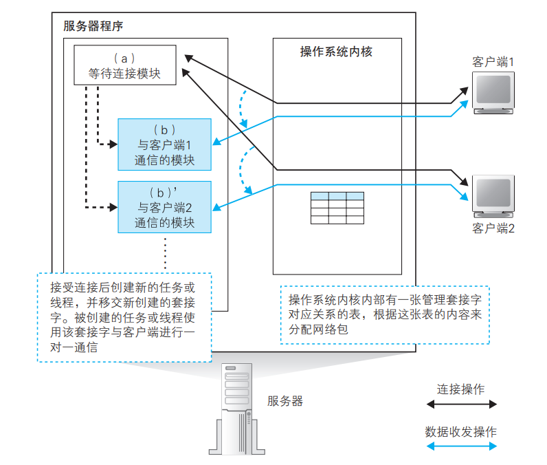
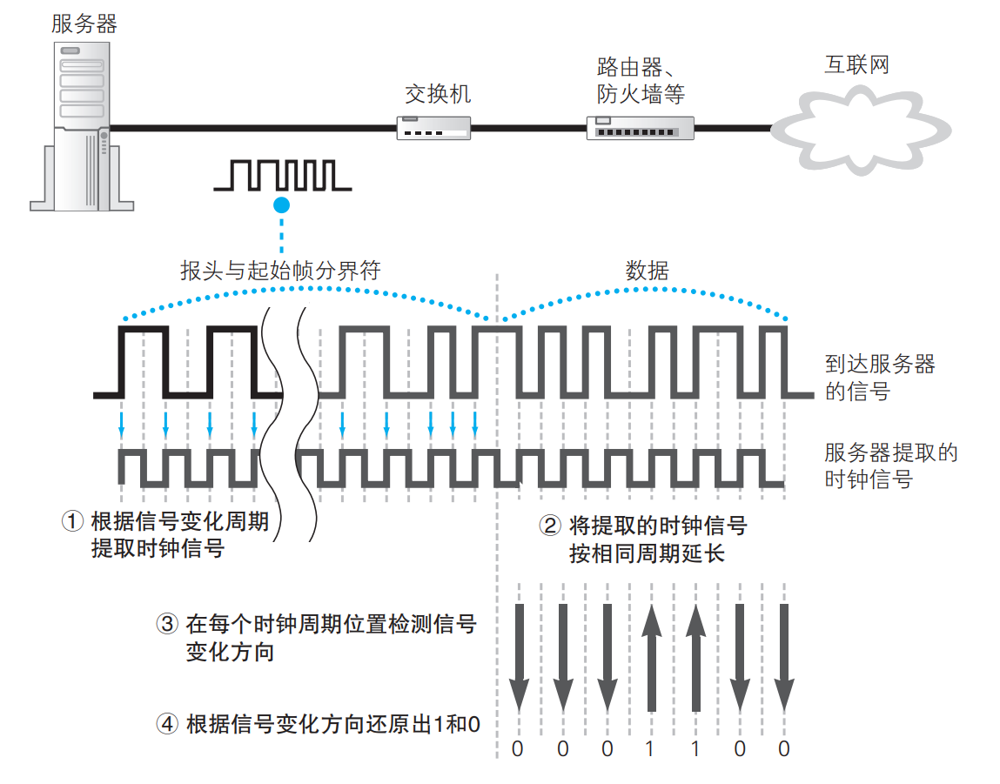

# Chapter6 Web服务器响应请求

> 上一讲探索了Web服务器前的内容，这一章将进入Web服务器，了解服务器响应请求的具体机制，主要分为：
>
> 1. 服务器概览
> 2. 服务器协议栈的接受操作
> 3. 服务器程序解释请求消息并相应
> 4. 浏览器接收响应并显示内容

## 服务器概览

### 客户端和服务器的区别

显然，服务器的硬件和操作系统和客户端是不同的，但是网络相关的网卡、协议栈、Socket库等功能和客户端并无二致。但是它们的用法上还是有区别的，比如服务器端调用Socket库的组件是等待连接所用的，而客户端调用Socket库的组件是发起连接所用的。此外，服务器的程序可以和多台客户端计算机通信，这也能说明二者的结构是不同的。

### 服务器程序结构

服务器需要同时和多个客户端通信，因此需要把握每一个客户端的操作状态。一般的做法是，每有一个客户端进来，就启动一个新的服务器程序，保证服务器程序和客户端一对一。

程序可以大致分成两个模块，**等待连接模块** 和 **与客户端通信模块**。在服务器程序启动并读取配置文件完成初始化后，就会运行等待连接模块，它会创建套接字，然后进入等待连接的暂停状态。当客户端发起连接时，这个模块会恢复运行并接收连接，然后启动客户端通信模块，移交完成连接的套接字。

这么做，可以保证服务器程序和客户端是一对一关系，每个通信模块只需要关心与其连接的客户端即可，降低程序编写难度。这也可以体现出服务器操作系统具有多任务、多线程功能，可以同时运行多个程序。

当然，这种方法也有缺点，就是启动新程序的过程比较耗时，响应时间也会增加。还有一种改进的方式是事先启动多个通信模块，当客户端发起连接时从中选一个出来，把套接字移交给它。

### 服务器端的套接字和端口号

#### 套接字创建与连接

下面介绍服务器端调用Socket库的过程，先看客户端和服务器端调用Socket库过程的区别：

- 客户端：

  1. 创建套接字（创建套接字阶段）

  2. 用管道连接服务器端的套接字（连接阶段）

  3. 收发数据（收发阶段）

  4. 断开管道并删除套接字（断开阶段）

- 服务器端：

  1. 创建套接字（创建套接字阶段）

  2. 将套接字设置为等待连接状态（等待连接阶段）

  3. 接受连接（接受连接阶段）

  4. 收发数据（收发阶段）

  5. 断开管道并删除套接字（断开阶段）

具体过程如下：

1. 调用socket创建套接字
2. 调用bind把端口号写入套接字
3. 调用listen向套接字写入控制信息：**等待连接状态**
4. 调用accept 接受连接
5. 收到后，协议栈给等待连接的套接字复制一个副本，把连接对象等控制信息写入新的套接字中
6. 启动客户端通信模块，把连接好的新套接字转交给通信模块

自然我们会想到，既然协议栈复制了一个新的套接字副本，并把它转交，那么原来那个套接字怎么办？它还会以等待连接的状态存在，当再次调用accept，当收到新请求时，再创建一个副本并转交。这么想好像这个操作没什么必要，但是反过来想，如果没有这个操作，直接把原来的套接字转交，那么会出现一个空挡，这个时间段内没有套接字在等待连接，那么在这一段时间内发进来的请求就会遇到问题。

#### 如何区别端口号相同的套接字

协议栈如果只看TCP头部的端口号是无法区分要把包交给哪个套接字的，一共要用四种信息来判断：

1. 客户端IP地址
2. 客户端端口号
3. 服务器端IP地址
4. 服务器端端口号

既然能用这四个信息来精确判断出套接字，为什么还需要套接字描述符？原因有两点：

1. 等待连接的套接字中没有客户端的IP地址和端口号
2. 使用描述符比较简单

## 服务器的接收操作

### 网卡将接收到的信号转换成数字信息

局域网传输的网络包信号是由数字信息和时钟信号叠加产生的，只要分离出时钟信号，然后根据时钟信号同步，就可以读取并还原出数字信息了。信号格式会随传输速率的不同而不同，下面介绍10BASE-T的工作方式：

还原出的数字信息结构如下：

然后根据帧校验序列(FCS)来校验错误（在以太网中用CRC-32计算）。然后再检查MAC头部的MAC地址，如果是自己的则接收，不是自己的就丢弃。还原后的数字信息被存到网卡的缓冲区，上面的操作都是由网卡的MAC模块完成。

存到缓冲区后，网卡需要向CPU发出一个中断，把网络包到达的事件告知CPU，CPU这时就会切换到网卡的任务。网卡驱动把数据从缓冲区取出，根据MAC头部的以太类型字段判断协议种类，调用相应协议栈处理。

> 大多数情况下，网卡驱动不会直接调用协议栈，而是先切换回操作系统，然后由操作系统调用协议栈

### IP模块的接收操作

当网络包被转交到协议栈时，IP模块首先开始工作。IP模块首先检查IP头部格式是否符合规范，然后检查接收方IP地址是否与自己匹配。（当服务器启动类似路由器的包转发功能时，对于不是发给自己的包，会根据路由表进行转发）。接着检查包是否被分片，若分片，则存在缓存中，等全部到达后再组装起来。最后需要检查IP头部的协议号字段，并把包转交给相应模块。比如，如果协议号是0x06，就转交给TCP模块；如果是0x11，就转交给UDP模块。

> 简单地说就做三个检查：
>
> 1. 是不是发给自己的
> 2. 有没有分片
> 3. 转交给哪个模块

### TCP模块如何处理连接包

> TCP模块具有复杂的握手机制，所以对于用来连接的包和数据包，我们分开讨论。

当TCP头部的SYN控制位为1时，表示这是一个发起连接的包，TCP模块先检查包的接收方端口号，确认在该端口上有无与接收方端口相同且处于等待连接状态的套接字。如果没有，则返回错误通知的包（返回一个表示接收方端口不存在等待连接的套接字的ICMP消息）

如果存在等待连接的套接字，则复制一个副本，并把发送方IP、端口号、序号初始值、窗口大小等必要参数写入，然后分配内存空间，生成代表接受确认的ACK号，表示接收缓冲区剩余容量的窗口大小，并利用这些信息生成TCP头部，委托IP模块发给客户端。这个包到达客户端后，客户端会返回表示接受确认的ACK号，当这个ACK返回到服务器时表示连接操作完成。

> 简单地说，TCP模块对于连接包，做了以下几件事：
>
> 1. 确认TCP头部的SYN控制位
> 2. 检查接收方端口号
> 3. 为相应等待连接的套接字创建副本
> 4. 记录发送方IP和端口号等信息

### TCP模块如何处理数据包

> 连接完毕后，进入数据收发阶段。

TCP模块会先根据发送方IP/端口、接收方IP/端口（上面已经讲述过了）找到对应的套接字，然后比对套接字中保存的数据收发状态是否和收到包中TCP头部的信息匹配，具体地说，就是根据套接字中保存的上一个序号和数据长度计算下一个序号，并检查与收到包的TCP头部的序号是否一致。若一致，TCP模块会从包中提取数据并存到缓冲区中，与上次收到的数据块连接起来。

一旦包进入接收缓冲区，TCP模块就会生成TCP头部，并根据接受包序号和数据长度计算出ACK号，然后委托IP模块发送给客户端。

接下来，应用程序就会调用Socket库的Read(其实应该在收到数据前就调用了，收到数据后立即执行)，控制流会转移到服务器程序，检查HTTP请求消息的内容，并根据内容向浏览器返回相应数据。

> 小结，TCP模块对于数据包的处理如下：
>
> 1. 根据发送方IP/端口、接收方IP/端口找到匹配的套接字
> 2. 把数据块合并起来保存到接收缓存区中
> 3. 向客户端返回ACK

### TCP模块的断开操作

收发完数据后，开始执行断开操作。

#### HTTP1.0

由服务器发起断开操作，调用Socket库的Close,TCP模块生成一个控制位FIN为1的TCP头部，委托IP模块发给客户端。客户端收到包后会返回一个ACK号，然后客户端调用close，生成一个FIN为1的TCP头部发给服务器，服务器再返回ACK号，此时断开操作完成。

#### HTTP1.1

由客户端发起断开操作，后面步骤反一下即可。

> 当断开操作完成后，套接字会在一段时间后被删除

## Web服务器程序解释请求信息并相应

### 将请求的URI转换为实际的文件名

在Web服务器中，通过read获取的数据就是HTTP请求信息，服务器程序会根据信息生成响应信息，通过write返回给客户端。对于请求中的URI，肯定不能完全按照上面的路径和文件名读取，因为这样就意味着所有磁盘中的文件都可以被访问，是很危险的。实际上，Web服务器公开的是虚拟目录，URI中写的应该是这个虚拟目录下的路径名。当读取文件时，需要先查询虚拟目录和实际目录的对应关系，把URI转换成实际文件名后才能读取文件。

> 如果URI中路径省略了文件名，那么服务器会读取设置好的默认文件名

### 运行CGI程序

如果URI指定的文件不是一个静态网页而是一个程序，那么服务器就会运行这个程序然后把程序输出结果返回。

接收到请求消息后，服务器会检查URI中的文件名是否是一个程序，这里的判断方法是根据实现设置的扩展名，如.cgi/.php等，也可以设置一个目录，让这个目录下的所有文件都被当作程序看待。判断出是程序文件后，服务器会委托操作系统运行这个程序，从请求消息中取出数据交给这个程序（如果是GET方法，那么把URI后面的参数交给程序；如果是POST方法，那么把消息体中的数据传给程序）。这些程序输出的数据一般会嵌入到html中，服务器可以直接将其作为响应返回。

### Web服务器的访问控制

Web服务器可以实现设置一些规则来允许或禁止某些访问。主要分为三种：

1. 客户端IP地址
2. 客户端域名
3. 用户名和密码

下面介绍设定访问控制规则时，服务器是如何工作的

#### 根据客户端IP地址

非常简单，只要在调用accept时对收到的IP地址做判断即可

#### 根据客户端域名

需要用到DNS服务器用IP地址反查域名。查到域名后还要再用这个域名查一次IP地址，确保是一致的。这是因为有一种在DNS服务器上注册假域名的攻击方式，所以需要双重检查。

> 缺点是需要和DNS服务器进行多次查询，会很慢

#### 根据用户名和密码

原理上就是检查用户发的用户名和密码是否和存的用户名和密码一致

> 当访问设置了用户名和密码保护的页面时，需要在头部加Authorization字段，否则Web服务器不会返回响应内容，而是会返回一个要求提供用户名和密码的字段

### 返回响应消息

首先，服务器调用Socket库的write，把响应消息交给协议栈，并给出套接字的描述符。然后协议栈会把数据拆分成多个网络包，加上头部发出去，最终到达客户端。

## 浏览器接收响应并显示内容

### 通过响应的数据类型判断内容

可以根据HTTP响应消息中的Content-Type字段来判断数据类型，它一般的格式是： **Content-Type: text/html**. "/"左边的类型称为主类型，表示数据的分类，右边的叫做子类型，表示具体的数据类型。

此外，如果数据类型为文本，还需要加上编码方式，格式为：**Content-Type: text/html; charset=utf-8**

除了通过Content-Type判断数据类型，还需要检查Content-Encoding头部字段。如果消息内容是经过压缩或编码得到的，那么这个字段就代表具体的转换方式。根据它可以恢复原始数据。

### 浏览器显示网页内容，访问完成

对于基本数据类型，浏览器自身有显示它们的功能。如果遇到图片，浏览器会向服务器再请求一次这个图片文件，并且在html中空出图片位置。对于其他数据，如文字处理、幻灯片等，浏览器会调用其他能处理这些数据的程序来完成。

---

本书完。