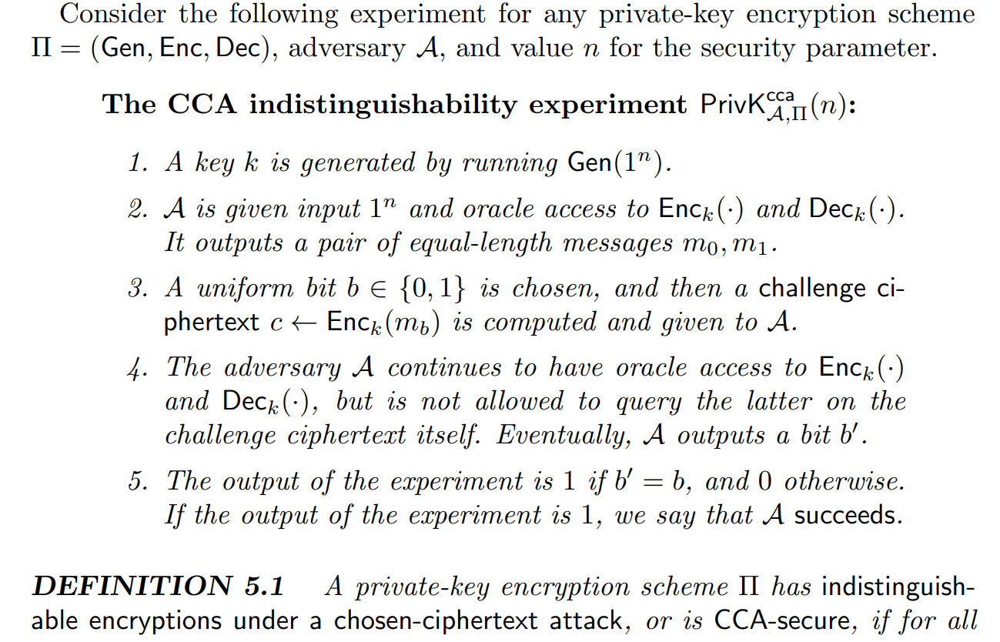
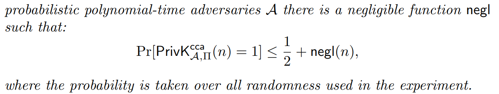
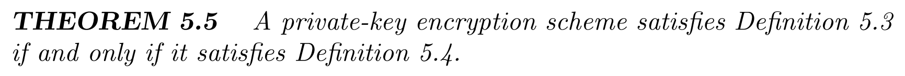
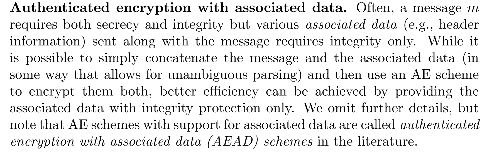
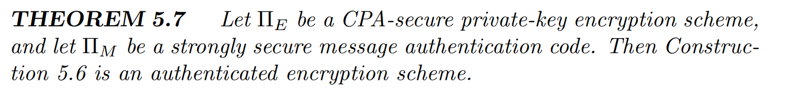
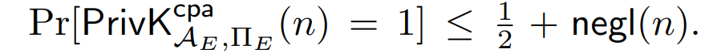

# Lec10 CCA & AE Security

!!! info "Abstract"

    在CPA中，我们集中于信息的Secrecy; 在MAC中，我们集中于信息的Integrity。现在，我们希望能combine两者，按书中说法，在这一章中:
    We consider the missing piece—**secrecy in the presence of an active adversary**—in Section 5.1, and introduce the notion of relevant notion of CCA-security there. Beginning in Section 5.2, we then consider the natural question of how to **construct encryption schemes that achieve both secrecy and integrity simultaneously.**

    Key words: CCA; POA; AE;

## CCA attack & CCA-Security

在前面的几讲中，对于安全性讨论时的敌手定义都是 **passive** 的，也就是只能被动观测密文（就算是CPA也不能对具体的加密过程作修改）。在这里，我们引入  **active** 的敌手模型（实际上在讨论完整性的时候使用的就是active的敌手）。我们自然要问，如果敌手修改密文，发送$c^{\prime}$到receiver，并且截获了解密后的明文$m^{\prime}$，那么敌手是否能从$m^{\prime}$中获得有关$m$的信息？换言之，即敌手是否能找到一种有效的修改方式。

> Definition of CCA attack: Adversary causes a receiver to decrypt ciphertexts that the adversary generates.

在上一讲最后提到的Padding-Oracle Attack，强调了在CCA attack下定义一种安全的重要性

### Defining CCA-Security

正如之前反复提及的，要定义一种安全，一是定义敌手的能力；二是定义安全被攻破的定义。对于后者，我们和前面并无二致，即如果敌手不能区分出用哪条信息加密的（很小的概率），那么就可以当作安全。对于前者，我们给敌手添加一个访问解密预言机的能力，即现在的敌手一共能访问$Enc_k(\cdot)$和$Dec_k(\cdot)$两种Oracle.形式化定义如下：

Game如图：

**需要特别注意的是，在Phase2的访问解密预言机过程中，不能把Challenge Phase中获得的密文作为输入**

> 这很显然，如果输入了，就马上能知道b的值

值得讨论的是，这个定义是比较强的，因为我们假设敌手访问解密预言机时能获得它的全部输出$m^{\prime}$，这个在现实生活中基本是不可能的。就像我们前面提及的POA，敌手仅仅知道自己发送过去的密文是否合规，因为Receiver只返回error or not 信息。但是这么强的定义是很有必要的，如果能实现该定义下的安全，那么理论上能抵御任何形式的CCA-attack.

### CPA $\nRightarrow$ CCA

对于CCA $\Rightarrow$ CPA是显然成立的，但是反之就不一定正确了。我们之前构造的所有加密方案都不是CCA-Secure的（但这并不代表不能通过CPA构造CCA，这还是一个未知的命题）

对于加密方案$Enc(sk,m)=r,F_{sk}(r)\oplus m$，我们修改密文$c_1,c_2$为$c_1,c_2 \oplus 1$，那么解密结果就是：

$$
Dec(c_1,c_2\oplus 1)=m_b^{*}\oplus 1
$$

也就是说，敌手能够构造一个有效的函数 $f$ ,根据这个函数修改密文为$c^{\prime}$，使$c^{\prime}$解密得到的结果是$f(m)$，那么敌手就可以进一步获得$m$的信息了。换言之，CCA安全在high level上就是攻击者无法对$c$做有意义的改装。这里涉及到一个CCA-Secure很重要的性质：**non-malleability** （不可延展性），它的定义为：

#### Definition of non-malleability

If the adversary modifies a given ciphertext, the result decrypts to a plaintext that bears no relation to the original one.

### CCA $\Rightarrow$ POA

下面通过归约证明CCA是涵盖POA的

## Authenticated Encryption

> 简称AE

我们不直接构造CCA-Secure的加密方案，而是引入一个更强的安全定义，它集成了安全性和完整性，随后直接构造AE的加密方案。

### Definition of AE

对于AE的安全定义，需要结合安全性和完整性。对于安全性，我们选用CCA-Secure的定义（因为要保证完整性，敌手必须具有修改密文的能力）；对于完整性，我们依靠MAC，但是需要重新定义不可伪造性实验（因为语法不同）

> MAC中的不可伪造性称为 MAC-forge; 在这里，重新定义AE中需要的不可伪造性 Enc-forge，注意区分

有了 CCA-Secure的定义和 unforgeable的定义，我们可以结合它们来定义AE

下面尝试构造AE的不可区分实验。我们引入两个场景：

1. 敌手能够访问加密预言机$Enc_k(\cdot)$和解密预言机$Dec_{k}(\cdot)$
2. 敌手能够访问新定义的两种理想预言机

> 第二种场景等价于伪随机不可区分实验中的纯随机输出，即是一种"ideal"的场景。不可区分就是让敌手不能区分出"ideal"和"real".

#### Definition of Ideal Oracle

这种不可区分定义是有很强的实际意义的，如果敌手不能区分，就说明：

1. 攻击者生成的任何新密文都是Invalid的。这不仅带来了强大的完整性，而且让CCA变得Useless
2. 攻击者无法区分Real Oracle 和Ideal Oracle，这表示强大的保密性

AE不可区分实验的形式化定义如下：

通过不可区分实验，我们又可以对AE-Security作新的定义：

可以证明，两种定义是完全等价的。

!!! note "补充:AEAD"

    即把一些只需要完整性的消息也定义进来，让AEAD变得更平凡

    

### CCA vs. AE

从第一种定义中可以看出，AE $\Rightarrow$ CCA，但是反之，CCA $\nRightarrow$ AE.

Example:

> 也是本学期的第二次Homework

## Construct AE

对于如何结合Encryption 和 Authentication，我们做出不同尝试

### Attempt1 Encrypt-and-authenticate

$$
Enc(sk_1,sk_2,m)=Enc(sk_1,m),Mac(sk_2,m)
$$

这种加密方案毫无保密性。因为密文和MAC是分开计算的，而MAC本身是丝毫不Care Secrecy的，敌手可以直接在MAC的结果中拿到明文信息。这启发我们永远不能把$m$直接单独放到MAC中

### Attempt2 Authenticate-then-encrypt

$$
Enc(sk_1,sk_2,m)=Enc(sk_1,m\vert\vert\tau)\quad\quad where\quad \tau =MAC(sk_2,m)
$$

这种加密方案是问题是它本质上也只有CPA-Secure，当接收方尝试解密的时候，它会把错误来源分开，具体地说：

由于敌手能看出返回的错误到底是 "bad padding" 还是 "authentication failure" 所以敌手完全可以对它进行POA，从而攻破这个加密方案。

> 一种不好的解决方式是取消所有错误来源的分离，即只返回一种错误信息

### Attempt3 Encrypt-then-authenticate

$$
Enc(sk_1,sk_2,m)=c_1,c_2
$$

$$
c_1=Enc(sk,m),\quad c_2=MAC(sk,c_1)
$$

这种加密方案是好的，因为它产生了依赖关系，即解密ENC和MAC是相互依赖的。具体地说，如果敌手要实施CCA-Attack，那么他必须要改装$c_1$到$c_1{\prime}$,由于$c_2$的输入是$c_1$，这说明敌手也必须要改装$c_2$到$c_2^{\prime}$。且最终要的是，这个$c_2^{\prime}$必须满足

$$
c_2^{\prime}=MAC(sk,c_1^{\prime})
$$

如果真能实现，那么敌手也就打破了MAC的完整性，这与MAC的性质相悖，故敌手不可能成功改装密文实现CCA-Attack，也就说明这种加密方案是CCA-Secure的。同时，由于完整性比较显然，那么这种加密方案也就满足了AE-Secure.

下面形式化这种加密方案：

### Prove the Security

首先，定理中的$\Pi_M$是一个强的MAC，这将说明**攻击者提交给解密预言机的任何“新”密文都将导致错误**，这比不可伪造性更强，当然也就能说明它满足 unforgeability。除此之外，$\Pi_M$还让解密预言机无效，这能让我们需要证明的安全从CCA安全坍缩到CPA安全。

下面提供几个前置定义：

-  Say a ciphertext that A submits to its decryption oracle is **new** if A did not receive it from its encryption oracle or as the challenge ciphertext.

- A ciphertext $<c,t>$ is **valid** (with respect to the secret key $(k_E, k_M)$ chosen as part of the experiment) if $Vrfy_{kM} (c, t) = 1$.
- Let **ValidQuery** be the event that A submits a **new, valid** ciphertext to its decryption oracle.

我们需要先证明一个很重要的前置定理：

从直观上看，ValidQuery只会在敌手伪造了一个新的、有效的 $<c,t>$对时发生。

设 $q(\cdot )$ 为 A 进行的**解密预言机查询次数**的**多项式时间**上限.考虑攻击MAC加密方案$\Pi_M$的敌手$A_M$：

从本质上看，这个敌手$A_M$在做的是猜$A$发出的第$i$个对解密预言机的查询是第一次有效查询，猜对则返回一个新的、有效的$<c,t>$对。下面对比$A_M$和$A$，前者完美模拟了访问加密预言机和Challange Phase，对于解密预言机上在第$i$次访问前都是一样的，但是后面就有不同的操作。从二者的视角上看，只要在ValidQuery发生前，它们都是完全一样的。

如果$A_M$猜对了，那么他就在这个实验中胜利了，这个概率是$\frac{1}{q(n)}$.然后我们有：

这个前置定理证毕。

用这个定理可以分别证明$\Pi$是unforgeable 和 CCA-Secure的。

#### Unforgeable

比较显然，不形式化地描述了。攻击者在unforgeable encryption experiment中，只要获得一条new 且 valid的密文对即可，但是在前面的定理中已经证明这个概率是$negl(n)$的，故可以说明是不可伪造的。

#### CCA-Secure

让$A$用CCA attack 去打 $\Pi$，再引入ValidQuery的概念：

接下来只要证明：

为了证这条，我们用$A_E$去打$\Pi_E$:

> 这是因为已经有ValidQuery为否的条件，所以CCA坍缩到CPA

然后就水到渠成了：

因为$\Pi_E$是CPA-Secure的，所以满足

所以$\Pi$是CCA-Secure的，证毕。

## Further Discussion

