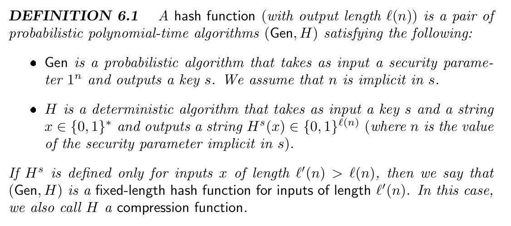
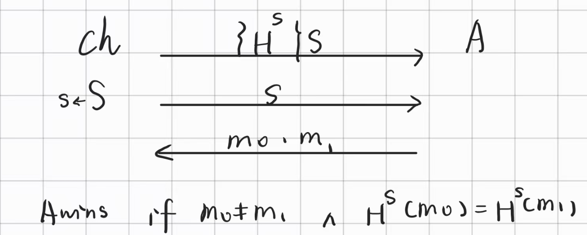
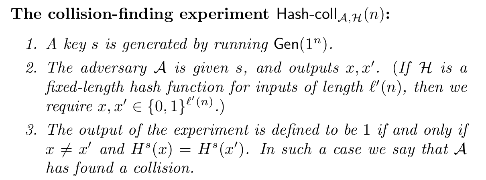

# Lec11 Hash Function

!!! info "Abstract"

    本讲全部集中在Hash Function上，这也是本课最“偏离”密码学的一讲。先从PRG的回顾反向引入了Hash Function，然后讲了Hash Function Family的定义，
    以及介绍了一些对Hash Function的攻击，最后讲了Hash Function的一些应用。
    
    key words: Hash Function; Collision Resistance; Merkle-Damgard Transform; Birth Attack; Hash and MAC

## Hash Functions

在前面对PRG的讨论中，我们知道它可以将$n$bit字符串扩展到任意多项式长度。那么，是否有一种技术，可以把字符串做压缩呢？这就引入了Hash Function的定义

### Definition

 Hash functions are simply functions that take inputs of some length and compress them into short, fixed-length outputs. 

### Collision Resistance 

和数据结构中的哈希不同，数据结构只是需要尽可能减少Collision，但是Cryptography中的哈希必须要“避免”Collision.

对于抗碰撞性质，我们可以用敌手不能在多项式时间内找到一个与已知哈希值发生碰撞的输入来刻画。为了形式化说明，我们还需要引入 keyed hash function.(Hash Function family)

#### Keyed hash function

$$
H^s (x) \mathop{=}\limits^{def} H(s,x)
$$

这个$s$是随机选取的，对于任意$s$，$H^s$都需要是难以被碰撞的

需要注意的是，这里的$s$并不是secret的，需要和前面的secret key区分开，敌手是能够知道$s$的值的。引入Ked后，我们可以定义：

接着我们进一步引入实验来定义安全性

#### Unkeyed hash function

其实我们会有疑惑，既然这个$s$是敌手已知的，为什么我们还需要它呢？换句话说，$H$是确定性算法在理论上为什么不是抗碰撞的。可以把Unkeyed hash function 理解成考生$A_H$在进考场前就拿到了试卷$H$，那么总会有一个考生带了一份正确的小抄$A_{m_0,m_1}$，这个考生用这份小抄就可以把这个试卷完成，即碰撞这个$H$。如果引入了$s$，相当于考生无法在考前拿到卷子，只知道题库，只有进入考场后才会从题库抽题出来考，那么此时是不可能在考前做好小抄的（题库太大）。

稍微形式化的说明是：

This is problematic from a theoretical standpoint since for any such function there is always a **constant-time algorithm** that outputs a collision in $H$: the algorithm simply outputs a colliding pair $(x,x)$ **hardcoded into the algorithm itself**. Using keyed hash functions solves this technical issue since **it is impossible to hardcode a collision for every possible key using a reasonable amount of memory**.

但是实际上，现实生活中应用的都是Unkeyed hash function(如SHA-1, SHA-256等).虽然在理论上它是不抗碰撞的，但是实际上敌手也仅仅是已知存在一种碰撞方式，如果要构造出这种碰撞是困难的。在现实生活中，这样的条件已经足够。

### Weaker Notion of Security

抗碰撞是一个较强的安全性要求，并且很难达到。然而，在某些应用程序里，依赖更松弛的要求已经足够。对于Hash Function，除Collision Resistance外，还有两种较弱的安全水平

> 左边为抗原像（One-way 性质），右边为抗第二原像

## Merkle -Damgard Transform

和讨论PRG时的逻辑类似，在现实生活中，我们往往希望获得能处理任意长（多项式）信息的哈希函数，用

Merkle -Damgard Transform可以对定长的Hash Function 做 Domain Extension.

## Attacks

### Brute-force

最简单的想法是算出所有信息空间中信息的哈希，然后逐一验证，令哈希函数为$\{0,1\}^* \rightarrow \{0,1\}^l$的映射，则需要计算 $H$  共 $q =2^l+1$次 .所以时间复杂度是$O(2^l)$，空间复杂度是$O(1)$.

具体地说，我们选择$q$个均匀分布的输入$x_1,x_2,\cdots , x_q$，对于每个$i$计算$y_i = H(x_i)$，然后检查是否有相同的$y_i$. 根据鸽笼原理，若$q > 2^l$，那么一定能找到。

当$q<2^l$时，此时不一定会发生碰撞，那么这个概率是非常难计算的（因为$H$是任意的）。因此我们考虑将 $H$ 视为random function的理想化情况。（可以证明这是worst-case，如果 $H$ 偏离 random，则发生碰撞的可能性更高。

也就是说，$y_i = H(x_i)$都是i.i.d 的（独立同分布）。至此我们可以把问题简化如下：从$\{0,1\}^l$中均匀选取$q$个元素，分别是$y_1,y_2,\cdots,y_q$，那么存在$i,j$，使得$y_i = y_j$的概率是多少。这也就是大名鼎鼎的 “生日问题”

### Birth Attack

由于哈希的碰撞可以转化成生日问题，那么基于生日问题进行的攻击分析就叫作生日攻击。可以证明，这种攻击下，发生碰撞的概率大概在$O(\frac{q^2}{2^n})$,也就是说$q$大概在$2^{\frac{l}{2}}$左右，比原来小了很多（虽然还是指数级，但实际上已经非常可观）。但是生日攻击也有很大的弊端： 攻击者需要存规模为 $\Theta(q) = \Theta(2^{\frac{l}{2}})$ 的 $y_i$ 值, 因为攻击者不知道哪一对信息会发生碰撞，也就是说，这种方法的空间复杂度是$O(2^{\frac{l}{2}})$.实际上可以证明，有一种方法让生日攻击的空间复杂度能够优化到$O(1)$，但这里不展开介绍。

!!! note "生日攻击时间界的证明"

    
    
    
    
    

## Applications

> 本讲由于时间问题，只讲了Hash and MAC

### Hash and MAC

本质上这种方式就是先做了HASH后再做一次MAC，从而让MAC能够处理任意长消息

想要证明这种构造的安全性，我们考虑两种可能性：

然后我们就可以分两部分证明安全性

> 直接引用书中证明，非常清晰，无需加以说明

> 下面说明第一部分，即利用Collision Resistance证明$Pr[coll]$是negl()的

> 下面说明第二部分，即利用Secure MAC证明$Pr[Mac-forge_{A^{\prime},\Pi^{\prime}}(n)=1 \wedge\overline{coll}]$是negl()的

