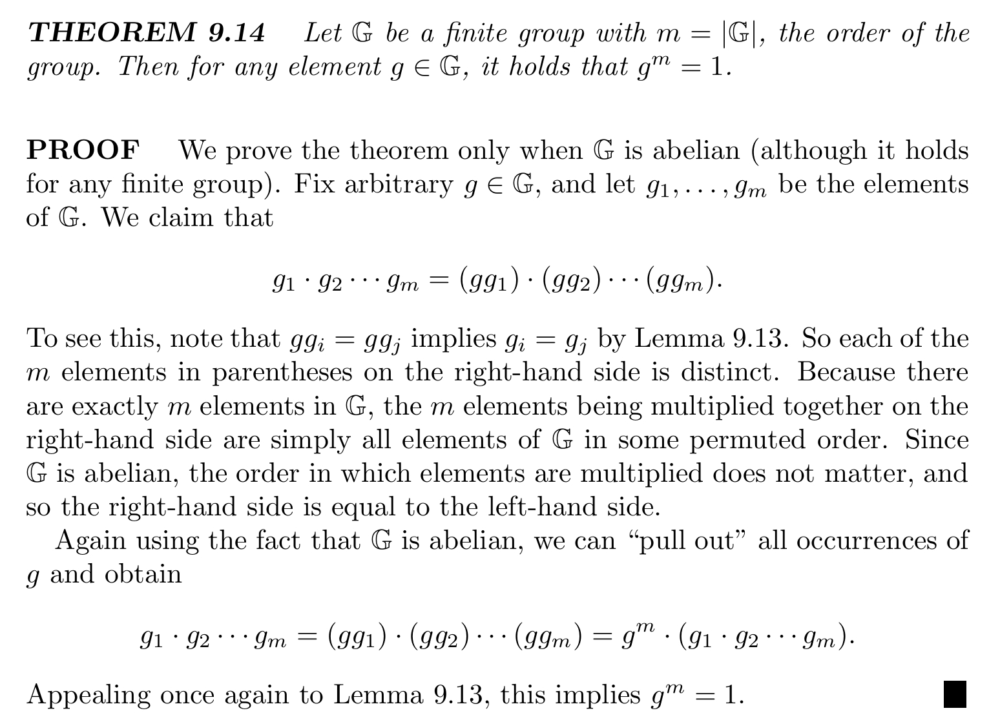
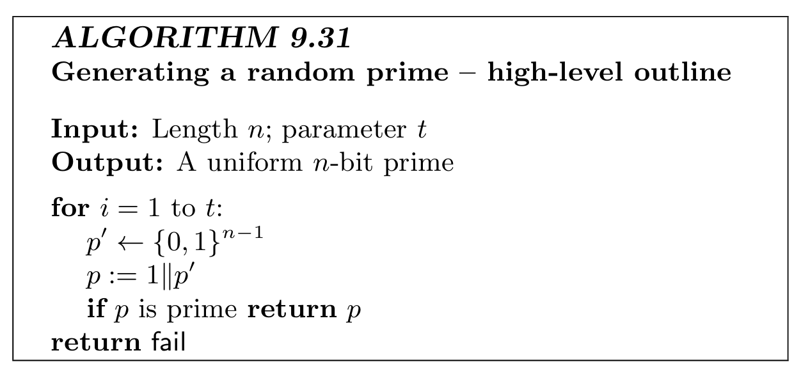
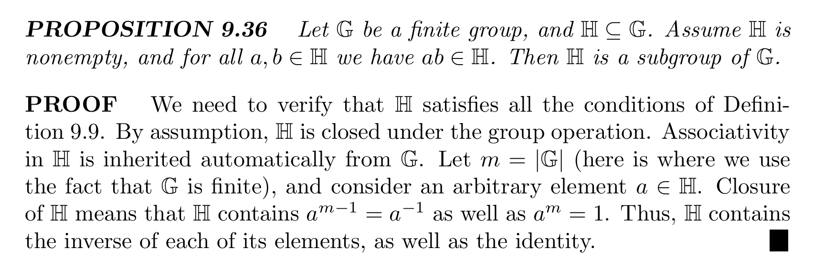
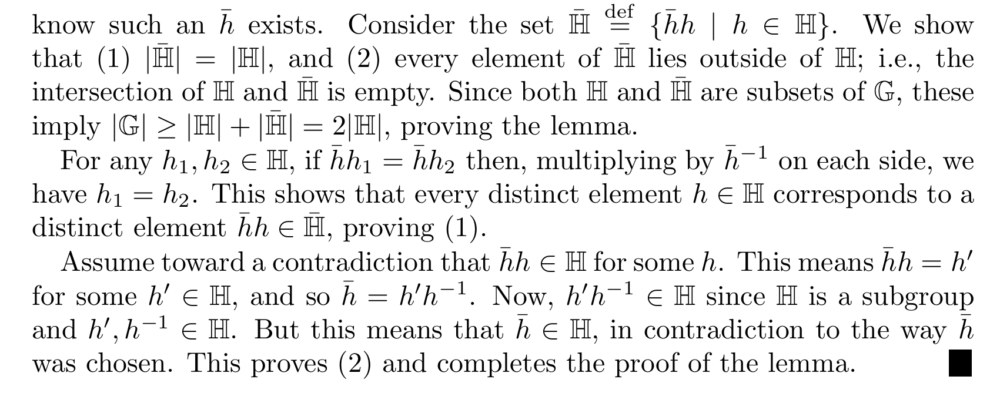
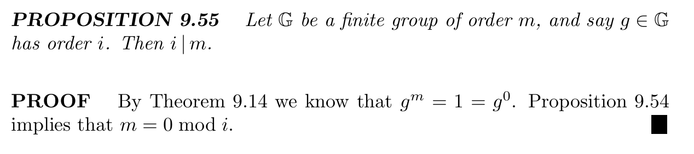
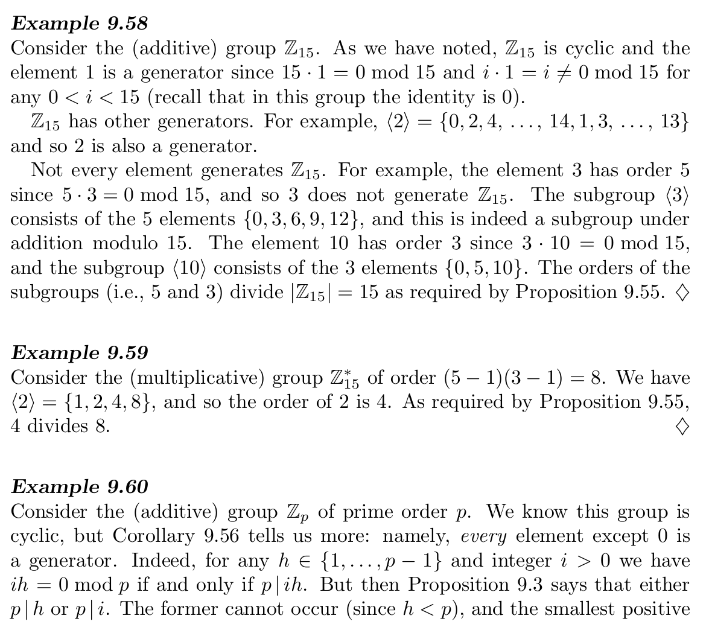
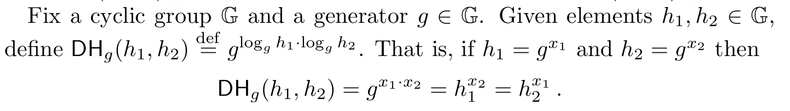

# Lec12 Hard Assumptions

!!! info "Abstract"

    本讲是从私钥加密进入公钥加密的过渡，是公钥加密的数学基础，介绍了数论、群论的一些基本概念，以及一些常见的困难假设。
    
    本讲分别依次讲了大数分解、RSA、离散对数、CDH、DDH 这些Hard Assumptions
    
    Key words: Factoring; RSA; Discrete Logarithm; CDH; DDH

本讲可以看作是对私钥加密“自顶向下”方法下的一个顶点，用图来表示即

## 数论与群论基础

### 可除性基本命题

> 证明均非常简单

### 模算术

模运算满足自反性、对称性、传递性，并且和普通运算具有相同的加减乘规则，但不满足除规则。对于取模运算下的除规则，我们定义乘法逆元进行，即把除以$b$定义为乘以$b$的乘法逆元$b^{-1}$.逆元存在性命题：

### 群

现代密码学涉及的群论定理和证明，均假设这个群是阿贝尔群（即满足交换律的群）。如果$G$是一个群，集合$H$是集合$G$的一个子集，且$H$关于$G$的运算构成一个群，那么$H$称为$G$的子群。

#### 群幂运算

若群运算符为加，那么群幂定义为

此幂运算满足普通乘法的所有性质

若群运算符为乘，那么群幂定义为

此幂运算满足普通幂运算的所有性质

根据引理

可以证明以下重要结论

下面引出两个重要推论

第一个推论是幂运算中指数对阶数取余后结果不变

第二个推论是有限群下根据幂运算构造置换

#### $\mathbb{Z}_N^*$群

$\mathbb{Z}_N$群是关于集合$\mathbb{Z}_N=\{0,1,\cdots,N-1\}$，以及模$N$加法运算的群。而我们需要构造一个关于模$N$乘的阿贝尔群，我们称之为$\mathbb{Z}_N^*$群。这个群在密码学中有重要意义，下面展开介绍该群的构造和其具有的一些性质。

可见$\mathbb{Z}_N^*$群就是集合$\{0,1,\cdots,N-1\}$中所有与$N$互素的元素构成集合关于模$N$乘运算的阿贝尔群。即

$$
ab\triangleq [ab\mod N]
$$

显然，$\mathbb{Z}_N^*$群的阶是欧拉函数$\phi(N)$，下面我们来求出不同$N$下的$\phi(N)$

当$N=p$，即是素数时，$\phi(N)=p-1$

当$N=pq$，即是两个素数乘积时，其集合元素为合数的情况只能为：要么是$p$的倍数，要么是$q$的倍数，且前者有$q-1$个，后者有$p-1$个。那么$\phi(N)=(N-1)-(p-1)-(q-1)=(p-1)(q-1)$

当$N=\Pi_i p_i^{e_i}$，即是素数的乘积时，我们不加证明地给出$\phi(N)=\Pi_i p_i^{e_i-1}(p_i-1)$

下面介绍两个推论

第一个推论即欧拉定理以及费马小定理

!!! note "欧拉定理&费马小定理"

    定理的证明可以参考OI Wiki
    
    [欧拉定理 & 费马小定理 - OI Wiki](https://oi-wiki.org/math/number-theory/fermat/)

下一个推论同样针对密码学，与置换有关

---

## 大数分解及RSA假设

### 大数分解

这个问题是易懂的，但是当我们想要对其进行形式化表述的时候，难点就在于，如何生成大素数，下面着重讨论该问题

给出一个简单的算法，运行$t$次，找到素数为止，找不到就停机

对于这个算法，我们要考虑两个问题：

1. 这个$t$需要是多少，即素数在整数中的分布是怎样的
2. 如何判断$p$是否是素数，这个算法是否是高效的

####  The distribution of primes

可以证明，$n$bit长整数范围内的素数至少占$\frac{1}{3n}$，据此可以证明当$t=3n^2$的时候就可以保证找不到素数的概率是可以忽略的，这个概率可以表达为：

> 当然也可以用更弱的界，即只要是$\frac{c}{n}$即可

#### Testing primality

这里介绍 Miller-Rabin 算法，它可以保证若$N$是素数，那么一定能判断出；若$N$是合数，只有可忽略的概率会把它误判成素数

该算法利用的定理是

$$
a^{N-1}\equiv 1\mod N
$$

若$N$是素数，则满足上述定理。对于每个数，只要遍历$a$，若该等式不成立，那么$N$一定不是素数；否则，$N$有很大概率是素数，这个置信度如果大到一定程度我们认为利用这个定理是可以分辨出素数的。

对于置信度的讨论，我们需要证明若$N$是合数，在$\mathbb{Z}_N^*$这个集合中有足够多的数可以让这条等式不成立。为此，我们需要两条引理。

引理一

引理二

有了这两条关于子群阶性质的引理，我们可以证明以下定理：即只要存在一个证据（能够让等式不取等的$a$）能证明$N$是合数，那么在$\mathbb{Z}_N^*$至少有一半的证据可以证明$N$是合数。

> 注意这里我们的假设是如果存在一个证据，那么事实上对于很多合数并不存在证据。对于这种情况可以通过对算法的修正来解决，但此处证明过于复杂，就不展开了

设$N$是合数，算法在$t$次循环中没有找到$N$是合数的证据，即错误地输出$N$是素数的概率为$P$，那么可知$1-P$代表的事件就是在素数中找到了一个证据或者是循环遍历到的数不是素数（因为$a$是从$1$遍历到$N-1$，可以计算得

$$
P=\left(1-\frac{\frac{\vert\mathbb{Z}_N^*\vert}{2}+\left(N-1-\vert\mathbb{Z}_N^*\vert\right)}{N-1}\right)^t= \left(1-\left(1-\frac{\frac{\vert\mathbb{Z}_N^*\vert}{2}}{N-1}\right)\right)^t\leq \left(\frac{\frac{\vert\mathbb{Z}_N^*\vert}{2}}{\vert\mathbb{Z}_N^*\vert}\right)^t=\frac{1}{2^t}
$$

#### Combination

有了上述两点，我们可以正式定义产生大素数的算法

#### The Factoring Assumption

有了产生素数的算法后，我们可以形式化地表述大数分解问题

### RSA

虽然大数分解假设存在，但是一直没有一种高效的算法可以实现一个在现实中可用的加密系统。于是人们就从大数分解出发，找一些和大数分解有相似难度的问题来实现现实中可用的加密系统，RSA就是人们通过类比大数分解发现的一个比较好的、难度相当的假设。

RSA假设是对于$N=pq$，$p,q$是素数，那么根据之前的结论，群$\mathbb{Z}_N^*$的阶是$(p-1)(q-1)$。RSA假设就是如果已知$N$的分解形式，那么计算群$\mathbb{Z}_N^*$的阶是简单的，反之，如果未知$N$的分解形式，那么计算群$\mathbb{Z}_N^*$的阶是困难的。

令$GenRSA$为一个PPT算法，输入为$1^n$，输出模数$N=pq$以及两个正整数$e,d$，其中，$e$与$\phi(N)$互质，即$gcd(e,\phi(N))=1$，$ed$互逆，即$ed=1 \mod N$.(根据群论定理，当$e$和群的阶数互质时，$e$存在唯一逆元$d$)

!!! note "How to choose $e$? "

    对于不同的$e$来说，RSA问题本身的复杂性是不变的，但是对于某些特定的$e$，可能在实际运用中有好处。
    
    比如，$e=3$时，求幂是简单的，但是对$pq$的要求变高了，即$pq$不能取任何模3余1的数。另一种选择是$e=65537$，它以较高的运算代价降低了对$pq$的要求，并且避免了一些低指数攻击。

## 循环群和生成元

### Notions

> 书中Notion表述很清晰了，不再赘述

??? note "Notions"

    
    
    
    
    

### Cyclic Groups

一个群的幺元是唯一的阶为$1$的元素，它的生成群$\left\langle 1\right\rangle=\{1\}$。如果存在元素$g\in\mathbb{G}$，$g$的阶和群$\mathbb{G}$相同，那么$\left\langle g\right\rangle=\mathbb{G}$.此时我们称$\mathbb{G}$为循环群，元素$g$为生成元。一个循环群的生成元不唯一，对于生成元$g$来说，群中的元素集合可以表示为$g^x,\quad x\in\{0,1,\cdot,m-1\}$的集合，即是一组映射。下面先介绍几个引理，再对于循环群给出一个重要定理。

引理1，元素的阶一定整除群的阶

我们有推论，若一个群的阶为素数，那么这个群一定为循环群，且除幺元外的所有元素都是生成元

下面进一步讨论特定的循环群。教材给出了两类简单的循环群，一类即阶为素数的群，另一类即为加法群$\mathbb{Z} _N$（幺元通常是生成元）.下面的定理又给出了一种循环群，即$N$为素数，阶为$N-1$的群

下面教材给出几个例子具体地说明循环群

??? note "Examples"

    
    
    

## 离散对数及Diffie-Hellman假设

离散对数及Diffie-Hellman假设是基于循环群构造出的困难问题。

### 离散对数

同样，我们定义$\mathcal{G}$是一个PPT的$group-generating$算法，它的输入为$1^n$，输出为一个循环群$\mathbb{G}$的描述，即群的阶数$q$（$q=n$）以及群的所有生成元$g$.

若$\mathbb{G}$是阶为$q$的循环群，则存在生成元$g\in\mathbb{G}$满足$\{g^0,g^1,\cdots,g^{q-1}\}=\mathbb{G}$.同理，$\forall h\in\mathbb{G}$，存在唯一$x\in\mathbb{Z}_q$，使得$g^x=h$。当群$\mathbb{G}$已知，就称$x$为关于$g$的$h$的离散对数，记作$x=\log_g{h}$.对任意整数$x^{\prime}$，若$g^{x^{\prime}}=h$，则有$\log_g{h}=[x^{\prime}\mod q]$.

离散对数的值是有限的，故称作“离散”，但它满足大多数标准对数的性质。

形式化地说，离散对数问题就是对于一个给定的循环群$\mathbb{G}$，为随机分布的元素$h\in\mathbb{G}$计算出其离散对数$\log_g{h}$.下面通过实验表述：

### Diffie-Hellman Assumption

离散对数问题是困难的前提是我们假设group-generating算法$\mathcal{G}$存在。而下面的CDH和DDH则尝试给出这种算法。

#### CDH

CDH问题就是对于随机选取的$h_1,h_2$，计算$DH_g(h_1,h_2)$.

其不对称性可以这样考虑。如果已知了$h_1,h_2$，先计算离散对数$x_1=\log_g{h_1}$，再求幂$h_2^{x_1}$即可。反之，若$h_1,h_2$未知，实际上是不能严格说明它和离散对数一样是困难的（学界还未解决）

#### DDH

用区分器对CDH做包装，即区分$DH_g(h_1,h_2)$和随机从群中抽取的元素，又回到我们熟悉的定义

