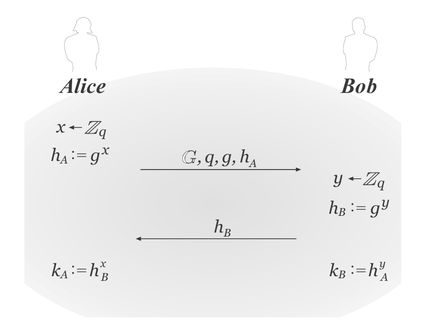

# Lec13 Key-Exchange

!!! info "Abstract"

    本讲正式开始引入“公钥”的思想，从私钥中密钥分发和管理的困难性中，我们可以发现“公钥”的思想是一个伟大的突破。
    
    本讲分别讲了私钥过程中对密钥分发和管理的多种尝试，以及密钥交换协议Diffie-Hellman Protocol，最后在语法上对Encryption和MAC做了公钥化。
    
    同时，本讲会实现以下目标：
    
    **Goal: How to share a secret key via Insecure channel**
    
    Key words: Key Distribution, Key Management, Public Key, Diffie-Hellman Protocol

## Key Distribution and Management in Private Key

我们前面对私钥加密的讨论都基于一个前提：通信双方都能事先通过一个安全信道获得一个私钥，现在我们深入理解现实中如何去完成密钥分发和管理。最简单的做法是在双方物理上互相告知这个密钥，比如两个组织可以派一个可信任的人去完成这件事，实际上，莫斯科和华盛顿的"red phone"就是用one-time pad 生成密钥后让信使带着它去到对方城市。显然这种方法是不好的，如果通信方有很多个（设为$n$），那么代表着每一方都必须存其他$n-1$个通信方的密钥，总的存储代价为$O(n^2)$。同时，这些密钥还需要被安全存储，越多的密钥会引入更高的保护代价，如果把这些密钥存在通信方的个人计算机里显然是不安全的。

同样，在开放的通信系统中，私钥加密显然是做不到在安全信道中的密钥分发的，因为你可能甚至都不知道对方是谁。所以私钥加密下的密钥分发总的来说有三点问题：

- 如何完成密钥分发
- 如何存储和管理大数据量的密钥
- 在开放系统下的不适用性

下面尝试逐步解决这些问题

### Attempt0

通信方彼此更新密钥信息，即每新增一个通信方，需要把它的信息告知给其他所有通信方，并把其他所有通信方的信息告知新增的通信方。即$A_1,A_2,\cdots,A_n$在物理上去 share 这些密钥，它的维护代价是$O(n^2)$的。

这显然是差的，我们引入一个可信第三方$B$，尝试让它帮我们做密钥分发和管理，这个$B$就被称为 **Key-Distribution Center**（KDC）

### Attempt1

When $A_1$ come to company for the first day, $B$  sends $k_{12},k_{13},\cdots,k_{1n}$ to $A_1$, then sends $k_{12}$ to $A_2$,$\cdots$ ,$k_{1n}$ to $A_n$.

这本质上和Attempt0是一模一样的，只是引入了$B$去做分发而已。每个人仍需存$O(n)$个密钥。

Problem: Secret Key Storage

1. memory by human (x)
2. storage in computer (not secure enough)
3. storage in Hardware(Smart Card) (useful in small size sk,but high cost and limited memory)

### Attempt2

When $A_1$ come to company for the first day, $B$  shares a secret key with $A_1$ say $k_1$, when $A_1$ wants to talk with $A_i$：

- $A_1 \rightarrow B$: "I want to talk with $A_i$"
- $B\rightarrow A_1$:  $Enc(k_1,random)$
- $B\rightarrow A_i$: $A_1$ wants to talk with you, $Enc(k_i,random)$

> 这个random就叫做 session key; $A_1$和$A_i$拿到加密结果用用自己和KDC共享的密钥解密即可获得random.

这个方式的好处就是通信方只需要实时存一个会话的密钥即可。

Problem1: $B$ is too busy.

可能会受到ddos攻击，并且如果$B$瘫痪了，整个系统就瘫痪了。一个解决方案是把$B$分成$B_1,B_2,\cdots,B_t$，缓解压力，但是出错概率以指数级上升

Problem2: $A_i$ is not online.

如果$A_i$不在线，那么$B$就没法及时把密钥发给对方，下面的Attempt尝试解决这一点

### Attempt3

When $A_1$ come to company for the first day, $B$  shares a secret key with $A_1$ say $k_1$, when $A_1$ wants to talk with $A_i$：

- $A_1 \rightarrow B$: "I want to talk with $A_i$"
- $B\rightarrow A_1$:  $Enc(k_1,random)$,$Enc(k_i,random)$

这种方式也叫做 **Needham-Schroeder protocol**，这个$Enc_{k_i}$也叫做 "ticket".

这个协议减轻了KDC的负担，因为它不再需要和Bob进行二次连接并且不关心Bob是否在线，如果Alice想要再和Bob会话，只要发这个ticket即可（当然需要定期更新）

---

至此，该协议已经很大程度上解决了私钥密钥分发和管理的一些问题，但是我们还是基于了一个假设：**通信方和KDC间的信道是安全的**。本质上，以上协议还是没能解决私钥加密本质的缺陷，仍然无法解决在open systems里的密钥分发和管理问题。

在私钥加密领域里如此艰难的尝试和步进为接下来的公钥思想作了很好的铺垫，我们更能体会到公钥的伟大。

## Diffie-Hellman Key-Exchange Protocol

Diffie和Hellman创造了Key-Exchange协议，实现了 share a secret key, via communication over a **public channel**, by having the parties perform operations that an eavesdropper cannot reverse.

### Definition of the Protocol

这个协议的正确性由群论运算保证，即对于Bob来说：

$$
k_B=h_A^y=(g^x)^y=g^{xy}
$$

对Alice同理:

$$
k_A=h_B^x=(g^y)^x=g^{xy}
$$

该协议依赖于”离散对数是困难的”假设，即从$g^x$中解出$x$是困难的。同时，该协议依赖于CDH假设，即已知$g^x,g^y$，计算$g^{xy}$是困难的。

### Definition the Security of KE

我们定义KE的安全性如下：

注意到这里依赖的假设从CDH（即Adv需要计算出$h^{xy}$）变成了DDH（Adv只需要区分出$h^{xy}$），是更强的。下面证明DDH假设下，KE协议是窃听下安全的

### Proof of Security

可以证明DDH假设下，对于Passive的敌手（即只有窃听能力），该协议是安全的。

> 也可以理解成第二个假设：信道具有完整性

??? note "Proof"

    
    
    

### Group elements vs. Bit-strings

KE协议输出的key是一个群元素，而不是一个比特字符串，所以在不可区分实验中，我们用来混淆的随机元素应该也是个群元素而不是一个随机字符串

### Active adversaries

可以验证KE协议不是CCA安全的，即对于Active的攻击者是不安全的。特别是对于中间人攻击（MITM）是完全不安全的。

比如敌手Adv伪造公钥$g^{y+1}$发给$A$，$A$会返回给Adv $g^{x(y+1)}=g^{xy}\cdot g^x$，利用群运算很容易就能计算出 $g^{xy}=sharedkey \cdot g^{-x}$

现代的一些密钥交换协议基于Diffie-Hellman协议做了优化，已经可以抵御中间人攻击了，比如TLS协议。

## Public-Key Revolution

我们已经对密钥的分发和管理过程做了公钥化，把它变成了Key-Exchange.那么我们自然会想到是否可以对前面私钥加密的其他东西都做公钥化，答案是可行的。对Encryption做公钥化，就产生了Public-Key Encryption; 对MAC做公钥化，就产生了Digital Signature.

本讲的最后我们对公钥化后的语法做更新：

### Syntax of Public-Key Encryption

$$
Gen(\cdot)\rightarrow sk \Longrightarrow Gen(\cdot) \rightarrow (pk,sk)
$$

$$
Enc(sk,m)\rightarrow c \Longrightarrow Enc(pk,m)\rightarrow c
$$

$$
Dec(sk,c)\rightarrow m \Longrightarrow Dec(sk,c)\rightarrow m
$$

### Syntax of Digital Signature

$$
Gen(\cdot)\rightarrow sk \Longrightarrow Gen(\cdot)\rightarrow (pk,sk)
$$

$$
MAC(sk,m)\rightarrow \tau \Longrightarrow MAC(sk,m)\rightarrow \tau
$$

$$
Verify(sk,m,\tau)\rightarrow \{0,1\} \Longrightarrow Verify(pk,m,\tau)\rightarrow \{0,1\}
$$
