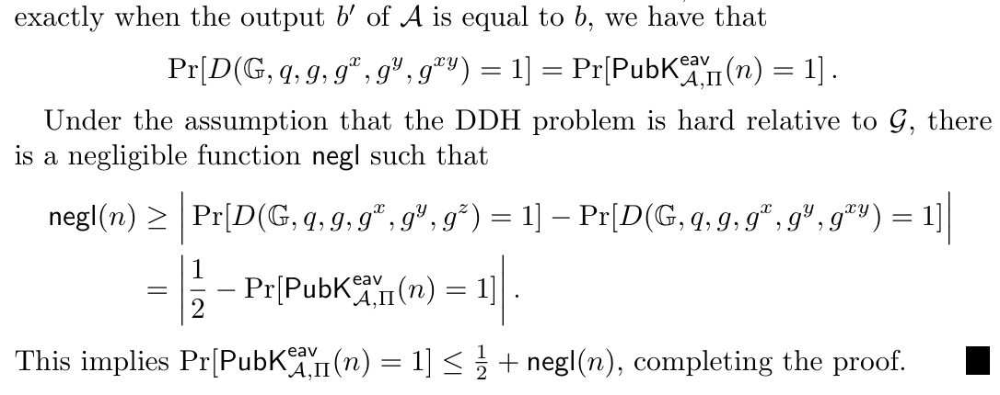

# Lec14 Public-Key Encryption

!!! info "Abstract"

    本讲主要讲Public-Key Encryption 的 Notion, Construction, Security.同时介绍了重要的加密算法: El-Gamal
    
    同时简单介绍了现代密码学的重要模型: Random Oracle Model (ROM)
    
    Key words: Public-Key Encryption, ElGamal, Diffie-Hellman, Random Oracle Model

## Notion

|            | Public Key    | Secret Key     |
| :--------: | ------------- | -------------- |
|     KG     | √             | ×              |
|    PKI     | ⚪             | ?              |
| Efficiency | ×             | √              |
|            | $\Rightarrow$ | $\nRightarrow$ |

- 密钥生成上，Public Key是好的，它只需要生成一对公私钥对，然后分发公钥即可；私钥加密需要保证信道的安全性

- 公钥加密需要保证公钥的完整性，在Active的攻击者模型里，攻击者可能能够实施中间人攻击（MITM），那么接受者如何确保拿到的公钥是发送者发出的呢？此时需要引入 **PKI** 的概念，它作为一个公认的第三方，可以保证公钥的完整性
- 在加密效率上，公钥要远低于私钥（慢两个数量级左右）
- 可以简单地从公钥加密构建私钥加密，反之不能。即$PKE\Rightarrow SKE;SKE\nRightarrow PKE$ .前者很显然，把生成的公私钥对$(sk,pk)$打包成一个私钥$sk^{\prime}$即可。因为原$sk$是有机密性的，所以拼接后的密钥也具有机密性。

## Syntax

在上一讲中我们已经定义了公钥加密的语法，下面我们对 **CPA** 等安全性做公钥化

??? note "公钥加密语法"

    

### EAV & IND-CPA

回忆在私钥加密中，EAV-Security 和 IND-CPA是截然不同的，前者的敌手只具有窃听能力，后者的敌手新增了访问加密预言机 （Encrypt Oracle）的能力，在Game中体现为Phase1 和 Phase2.但在公钥加密中，我们用公钥$pk$做加密，而$pk$是公开的，即敌手可见的。那么也就是说，敌手完全有能力自己做加密，无需依赖于加密预言机。换句话说，通过简单的归约可以证明公钥加密下的EAV敌手完全可以利用$pk$实现Phase1 和 Phase2。于是我们得到（在公钥加密下）：
$$
EAV \Leftrightarrow IND-CPA 
$$

IND-CPA不需要另外定义，因为：

??? note "公钥加密下完美安全是不可能的"

    很显然，敌手能自己做加密，那么就不可能达到完美安全
    
    

### Construction for IND-CPA

我们不过多讨论安全性的证明，考虑如何构造CPA安全的加密方案。在公钥加密中我们自然会联想到RSA的加密方案，但它是确定性算法，同时我们回想私钥加密中已经证明，确定性算法不可能实现CPA安全，这在公钥加密领域也是一样的。

下面介绍一种加密方案，它把RSA做了随机化处理，在实践中证明是好的

### El-Gamal Encryption

基于DDH假设构建的加密方案

#### 引理

群中元素乘以一个随机选取的元素的结果和该元素独立，不泄露该元素的任何信息

#### Construction

相当于把原来Alice和Bob交流的过程做更改，Bob并不持有固定的一对密钥，而是随机生成。对于Bob的加密来说，它只需要把自己的公钥和用私钥加密后的密文一起发给Alice，Alice再用自己的私钥解密即可。

同理，群运算的性质保证了该加密方案是正确的

??? note "An Example"

    
    
    

#### Security

可以证明，在DDH是困难的前提下，El Gamal Encryption 是CPA安全的

??? not "证明过程"

    
    
    
    
    

#### Weakness

下面介绍一种攻击，证明El Gamal Encryption不是CCA安全的。考虑信息$m$加密后生成的密文$c_1,c_2$，敌手可以简单地构造出一对密文

$$
c_1^{\prime}=c_1
$$

$$
c_2^{\prime}=c_2\cdot m^{\prime}
$$

那么解密后的结果就变成$m\cdot m^{\prime}$. 也就是说，攻击者可以通过构造$m^{\prime}$来实现对原文的任意变换，显然不是CCA安全的。

### CCA Security

那么如何实现公钥加密意义下的CCA安全呢？ 在私钥加密领域内，我们采用了 MAC 技术来使两个密文之间相互依赖，从而保证了消息的完整性，但在公钥下这种方式是行不通的，因为MAC本身是私钥的，并不能用公钥的技术实现（并不严谨，是high level的描述）。并且，在公钥下，我们做CCA的归约是很难的，因此我们需要引入一个新的技术，增强归约的能力，削弱敌手的能力，这种技术被称为 **Random Oracle Model** （随机神谕模型）

## Random Oracle Model

Random Oracle Model 本身是极其复杂的理论，在这里只做最简单的介绍。

可以把Random Oracle理解成一个神，它给我们提供了接口，我们输入一个任意长字符串，他都能完全随机地输出一个任意长的字符串，换句话说：

$$
H(x)=s_1\vert\vert s_2\vert\vert \cdots \vert\vert s_n
$$

$$
H(x^{\prime})=s_1^{\prime}\vert\vert s_2^{\prime}\vert\vert \cdots \vert\vert s_n^{\prime}
$$

只要$x\neq x^{\prime}$，那么$H(x)$和$H(x^{\prime})$就是完全随机均匀分布的。另一种描述是，只要不去 query $x$，$H(x)$就无法被得知。

在Random Oracle Model 下，我们构建加密方案的思路如下：

即先证明在Random Oracle存在的情况下，该加密方案是好的。再在现实生活中尝试伪造一个和$H$足够像的哈希函数$\hat{H}$.

### Distribution of Random Oracle

下面重点考虑Random Oracle 的分布。我们定义： **A Random Oracle is a function maps $\{0,1\}^*\rightarrow \{0,1\}^n$ **

> 教材中的输出也是任意长字符串，但是老师认为这样是难以解释的，故他采用$n$比特长字符串定义和说明

由于我们需要考虑输入的分布，那么它一定需要是 ”可以采样的“。然而，由于左边是可列无穷集，简单的 sample 得到的概率一定是0.

我们把Oracle拆分成：

$$
O=(\{f_1\},\{f_2\},\cdots,\{f_n \},\cdots)
$$

定义$f_i$为输入空间为$\{0,1\}^i$的函数，即：

$$
\{f_1\}:\{0,1\}^1 \rightarrow \{0,1\}^n
$$

$$
\{f_2\}:\{0,1\}^2 \rightarrow \{0,1\}^n
$$

$$
\cdots
$$

$$
\{f_n\}:\{0,1\}^n \rightarrow \{0,1\}^n
$$

$$
\cdots
$$

#### Lazy Sampling

实际运用中，往往采用类似密码本的方式来记录访问过的值。即，对于一个输入$x$，如果它被query过，那么返回密码本里记录的值；如果没有被query过，那么randomly选一个值返回然后把改数据对$(x,H(x))$记录在密码本上。

### Definitions and Proofs in the Random-Oracle Model

在实际运用中，random oracle一般用来构造一些方案，在使用证明这些方案的安全性时的归约中，我们令归约伪造一个$\hat{H}$，让它来模拟$H$的行为。因为方案的构造是基于random oracle的，那么在归约中Adv不可避免地需要和其交互。在我们的归约方法中，我们把Adv和$H$的交互强行换绑为和$\hat{H}$的交互，这样归约R就可以获取一些Adv的输入并且能够控制返回的输出。在high level的角度上，这种方法相当于 ”给了归约一把武器，并且捆绑住了Adv的手脚“，让归约证明变得可行。

在 random oracle model 实际运用在证明中时，需要注意它有三条比较好的性质：

#### Properties

- 性质一

> 下面两条性质和利用random oracle做归约证明息息相关

- 性质二：**Extractability**

- 性质三：**Programmability**

> 最后，由于random oracle model 实际上并不现实，因为它依赖于一个非常强的假设，而且这个假设被公认为难以实现。所以目前的现代密码学界对其的看法不一，既有支持者也有反对者，反对者认为实际上对应用没有帮助，支持者认为有基于假设的证明比毫无证明要好得多。至少在我看来这是一个非常漂亮的理想模型。
