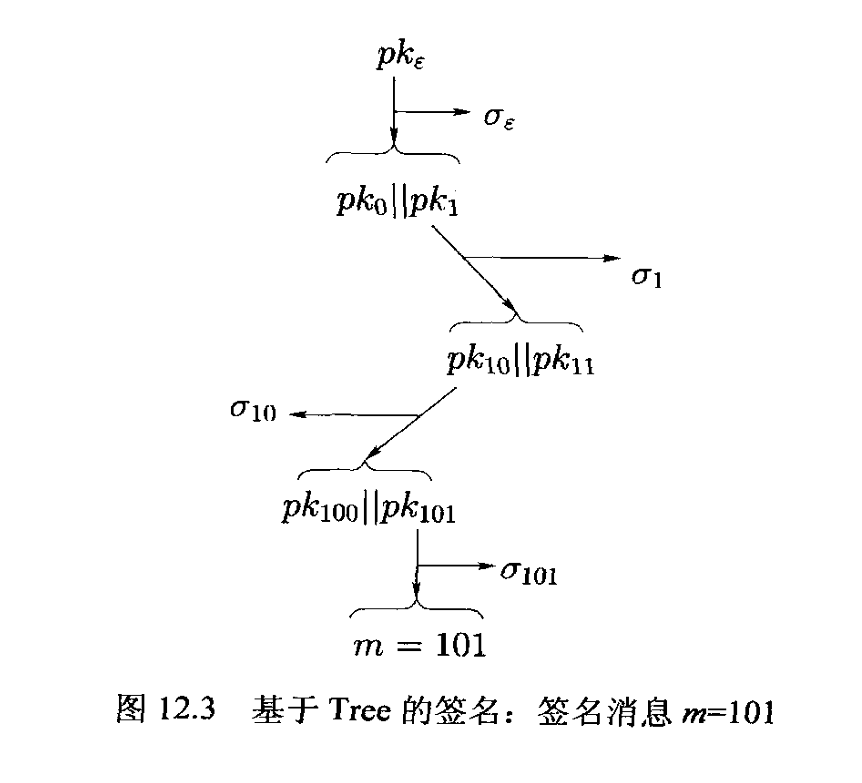
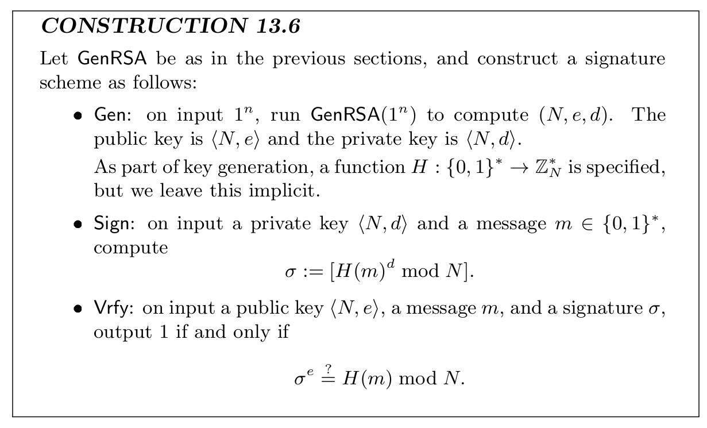

# Lec15 Digital Signature

!!! info "Abstract"

    首先补充了Random Oracle比较具体的例子EC-IES，然后介绍了Digital Signature的语法、构造。
    
    Key words: Random Oracle, EC-IES, Digital Signature, One-time Digital Signature, RSA-based Digital Signature

## EC-IES

在上一讲中我们介绍了理想模型Random Oracle，本讲做补充以及用具体例子说明。我们知道在公钥加密中，归约$R$往往是拿不到$sk$的，但是在$R$和$A$的game中，$R$需要假装自己有$sk$，但这样显然是困难的。考虑以下情形：在CCA安全下，$A$具有访问解密预言机的能力，当$A$丢给$R$一个密文时，$A$期望从$R$中获得解密结果，否则就Abort.但事实上$R$是没有$sk$的，也就是说解密不了，这也就是之前说$R$能力不足的本质。Random Oracle做了一件事，即让$A$的加密变得更困难，用$H$来约束住$A$。

以El-Gamal加密算法为例，我们已经证明它是CPA安全的，但不是CCA安全的，问题出在它的加密太过于粗糙：

$$
Gen(1^n)\rightarrow \quad sk\leftarrow Z_p, \quad pk\leftarrow g^x
$$

$$
Enc(sk,m,r):= (c_1=g^r,\quad c_2=pk^r\cdot m)
$$

$$
Dec(sk,c_1,c_2):= m\leftarrow \frac{c_2}{c_1^{sk}}
$$

我们尝试用对称加密的AE安全下的算法来包裹它：

$$
Enc(sk,m,r):=(c_1=g^r,\quad c_2=AE(pk^r:m))
$$

这样看似是好的，因为它能够保证CCA安全。但是本质上的问题还是没有解决：归约$R$仍然没有$sk$，它还是解密不了。于是我们可以看到Random Oracle在公钥加密中的重要性，引入它可以构造出更强的加密函数：

$$
Enc(sk,m,r):=(c_1=g^r, \quad c_2=AE(H(pk^r):m))
$$

对应的解密函数：

$$
Dec(sk,c_1,c_2)=AE.Dec(H(c_1^{sk}),c_2)
$$

这种加密算法让$A$必须去访问$R$中模拟的$H^{\prime}$，这样$R$就可以知道$A$生成的$pk^r$，也就是解密所需的$c_1^{sk}$，$R$就可以解密了。

## Digital Signature

把MAC公钥化的尝试，对于MAC来说，只有持有相同$sk$的通信方可以做认证，Digital Signature的想法就是想让任何人都可以用$pk$验证发送方用$sk$加密的消息。

### Syntax

$$
KG\rightarrow (pk,sk)
$$

$$
Sign(sk,m)\rightarrow \sigma
$$

$$
Verify(pk,m,\sigma)=\left\{
\begin{aligned}
&1\quad &valid\\
&0\quad &notvalid
\end{aligned}
\right.
$$

### Security Definition

通过和MAC类似的不可区分实验来定义安全性

**Unforgability Against Chosen Message Attack**

### Construction

令攻击者能够访问的次数为$q$，先讨论$q=1$时的构造，再推广到$q>1$的情况。

??? info "补充"

    在复杂度上可以证明 $OWF\Leftrightarrow PRG\Leftrightarrow PRF \Leftrightarrow SKE \Leftrightarrow AE$.它们都是抗量子的。
    
    在20世纪末已经证明$OWF\nrightarrow PKE$，因为本质上公钥依赖的群、离散对数、大数分解假设并不是抗量子的。
    
    但有些反直觉的是，同样作为公钥化的尝试，$OWF \rightarrow DS$ 是在一定程度上成立的

#### One-time Signature

$q=1$，攻击者只能做一次签名。

实验退化为

构造如下，假设Message Space = $\{0,1\}^n$，$f$为一哈希函数. 我们定义：

$$
sk=\left(
\begin{aligned}
x_{10},x_{20},\cdots,x_{n0}\\
x_{11},x_{21},\cdots,x_{n1}
\end{aligned}
\right)
$$

$$
pk=\left(
\begin{aligned}
f(x_{10}),f(x_{20}),\cdots,f(x_{n0})\\
f(x_{11}),f(x_{21}),\cdots,f(x_{n1})
\end{aligned}
\right)
$$

把$m$按比特拆分$m=m_1\vert\vert m_2 \vert\vert \cdots \vert\vert m_n$.

$$
Sign(m,sk)=\sigma=x_{1m_1}\vert\vert x_{2m_2} \vert\vert\cdots \vert\vert x_{nm_n}
$$

解密时把$\sigma$按比特拆分：$\sigma = \sigma_1,\sigma_2,\cdots,\sigma_n$.

$$
Verify(pk,m,\sigma)=\left\{
\begin{aligned}
&1 \quad \forall i,f(\sigma_i)=pk_{im_i},\\
&0 \quad otherwise.
\end{aligned}
\right.
$$

??? info "Example"

    

攻击者需要在输出的$\sigma$中任意找一个bit，若能得知它的原像，即$f(x)\rightarrow x$，那么通过翻转这个比特再把翻转后比特的哈希算出，即可得到$\sigma^{\prime}$，把$m^{\prime}$和$\sigma^{\prime}$发过去即可。但在哈希函数是难求逆的前提下，即OWF存在的前提下，$A$是难以攻破该算法的。

> 略去证明

#### Chain-Based Signature

下面考虑是否可以对任意多条消息做签名。有 Chain-Based 和 Tree-Based 两种方法，**仅作了解即可。**

#### Tree-Based Signature

#### RSA-Based Signature

以上几种都基于OWF存在的假设，因此是抗量子的。但是不幸的是它们的效率比较低。基于RSA的数字签名优点在于比以上的效率要高，但是它并不抗量子。在目前的应用中仍十分广泛。

**Plain RSA**

我们有种直觉，PKE和DG似乎是互逆的，即PKE用公钥加密，私钥解密；DG用私钥签名，公钥验证。那么是否把RSA加密和解密用的密钥互换就能得到对应的数字签名呢？

显然是不行的，因为根据群运算性质：若已知$m_1^d,m_2^d$，那么只要做乘法即可得到$(m_1m_2)^d$.意味着攻击者只要知道两条信息的签名，就可以伪造任意信息的签名。

$$
\sigma^e=(\sigma_1\cdot\sigma_2)^e=(m_1^d\cdot m_2^d)^e=m_1^{ed}\cdot m_2^{ed}=m_1\cdot m_2=m\mod{N}
$$

自然的想法是引入哈希或者Random Oracle去模糊掉这个$m$，事实上也是可行的。

**RSA-FDH**

> $H$可以取为抗碰撞哈希或Random Oracle，但后者是较好的，后面的定理也是基于Random Oracle做的证明

此时若攻击者已知$H(m_1)^d,H(m_2)^d$，他并不能通过乘法获取$H(m_1m_2)^d$.

> 证明省略
