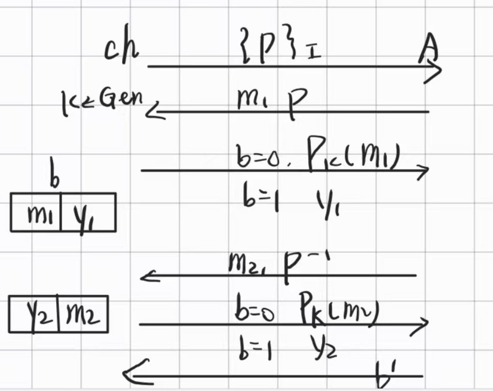
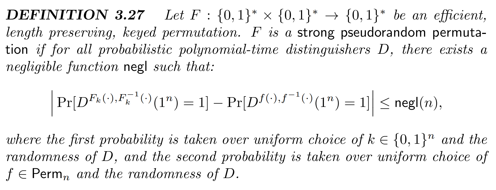
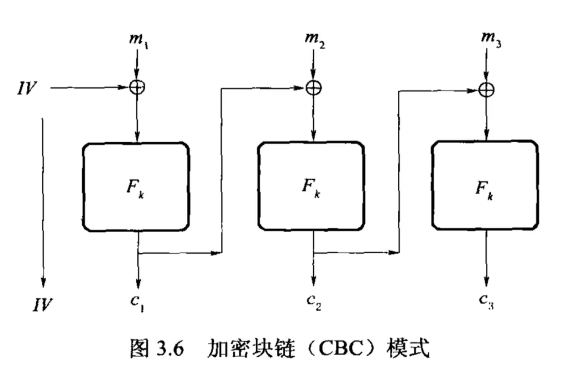

# Lec7 PRG PRFs PRP & MAC

!!! info "Abstract"

    本讲的内容比较杂，先补充了上讲提到的PRFs vs. PRG; 再介绍了PRPs以及基于IND-CPA的具体应用：CBC-model ;至此，本课程关于数据安全“机密性”的部分告一段落，在本讲的后半部分，将注重数据“完整性”部分的引入，即介绍了MAC的定义，起过渡作用

    Key words: PRFs vs. PRG;PRPs; CBC-model; MAC

## PRFs vs. PRG

已知结论PRFs $\Leftrightarrow$ PRG,由于证明过于复杂，我们给出简单的构造形式和思路

> 书中参考P78

### PRG$\Leftarrow$PRFs

相对简单，通过字符串连接实现：
$$
PRG(k)\mathop{=}^{def}PRF_k(1) \vert\vert PRF_k(2) \cdots \vert\vert PRF_k(l)
$$
简单来说就是绑定index后，通过内嵌的形式再做extension.

### PRG$\Rightarrow$PRFs

#### Attempt1

一种很naive的想法是用PRG生成一串非常非常长（指数级）的字符串，再从中分割出$K=1,K=2,\cdots ,k=2^r$段的PRFs.

正如前面所说的，这个字符串非常长，而且是线性的，意味着每一次想要获得一个PRF就得从头全部重新生成一次，效率非常低。

> 这个方法在小输入的时候的可行的

#### Attempt2

上述线性的构造是$O(l)$的，我们自然可以想到，引入二叉树，可以把复杂度压缩到$O(\log l)$.对于二叉树形式下的安全性证明我们直接省略。

$Theorem$: F is PRFs under the assumption G is PRG

同样使用Hybrid Argument,构造$n$组Game

$$
\begin{align}
& Game0:all\quad G,\\
& Game1:all\quad G,but\quad layer1,\\
& Game2:all\quad G,but\quad layer1\quad and\quad layer2,\\
& \cdots\\
& Gamen: all\quad Truly Random\\
\end{align}
$$

> 省略严格证明

## PRPs

考虑具体的加密方案，如果想要实现任意长度的加密，我们可以利用CPA进行逐一比特的加密：

$m=m_1\vert\vert m_2\vert\vert \cdots \vert\vert m_l$

$c=Enc(m_1)\vert\vert Enc(m_2)\vert\vert \cdots \vert\vert Enc(m_l)$

这个加密方式是符合IND-CPA安全定义的（前面已经提及），但这显然是一个比较低效的加密方式，每一比特加密后都会扩展出额外冗余的信息，让$c$变得非常长。理想情况下，密文长度应该和明文长度相同（显然不可能小于，否则必然会有信息丢失，无法复原明文信息）。可以简单地认为，理想条件是苛刻的，那么不妨稍微放松条件，即密文长度比明文长度多一个常数是可以接受的。下面介绍的PRPs就可以做到这一点。

**PRPs,Pseudo-random Permulations.**它是一个 **置换**（空间的一组排列），记作$Perm_n$,即存在逆函数，等价于一个一一映射，是相同长度$n$下$Func_n$的一个子集。对于空间$\{0,1\}^n$,有$(2^n)!$种置换，即：

$$
size(Perm_n(\cdot))=(2^n)!
$$

> $n! \approx \frac{n^n}{e^n}$,是super-exp级别的，远远大于$2^n$。

在定义上，PRPs和PRFs是类似的。PR是它们的安全属性，即它们都满足伪随机性，P与F则是它们的功能属性，前者是一个置换（即排列），后者是一个函数

我们对PRPs不多做介绍，只给出它的定义：

其中，满足伪随机性要求的表述如下：
$$
Pr[b=b^{\prime}]\leq \frac{1}{2} + negl(n)
$$

!!! note "补充"

    教材中把满足伪随机性的PRP称为“强的”:

    

**至此，我们不加证明地给出一个重要结论：**

$Theorem:\quad OWF\Leftrightarrow PRG\Leftrightarrow PRFs\Leftrightarrow PRPs$

## CBC model

### Block Cipher

是PRP的一个别称，且Block Cipher也可以用来构造Stream Cipher

### 加密操作模式

是用**分组密码**（PRP）来加密任意长度消息的基本方法。常见的加密操作模式有：电子密码本（ECB）模式；密码分组链接（CBC）模式；输出反馈（OFB）模式；计数器（CTR）模式等。在这里我们仅展开介绍CBC model.

> 需要注意的是，分组密码是与流密码相对应的概念，在后面我们也会比较二者的优劣

对于上讲提到的加密函数$Enc$，为了让它能够加密多条信息，我们采取了以下定义消除了它的确定性：
$$
Enc(m,sk:r):=r,F_{sk}(r)\oplus m
$$
这个加密函数产生的密文把原来的明文长度扩大了两倍($L \rightarrow 2L$),因为每加密一次，我们就要重新生成一个纯随机数$r$，虽然这比前面提到的逐位加密要好太多，但是仍然不够。CBC Model尝试减少$r$的数量，来获取摊还意义下的密文长度比明文长度仅仅差一个常数。

在CBC模式中，我们把上一组的密文和这一组的明文异或后整体作为输入，输入到伪随机置换中，即：
$$
Enc_{sk}(sk,m:r)=r,P_k(m\oplus r)
$$

可以证明，如果$F$是伪随机置换，那么CBC加密模式是CPA安全的。但是它的缺点也很明显，就是它也是线性的，这也就是说，如果要加密明文分组$m_i$,我们依赖于密文分组$c_{i-1}$,所以每组的加密必须从头来过。

## MAC

从这里开始，正式进入对数据**”完整性“**的讨论。在前面六讲中，我们集中于数据**”私密性“**，考虑的是如何让Adversary不获取明文信息的内容，而有些信息并不care私密性，但是它却很需要完整性，即它不能被篡改，需要有高的可信任度。”完整性“和”私密性“作为数据安全的两个特性，它们是完全正交的，不能强行在它们之间建立关联。

**MAC: Message Authentication Code**，它是在对称加密背景下定义的，也就是我们总假设信息交流双方共享一个密钥$sk$，这也是我们区分MAC和数字签名的最根本理由，因为数字签名是基于非对称加密背景的。

### Syntax of MAC

$$
\begin{align}
Gen(1^n)&\rightarrow sk\\
MAC(sk,m)&\rightarrow \tau\\ 
verify(sk,\tau,m)&\rightarrow 0(invalid)\quad or \quad 1(valid)\\
\end{align}
$$

### MAC-Secure

和之前一样，定义一种安全需要定义敌手的能力和“Break”的含义。其中，敌手仍然是PPT的，对于Break如何定义，我们定义了MAC实验：

> 也叫做 Unforageability-chosen Msg Attack （**UF-CMA**），图示：

A获胜的定义如下：$Pr[Awins]=Pr[verify(m^*,\tau^*)=1] \land m^*neveroccur$

