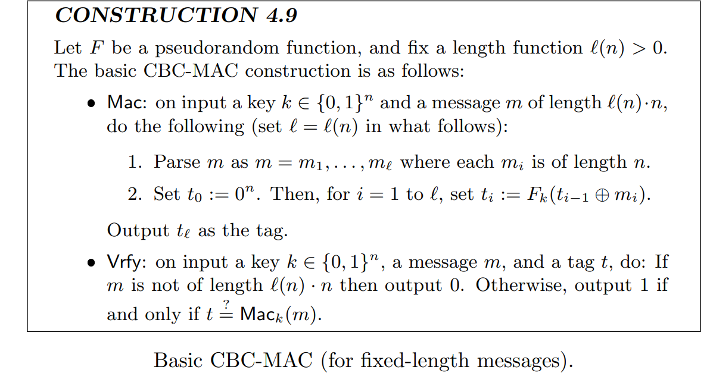
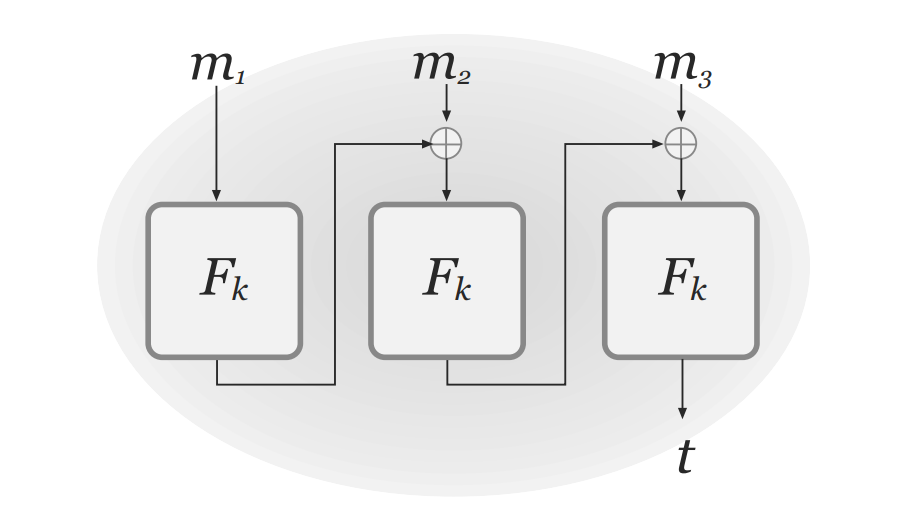

# Lec9 Constucting MAC

!!! info "Abstract"

    在第七讲中，介绍了MAC的语法和UF-CMA的定义，在本讲中，会集中在如何构造一个安全的MAC（将用到之前涉及的PRFs和CBC模式），最后又简单地介绍了Padding Oracle Attack.
       
    Key Words: MAC; PRFs; CBC-MAC; Padding Oracle Attack

## Fixed-Length MAC

使用工具PRFs，我们可以构造出能对定长消息加密的MAC加密方案：

 

我们需要证明，PRFs能保证MAC是Secure的。

> 证明具体细节略，详见教材。思路就是比较纯随机函数$f$和PRF，最后证明对于PRF来说，PPT Adversary攻破该MAC的概率是negl级别的，即最终需要证明：
>
> 

## Arbitrary-Length MAC

下面我们要给MAC做Domain Extension. 基于上面的定长加密方案做改进，尝试不断优化定义

### Attempt1

一种很naive的想法是对每$n$个bit的message用PRFs做加密（假设PRFs是长度保留的，输入输出空间大小为$n$的）

$$
m=m_1 \vert\vert m_2 \vert\vert \cdots \vert\vert m_s\\
$$

$$
Mac(sk,m)=F_{sk}(m_1) \vert\vert F_{sk}(m_2) \cdots \vert\vert F_{sk}(m_s)\\
$$

但是这样是抵御不了 **block re-ordering attack** 的。只要敌手构建

$$
m^{\prime}=m_2 \vert\vert m_1 \vert\vert \cdots \vert\vert m_s
$$
由于敌手是已知$m$的MAC的，且已知每个分块的大小，那么他就可以知道$m^{\prime}$的MAC.

从中我们可以看出： **Order Matters**

### Attempt2

由Attempt1可知，我们需要在构造中引入顺序这个概念，更新加密方案

$$
Mac(sk,m)=F_{sk}(1\vert\vert m_1) \vert\vert F_{sk}(2\vert\vert m_2)\vert\vert \cdots \vert\vert F_{sk}(s\vert\vert m_s)
$$

这样敌手就不能通过换序来获得额外信息的MAC。但是这样抵御不了 **truncation attack** ，即敌手总是可以获取该信息的前缀的MAC.比如敌手可以构造

$$
m^{\prime\prime}=m_1 \vert\vert m_2 \vert\vert \cdots \vert\vert m_{\lfloor \frac{s}{2} \rfloor}
$$

从中我们可以看出： **Length Matters**

### Attempt3

同时引入Order 和 Length 的概念，更新定义

$$
Mac(sk,m)=F_{sk}(s\vert\vert 1\vert\vert m_1) \vert\vert F_{sk}(s\vert\vert 2\vert\vert m_2)\vert\vert \cdots \vert\vert F_{sk}(s\vert\vert s\vert\vert m_s)
$$

那么此时面临的问题是 **“mix-and-match” attack** ，即敌手可以通过嫁接两条等长信息的相同block来构造新的信息，并获取MAC.

$$
m=m_1 \vert\vert m_2 \vert\vert \cdots \vert\vert m_s\\
$$

$$
m^*=m_1^* \vert\vert m_2^* \vert\vert \cdots \vert\vert m_s^*\\
$$

$$
\mathop{m}\limits^{\sim} =m_1 \vert\vert m_2^* \vert\vert \cdots \vert\vert m_s\\
$$

### Attempt4

对于Attempt3 ，我们可以再引入一个纯随机数来防止嫁接攻击

> The scheme only handles messages of length less than $2^{\frac{n}{4}}$ , but this is an exponential bound.

对于任何构造，我们需要证明安全性

> 证明具体细节略，详见教材。思路就是分类讨论

## CBC-MAC

根据上述第四种定义，我们成功从定长的MAC到了任意长的MAC加密方案，也就是说，任意长的安全MAC加密方案是可以被block cipher构造出来的。但是，这种构造是及其低效的，因为：

**To compute a tag on a message of length $dn$, the block cipher is evaluated $4d$ times, and the tag is more than $4dn$ bits long.**

所以我们需要更高效的构造方法，而CBC-MAC就是一个较高效，且实现简单的方案。

### Basic Construction

在basic construction中，CBC-MAC只能保证定长消息下的安全

我们还有如下定理：

> 这个定理的证明相当复杂，略。

那么我们不妨要问，既然Basic的CBC-MAC只能加密定长消息，为什么还要用它？

原因有以下几点：

- 对于相同长度的密钥，能加密的消息更长，不再受到$2^{\frac{n}{4}}$长度的限制
- 更高效，对于长度为$dn$的消息，分成$d$个block，只需要进行$d$次的运算，并且最终输出长度仅为$n$的tag

### CBC-MAC vs. CBC-mode encryption

两者的加密模式很像，但是有两点主要区别：

- CBC-MAC没有引入随机性。即没有外界输入$r$,当然，更好的视角是把$r$看成$0^n$.如果引入了随机数，可以证明CBC-MAC将会变得不再安全
- CBC-MAC只有一个tag的输出。对于CBC-mode encryption,对于每一个$m_i$，必须要输出加密后的$c_i$；对于CBC-MAC，只需要输出最后那个$t_s$即可。可以证明，如果输出了中间的$tag$，那么CBC-MAC是不安全的

### Arbitrary Length CBC-MAC

#### Way1

预处理消息，在前面引入消息长度

#### Way2

生成两个$sk$，现用$sk_1$跑一次CBC-MAC，再用$sk_2$加密一次$tag$.

这种方法的好处是不需要提前知道消息长度，坏处是多生成一个$sk$的代价往往很高，对于很长的消息，这个代价可能难以接受。

## Padding Oracle Attack

一个例子，揭示了为什么需要 Combine Secrecy and Intregrity. 

[Padding Oracle Attack(填充提示攻击)详解及验证 - 简书 (jianshu.com)](https://www.jianshu.com/p/833582b2f560)

> 下一讲中，将会由此引入CCA