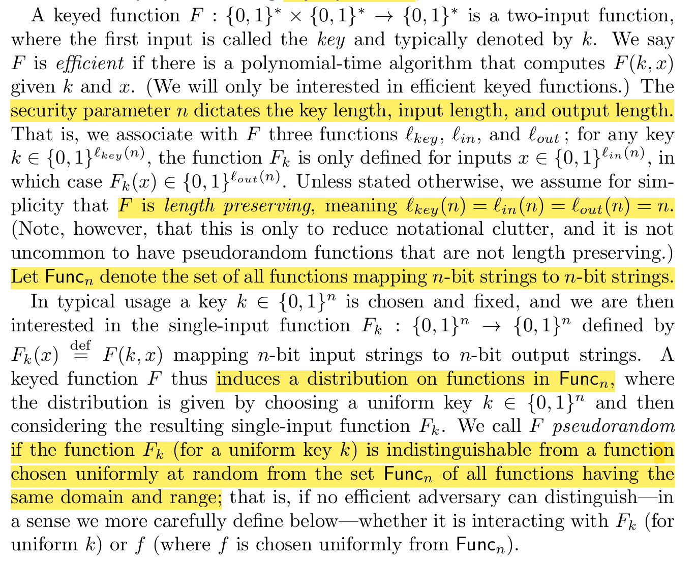
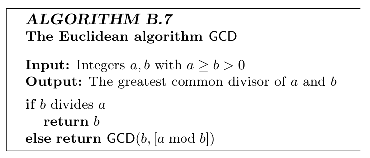

# Final Review

!!! info "Abstract"

    基于考纲的期末复习整理

主要分为 “概念”类、  “定义” 类 、“证明” 类 和 “计算” 类

- 概念：公私钥对比、某些工具的作用和局限性

- 定义：语法、安全性、会画Game
- 证明：会写Reduction
- 计算：RSA、大数分解、欧拉函数、El-Gamal

## 定义

### Perfect Privacy

完美安全模型下，敌手知道除了密钥外的所有信息，敌手的能力只有窃听，即定义在唯密文攻击场景下。

还有一种等价定义，不考虑明文空间分布，把视角转到密文空间，要求密文的出现不影响密文空间的分布。

本质上就是明文空间和密文空间是独立的。

由于可以证明完美安全定义和完美不可区分性是等价的，还可以用完美不可区分实验来定义（见Lec2，完美安全的实验并不是太重要）

### IND-EAV

> 因为Perfect Security是定义在窃听者模型下的，所以所有完美安全都是EAV-Secure的。

PRG的扩展性：只要PRG可以扩展一个bit，那么它就可以扩展任意多项式个bit（记住结论即可，不要求归约证明）

### Multi-Msg

> 不在考纲，但作为EAV和CPA的衔接非常重要

攻击者仍然是窃听模型，这个案例能够说明如果要实现多消息安全，加密算法不可能是确定性算法，必须引入随机性。但后面并不是在窃听者模型基础上实现多消息安全，而是去构造更强的加密方案，即加强攻击者能力为选择明文攻击后实现多消息安全。

### IND-CPA

给攻击者赋予访问加密预言机（Encryption Oracle）的能力。

单消息：

多消息（预言机输入换成对左右两组消息随机加密）：

> The Power of A in IND-CPA can be **trivially simulated** in CPA2.

### IND-CCA

给敌手新增了访问解密预言机的能力

### PRG

在定义EAV安全后，需要构建EAV安全的加密方案，所用的工具就是PRG.

Construction就不再赘述，可参考Lec4. 注意如何构造归约证明安全性的。

### PRFs

在定义IND-CPA后，同样需要构建对应的加密方案，因为多消息安全的加密算法必须要引入随机性，于是要利用PRFs实现

> 教材P76详细介绍了到底什么是PRF，推荐先看教材

??? note "What is PRFs?"

    

> 伪随机函数族大小是指数级（$2^{n\cdot 2^n}$）的，所以用Efficient的区分器是做不到计算的，这里给区分器加了访问预言机的能力，需要注意

### MAC

### AE

结合了保密性和完整性，保密性采用CCA，完整性采用MAC，为了语法的一致性，先修改了MAC的语法，引入Enc-Forge.

## 概念

### 完美安全的局限性

密钥空间必须大于明文空间，很好理解，由于解密算法是确定的，每条密文$c$对应可能的明文数就是$\vert K\vert$，如果$\vert K\vert <\vert M\vert$，肯定有一些明文是$c$怎么都无法解密得到的，这就打破了完美安全。

### MAC的作用

保证数据完整性

### 公私钥加密对比

书P402

### EAV/CPA/CCA 在公钥中安全定义的关系

## 证明

> 主要指Reduction，下面列举可能需要掌握的归约方法

### PRG $\Rightarrow$ EAV

见Lec4.

### PRFs $\Rightarrow$ IND-CPA

见Lec6.

### PRFs $\Rightarrow$ MAC

P115

## 计算

> 两种重要技巧：1. 求逆元 2. 快速幂

### Modular Arithmetic

大数分解的理论基础，模运算的各种性质，见书

### Group

群论的基本性质，关注书上的Examples，比较具象

### 大数分解

> 给定$N=pq$的欧拉函数，给定$N$的分解，如何计算欧拉函数

### RSA

> 给定$N$的分解，根据公钥计算私钥

从p332开始

P592

### El-Gamal

> 快速幂算法计算指数

