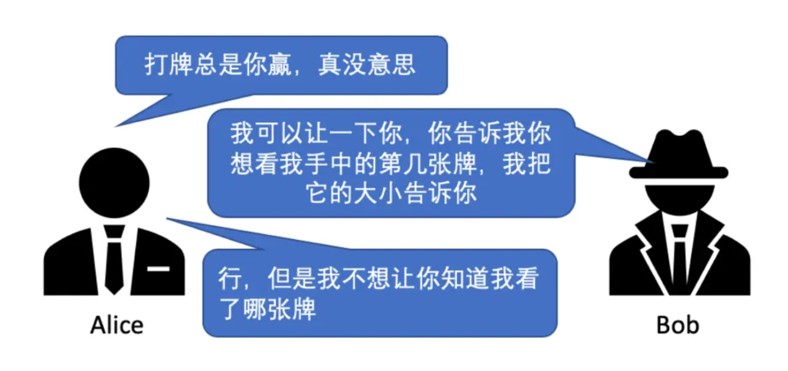
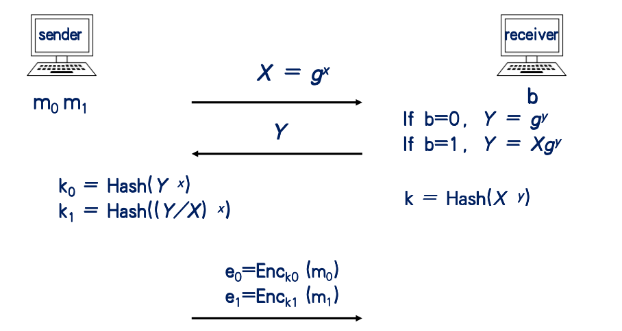
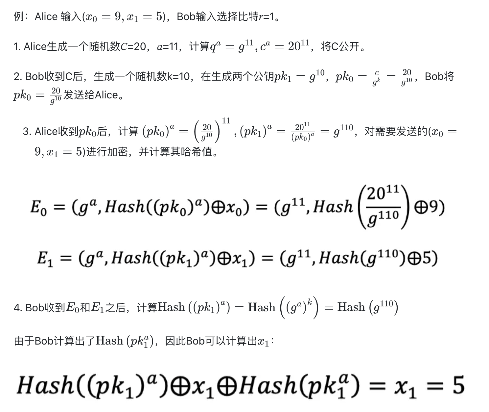
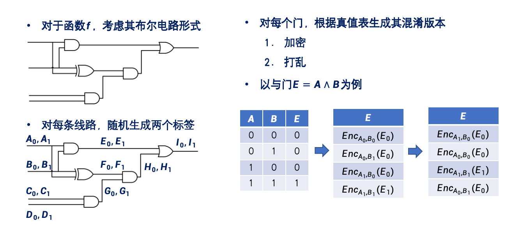
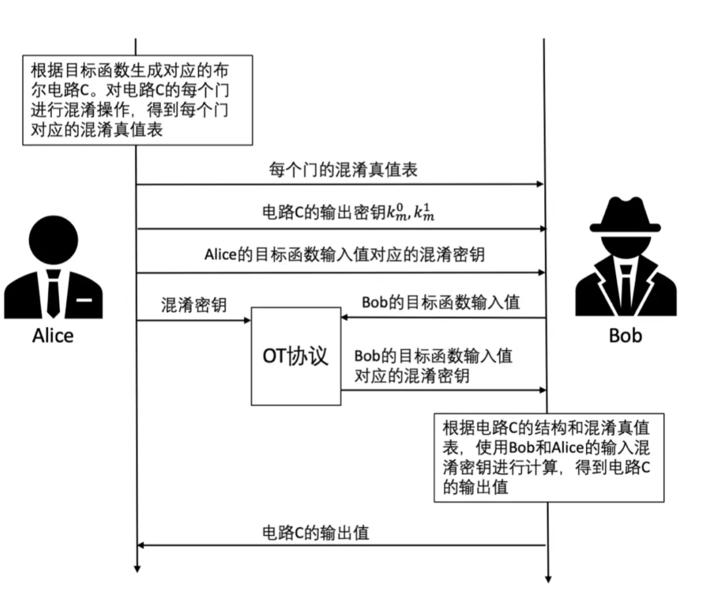

# 隐私计算关键技术介绍

## 不经意传输OT

不经意传输（OT）能够使得接收方获取发送方持有的两条秘密信息中的一条，同时保证：

1. 发送方无法得知接收方获取的是哪一条信息
2. 接收方无法得知发送方持有的另一个条秘密信息的内容

形象的例子是，有以下场景：

考虑二选一的情况，Bob有一组数据$a_0,a_1$，Alice输入$r\in\{0,1\}$，然后OT向Alice返回$a_r$，并且Alice不能知道$a_{1-r}$，Bob看不到Alice输入的$r$。

扩展到N选1完全同理，Bob输入$a_0,a_1,\cdots,a_{n-1}$，Alice输入$r,0\leq r\leq n-1$.

在具体实现上，课上介绍了一种较顶层的方法（基于离散对数假设）：

> 下面分析暂时省掉Hash

显然：

| OT    | b=0            | b=1            |
| ----- | -------------- | -------------- |
| $k_0$ | $g^{y\cdot x}$ | $g^{(x+y)x}$   |
| $k_1$ | $g^{(y-x)x}$   | $g^{y\cdot x}$ |

那么接收方可以用$b$来选择，用$k=g^{y\cdot x}$来解密。

这种实现称为Naor-Pinkas OT协议，其细节也并不复杂：

$pk$: $q$阶有限域的$Z_q$，有限域$Z_p$以及其生成元$g$和它的$q$阶子群$G_q$，其中$q\mid p-1$.

1. 发送者输入两个长度为𝑙比特的数据$(𝑥_0,𝑥_1)$，接收者输入一个选择比特$𝑟$。
2. 发送者生成一个随机数$C$，并将$C$进行公开，接着发送者生成一个随机数$a$，计算$g^a$和$C^a$。
3. 接收方生成随机数$k,1\leq k\leq q$. 生成两个公钥$pk_r =g^k$,$pk_{1-r}=\frac{C}{g^k}$.然后把$pk_0$发给发送方
4. 发送方计算$pk_0^a,pk_1^a=\frac{C^a}{pk_0^a}$. 然后发送方加密数据$(x_0,x_1)$:

$$
E_0=(g^a,Hash(pk_0^a) \oplus x_0)\quad E_1=(g^a,Hash(pk_1^a)\oplus x_1)
$$

5. 接收方计算$Hash(pk_r^a)=Hash((g^a)^k)$，然后算$x_r$:

$$
x_r=(Hash(pk_r^a)\oplus x_r)\oplus Hash(pk_r^a)
$$

> 可以看到其实和课上讲的完全一致

??? note "example"

    

## 混淆电路（Garbled Circuit）

在计算机中，任何函数都可以表示成布尔电路的形式（如果是连续的则使用一些数值分析方法作逼近等，不影响底层实现都是布尔电路等事实）。同时可以证明用 **异或门** 和 **与门** 可以完备地表示所有布尔电路。

混淆电路指的是对电路进行加密来掩盖电路等输入和电路等结构，以此实现对各个参与者隐私信息等保密，再通过电路计算实现目标函数的计算。实现思路如下：

记打乱后的表中的值为$c_{00},c_{01},c_{10},c_{11}$，这四个值就是该电路门的 **混淆值**。求值方不知道哪个是真正的输出。假设输入$A=0,B=1$，那么用$A_0,B_1$对这四个混淆值解密，只有$c_{01}$能被成功解密得到$E_0$，其他值解密后得到无效值。

>  如何区分有效值和无效值？ 可以在真值后面添加固定比特标志位。

对于整个电路来说，如果该门是整个电路的中间门，那么输出就是其他门的输出，把$E_0$作为其他门的输入继续计算，如果该门是最后的输出门，直接把$E_0$转换成0，$E_1$转换成1输出即可。

> 对于多个电路组成的门，当一个输入线分成多条分别接入到多个门，其分出的每条线上的信号标记都相同。对于一个门如有多个输出线，每条输出线的信号标记也都相同。

## 基于混淆电路的安全两方计算

这张图非常具体，在这个场景下，Alice设计混淆电路发给B（注意，A是知道混淆电路中的实际真值表的对应关系的），对于Bob，他需要知道自己的输入到底对应了什么混淆密钥，因此要利用OT协议拿到输入密钥。此时Bob就持有了电路的结构/混淆真值表/Alice的输入混淆密钥/Bob的输入混淆密钥。接着利用我们刚刚混淆电路的结论就可以直接计算了。因此，基于混淆电路的安全两方计算可以总结为以下几步：

1. Alice把目标函数转换为布尔电路
2. Alice对电路进行混淆
3. Alice将混淆电路发给Bob
4. Bob对混淆电路估值
5. 获得电路计算结果

## 秘密分享 Secret Sharing

> 在课上介绍的也叫做GMW协议

布尔电路可以用异或门/与门/非门组成，秘密分享能做到不混淆电路也能对电路求值。考虑以下情形：Alice和Bob的输入均为长为$n$的比特串，Alice输入$a$，Bob输入$b$。那么初始秘密的构造如下：

下面基于双方持有的秘密进行对布尔电路的计算

### 非门计算

由于非门是单输入门，直接对输入求反即可

### 异或门计算

异或门可以简单地在双方本地分别计算后上传再求值：
$$
(a_{Alice}\oplus b_{Alice})\oplus (a_{Bob}\oplus b_{Bob})=a_{Alice}\oplus a_{Bob} \oplus b_{Alice} \oplus b_{Bob}=a\oplus b
$$

### 与门计算

由于:
$$
a\and b=(a_{Alice}\oplus a_{Bob})\and (b_{Alice}\oplus b_{Bob})=(a_{Alice}\and b_{Alice})\oplus (a_{Alice}\and b_{Bob})\oplus (a_{Bob}\and b_{Alice})\oplus(a_{Bob}\and b_{Bob})
$$
可以看到有两项$a_{Alice}\and b_{Bob}$ $a_{Bob}\and b_{Alice}$.无法在本地计算，必须进行协同计算。

$(a_{Alice}\and b_{Bob})\oplus (a_{Bob}\and b_{Alice})$可以用4选1OT协议完成。$a_{Bob},b_{Bob}$两比特一共仅有四种组合，因此Alice可以先算出四种组合下的这两项的异或值，设为$c_{00},c_{01},c_{10},c_{11}$。

然后Alice再roll一个随机比特$r$，把这四个值异或上$r$后作为OT协议的输入，Bob用$a_{Bob}b_{Bob}$来选出结果，此时Alice持有$r$，Bob持有$c_{a_{Bob}b_{Bob}}\oplus r$.

